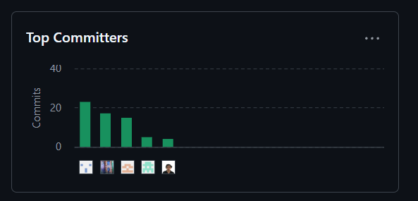
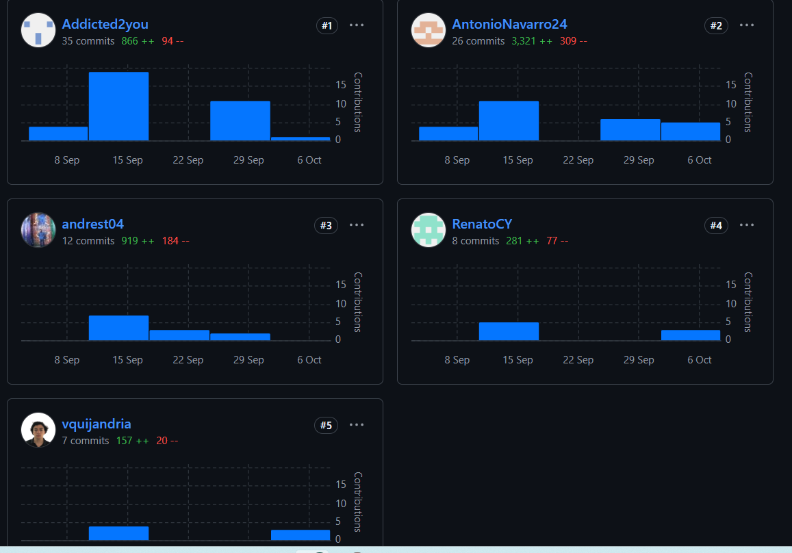
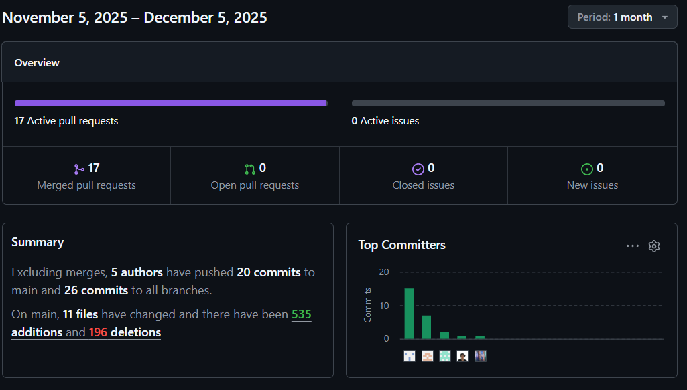
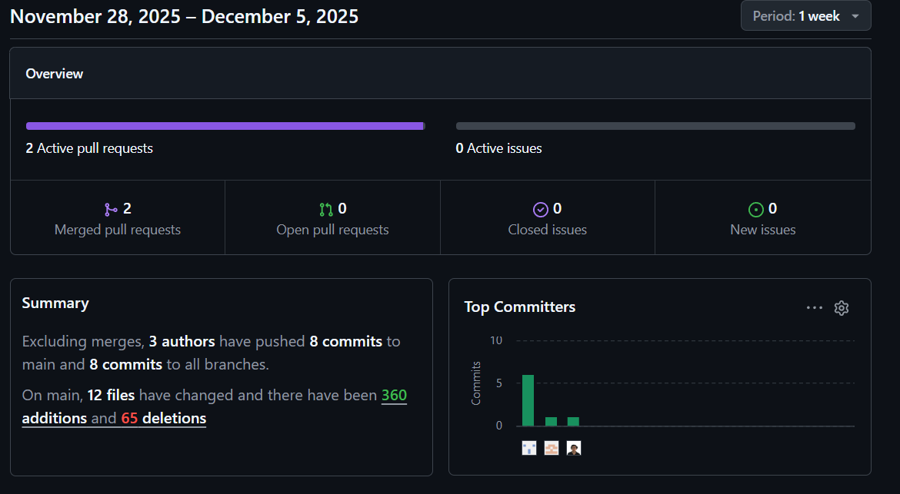

  

# Universidad Peruana de Ciencias Aplicadas

## Ingeniería de Software

Perido: 202520

1ACC0238 | Aplicaciones para Dispositivos Móviles

NRC: 12617

Docente: Mayta Guillermo, Jorge Luis

“Informe de Trabajo Final”

Startup: Eduspace

Producto: Eduspace

U202217053 - Calvo Yalan, Renato Guillermo
U202314101 - Navarro Chinga, Antonio Jhair
U202315283 - Rios Piñan, Dayro Richard  
U201822697 - Quijandria Araneda, Vicente  
U202220528 - Torres García, Andrés Alberto

Diciembre 2025

 
 
 
 
 
 
 
 
 

# **Registro de Versiones del Informe**

| Versión | Fecha | Autor         | Descripción de modificación                                                                              |
| ------- | ----- | ------------- | -------------------------------------------------------------------------------------------------------- |
| 1.0     | 19/09 | Andrés Torres | Se realizó la primera versión del informe. Capítulos 1 y dos realizados                                  |
| 2.0     | 9/10  | Dayro Rios    | Se realizó la segunda versión del informe, además del despliegue del backend. Capítulos 3 y 4 realizados |
| 3.0     | 9/11  | André Torres   | Se realizó la segunda versión del informe, además del despliegue del backend. Sprint 2 realizado |
| 4.0     | 5/12 | Vicente Quijandria | Se realizó la versión final del informe, incluyendo conclusiones y revisión general y el sprint 3. |

# **Project Report Collaboration Insights**

GitHub Collaboration Insights ofrece un cronograma que muestra las principales ramas y los procesos de fusión realizados. Todas las ramas se han creado siguiendo los principios de GitFlow, lo que asegura una organización eficiente al utilizar el sistema de control de versiones.

Andrés Alberto Torres García (andrest04)

Dayro Richard Rios Piñan (addicted2u)

Vicente Quijandria Araneda (vquijandria)

Renato Guillermo Calvo Yalan (RenatoCY)

Antonio Jhair Navarro Chinga (AntonioNavarro24)

Entregable TB1:

A continuación se muestran los gráficos de colaboración de los miembros del equipo en el repositorio durante nuestro primer sprint. Estos gráficos proporcionan una representación visual de las contribuciones realizadas por cada integrante, junto con las fechas correspondientes. También se incluye información sobre la cantidad de líneas de código modificadas en cada uno de los commits.

<strong>TP – Desarrollo Inicial del Proyecto (Sprint 1)</strong> 
En esta primera fase, el equipo avanzó en la creación del sitio web, el backend y la aplicación móvil, además de actualizar el informe técnico del proyecto. El sitio web se optimizó con un diseño adaptable y mejoras visuales.Backend desplegado y funcional y el mobile también funcional .

<strong>TB2 – Desarrollo Intermedio del Proyecto (Sprint 2)</strong> 
Durante esta etapa, el equipo se centró en la implementación de nuevas funcionalidades y mejoras tanto en el backend como en la aplicación móvil. Se realizaron ajustes en la arquitectura del backend para optimizar el rendimiento y se añadieron características clave a la aplicación móvil para mejorar la experiencia del usuario. Además, se continuó actualizando el informe técnico del proyecto para reflejar los avances realizados.

<strong>TF – Desarrollo Final del Proyecto (Sprint 3)</strong> 
En la fase final del proyecto, el equipo se enfocó en consolidar todas las funcionalidades implementadas en el backend y la aplicación móvil. Se realizaron pruebas exhaustivas para garantizar la estabilidad y el rendimiento de ambas plataformas. Además, se llevaron a cabo ajustes finales en la interfaz de usuario para mejorar la usabilidad y se completó la documentación técnica del proyecto.

# **Student Outcome**

<strong> ABET – EAC - Student Outcome 7 </strong>  
Criterio: <em> La capacidad de adquirir y aplicar nuevos
conocimientos según sea necesario, utilizando estrategias de aprendizaje apropiadas.</em> 
En el siguiente cuadro se describe las acciones realizadas y enunciados de
conclusiones por parte del grupo, que permiten sustentar el haber alcanzado el logro
del ABET – EAC - Student Outcome 7.

<table>
<tr>
  <th>Criterio Específico</th>
  <th>Acciones Realizadas</th>
  <th>Conclusiones</th>
</tr>

<tr>
  <td rowspan="5">
    Actualiza conceptos y conocimientos necesarios para su desarrollo profesional y en especial para su proyecto en soluciones de software.
  </td>

  <td>
    Calvo Yalan, Renato Guillermo:  
    TB1: Reforzó los conocimientos asociados a la realización del needfinding para reunir informaición necesaria para los arquetipos del mismo. 
    TP1: Identifica que el aprendizaje continuo en tecnologías backend y arquitectura de software es esencial para mantener la calidad técnica de los proyectos y su crecimiento como desarrollador. 
    TB2: Reforzó los conocimientos sobre backend para la migración de la base de datos a mongoDB. 
    TF: Aplicó y reforzó sus conocimientos de desarrollo backend y bases de datos NoSQL al integrar la vista de teachers con el backend en MongoDB, asegurando el correcto manejo de las secciones Home, Reservations y Breakdown Reports, así como el flujo de login y la consistencia de la información.
  </td>

  <td rowspan="5">
    TB1:El equipo demuestra un compromiso constante con la actualización y fortalecimiento de sus conocimientos, reconociendo la importancia de este proceso para el desarrollo profesional y el éxito de los proyectos en soluciones de software. Se refuerzan competencias vinculadas al needfinding para levantar información clave en la construcción de arquetipos, así como la profundización en arquitectura de software y diseño orientado a dominios que permiten crear soluciones escalables y alineadas al negocio. De igual forma, se aplican prácticas de refactorización y herramientas como el User Task Matrix, complementadas con entrevistas, que aseguran la pertinencia y mejora continua de las soluciones. También se incorporan metodologías como Empathy Mapping, event storming, domain message flow, context mapping y User Stories, que fortalecen la comprensión del usuario y la transformación de necesidades en requerimientos claros. Finalmente, se destaca el análisis de entrevistas y el modelado de dominios como medios para generar un entendimiento compartido y garantizar coherencia en el diseño. En conjunto, se evidencia una clara orientación hacia el aprendizaje permanente y la construcción de soluciones efectivas y centradas en el usuario. 
     
    TP1: El equipo evidencia la aplicación práctica de conocimientos actualizados en diferentes áreas del proyecto de software. Se refuerzan competencias técnicas en el desarrollo backend mediante ajustes y optimizaciones que aseguran la funcionalidad de los servicios, así como habilidades de gestión de proyecto a través de la coordinación de fechas de entrega y la resolución de dudas del equipo. Asimismo, se fortalece la capacidad de documentación técnica y la actualización de elementos de presentación como el landing page, garantizando coherencia entre la propuesta visual y los requerimientos del proyecto. En conjunto, se demuestra una actualización integral que abarca tanto aspectos técnicos de implementación como competencias de gestión, documentación y comunicación, consolidando el desarrollo profesional del equipo y el éxito del proyecto.
     
    TB2: El equipo continúa demostrando un compromiso sólido con la actualización y aplicación de conocimientos esenciales para el desarrollo profesional y el éxito del proyecto de software. Se refuerzan competencias técnicas en backend, específicamente en la migración de bases de datos a MongoDB, asegurando una gestión eficiente de la información. Además, se profundizan habilidades en documentación técnica y gestión de entregas, lo que contribuye a la claridad y organización del trabajo colaborativo. En conjunto, se evidencia una orientación continua hacia el aprendizaje permanente y la construcción de soluciones efectivas y actualizadas en el ámbito del desarrollo de software. 
    TF: En el trabajo final, el equipo consolida y actualiza sus conocimientos mediante la implementación de la vista de teachers conectada al backend en MongoDB, integrando funcionalidades clave como Home, Reservations y Breakdown Reports, además del flujo de login. Este avance supone la aplicación de conceptos de desarrollo backend, bases de datos NoSQL y desarrollo mobile en Android Studio, así como la realización de correcciones generales sobre la aplicación. En conjunto, se evidencia que el equipo no solo actualiza sus conocimientos de manera teórica, sino que los lleva a un entorno real de implementación, fortaleciendo su competencia técnica y su capacidad para construir soluciones de software coherentes con las necesidades del proyecto.
  </td>
</tr>

<tr>
  <td>
    Torres García, Andrés Alberto:  
    TB1: Se enfoca en profundizar en arquitectura de software con énfasis en el nivel táctico de Domain-Driven Design (DDD). Esto le permite fortalecer la base conceptual y práctica para diseñar soluciones escalables, alineadas con la lógica del negocio, contribuyendo de manera estratégica al proyecto. 
    TP1: Profundizó en la implementación backend del proyecto, enfocándose en realizar los ajustes técnicos requeridos para asegurar el correcto funcionamiento de los componentes del sistema. Con ello, fortaleció sus conocimientos en desarrollo de servicios y arquitectura de aplicaciones. 
    TB2: Profundizó en la mejora de la arquitectura e implementación del backend, además de realizar ajustes técnicos para el correcto funcionamiento del mimo. 
    TF: Profundizó en la arquitectura del backend al optimizar los servicios que consumen la vista de teachers y las funcionalidades de Home, Reservations y Breakdown Reports sobre MongoDB, asegurando la consistencia de los datos, el rendimiento de las consultas y la correcta integración con el login de la aplicación.
  </td>
</tr>

<tr>
  <td>
    Quijandria Araneda, Vicente:  
    TB1: Orienta su actualización hacia la práctica aplicada en refactorización y ajuste de landing pages, así como en la utilización de herramientas como el User Task Matrix. Esto, complementado con la realización de entrevistas, le permite no solo mantener sus conocimientos actualizados, sino también validar con usuarios reales la pertinencia de las soluciones, asegurando un desarrollo orientado a la experiencia de usuario y a la mejora continua. 
    TP1: Actualiza sus conocimientos mediante la elaboración de documentación técnica del proyecto y la refactorización del landing page, lo que le permite consolidar habilidades tanto en la comunicación escrita de soluciones técnicas como en el desarrollo frontend orientado a la presentación efectiva de la propuesta. 
    TB2: Profundiza y actualiza en conocimientos sobre frontend mobile applications para implementar features de nuestro negocio orientado la mejora de la experiencia del usuario. 
    TF: Actualizó y consolidó sus conocimientos en desarrollo de interfaces móviles al implementar y ajustar la vista de teachers en Android Studio, mejorando la usabilidad y el diseño de las secciones Home, Reservations y Breakdown Reports, además de participar en las correcciones generales de la aplicación para garantizar una mejor experiencia de usuario.
  </td>
</tr>

<tr>
  <td>
    Navarro Chinga, Antonio Jhair:  
    TB1: Actualiza sus conocimientos mediante el uso de Empathy Mapping, event storming, domain message flow, context mapping y User Stories, fortaleciendo su capacidad para comprender al usuario, modelar dominios de negocio y transformar necesidades en requerimientos claros. Con ello, asegura tanto su desarrollo profesional como la calidad de las soluciones de software en el proyecto. 
    TP1: Refuerza sus competencias en gestión de proyectos mediante el apoyo en la elaboración del informe técnico y la coordinación de fechas de entrega, asegurando el cumplimiento de los plazos establecidos. Adicionalmente, fortalece sus habilidades de comunicación al resolver dudas del equipo, contribuyendo a la claridad y organización del trabajo colaborativo. 
    TB2: Refuerza conocimientos sobre mobile applications, asegurando buenas prácticas y consolidar sus conocimientos. 
    TF: Reforzó sus conocimientos en desarrollo mobile y experiencia de usuario al validar y ajustar los flujos de navegación de la vista de teachers (login, acceso a Home, Reservations y Breakdown Reports), alineando la implementación en Android Studio con los requerimientos levantados en fases previas y asegurando coherencia entre la solución técnica y las necesidades del usuario docente.
  </td>
</tr>

<tr>
  <td>
    Rios Piñan, Dayro Richard:  
    TB1: Actualiza sus competencias en metodologías de descubrimiento y modelado como event storming, domain message flow y context mapping. Estas prácticas le otorgan la capacidad de identificar con claridad los dominiios de negocio, mapear interacciones clave y generar un entendimiento compartido que asegura coherencia en el diseño de las soluciones. Además de la realización del análisis de entrevistas. 
    TP1: Fortalece sus conocimientos en documentación técnica y gestión de entregas al apoyar en la elaboración del informe y en la definición de las fechas de entrega. Asimismo, desarrolla habilidades de soporte al equipo mediante la resolución de consultas, garantizando la coherencia y el avance continuo del proyecto. 
    TB2: Actualizó y fortaleció conocimientos sobre backend y frontend para implementar features necesarios del negocio. 
    TF: Actualizó y fortaleció sus conocimientos full stack al apoyar la integración de la vista de teachers con los servicios conectados a MongoDB y participar en las correcciones generales de la aplicación en Android Studio, asegurando que las funcionalidades de Home, Reservations y Breakdown Reports se implementen de forma coherente con el modelo de dominio.
  </td>
</tr>

<tr>
  <td rowspan="5">
    Reconoce la necesidad del aprendizaje permanente para el desempeño profesional y el desarrollo de proyectos en soluciones de software.
  </td>

  <td>
    Calvo Yalan, Renato Guillermo:  
    TB1: Reconoce que el aprendizaje continuo es fundamental para fortalecer sus competencias y aportar soluciones innovadoras en el desarrollo de proyectos de software. 
    TP1: Identifica que el aprendizaje continuo en tecnologías backend y arquitectura de software es esencial para mantener la calidad técnica de los proyectos y su crecimiento como desarrollador. 
    TB2: Reconoce que el aprendizaje continuo y estar pendiente de las tendencias es escencial para mejorar su futuro como profesional. 
    TF: A partir de la integración de la vista de teachers con el backend en MongoDB y de la implementación de funcionalidades como Reservations y Breakdown Reports, reconoce que debe seguir actualizándose en integración backend–mobile, seguridad de login y bases de datos NoSQL para afrontar proyectos cada vez más complejos.
  </td>

  <td rowspan="5">
    TB1:El equipo en su conjunto reconoce la importancia del aprendizaje permanente como base para el desarrollo profesional y el éxito de los proyectos en soluciones de software. Se valora la formación continua como medio para innovar y fortalecer aportes, la actualización en arquitectura y diseño para garantizar calidad, el aprendizaje constante como motor para refactorizar y mejorar soluciones, la formación en metodologías ágiles y centradas en el usuario para aportar eficacia, así como la actualización en prácticas de modelado de dominio como elemento esencial para un desempeño sólido. En conjunto, se evidencia un compromiso claro con la mejora continua y la construcción de soluciones relevantes y efectivas
     
    TP1: El equipo reconoce de manera integral la necesidad del aprendizaje permanente en diversas dimensiones del desarrollo de software. Se valora la actualización constante en tecnologías backend y arquitectura como base para la calidad técnica, la formación continua en documentación y frontend para ampliar el perfil profesional, así como el desarrollo de competencias en gestión de proyectos y trabajo colaborativo como factores clave para el éxito de las entregas. En conjunto, se evidencia una conciencia clara sobre la importancia de la formación continua no solo en aspectos técnicos, sino también en habilidades blandas de coordinación, comunicación y soporte al equipo, consolidando un enfoque integral del desarrollo profesional.
     
    TB2: El equipo reconoce la importancia del aprendizaje permanente como base para su desarrollo profesional y el éxito del proyecto de software. Se valora la actualización continua en tecnologías backend y frontend, así como la formación en buenas prácticas de desarrollo móvil, asegurando la calidad técnica y la pertinencia de las soluciones implementadas. En conjunto, se evidencia un compromiso claro con la mejora continua y la construcción de soluciones efectivas y actualizadas en el ámbito del desarrollo de software.
     
    TF: En el trabajo final, el equipo refuerza su reconocimiento de la necesidad del aprendizaje permanente al enfrentarse a la integración completa de una vista funcional para docentes, conectada a un backend en MongoDB e implementada en Android Studio. La incorporación de módulos como Home, Reservations y Breakdown Reports, junto con el login y las correcciones generales de la aplicación, evidencia que el dominio de nuevas tecnologías, patrones de integración y buenas prácticas de desarrollo mobile es un proceso continuo. De esta manera, el equipo asume que la mejora de sus competencias técnicas y de diseño es indispensable para abordar proyectos reales con mayor solvencia y profesionalismo.
  </td>
</tr>

<tr>
  <td>
    Torres García, Andrés Alberto:  
    TB1: Identifica la actualización constante en arquitectura de software y diseño táctico como clave para su crecimiento profesional y para garantizar proyectos de calidad. 
    TP1: Valora la importancia de actualizarse constantemente en el desarrollo backend y en la resolución de problemas técnicos, reconociendo que esto es clave para su desempeño profesional y para el éxito del proyecto. 
    TB2: Reconoce que el aprendizaje permanente en arquitectura de software y desarrollo backend es fundamental para su crecimiento profesional y para garantizar la calidad de los proyectos. 
    TF: Reconoce que la implementación y mantenimiento de funcionalidades como Reservations y Breakdown Reports, sobre una arquitectura basada en MongoDB, exige seguir profundizando en patrones de arquitectura backend, optimización de consultas y buenas prácticas de integración con aplicaciones móviles.
  </td>
</tr>

<tr>
  <td>
    Quijandria Araneda, Vicente:  
    TB1: Entiende la importancia de aprender permanentemente para refactorizar y ajustar soluciones, asegurando mejoras continuas y mayor valor para el usuario. 
    TP1: Reconoce que el aprendizaje permanente en documentación técnica y desarrollo frontend es fundamental para ampliar su perfil profesional y aportar valor integral al proyecto. 
    TB2: Reconoce que el aprendizaje continuo en frontend y experiencia de usuario es esencial para su desarrollo profesional y para mejorar la calidad de los proyectos. 
    TF: Comprende que para mantener y mejorar la vista de teachers y sus flujos (Home, Reservations y Breakdown Reports) es necesario continuar aprendiendo sobre diseño de interfaces móviles, patrones de navegación y usabilidad en Android, de modo que la experiencia del usuario docente siga evolucionando.
  </td>
</tr>

<tr>
  <td>
    Navarro Chinga, Antonio Jhair:  
    TB1: Reconoce que la formación continua en metodologías ágiles y centradas en el usuario es esencial para su desarrollo profesional y la eficacia del proyecto. 
    TP1: Identifica la necesidad de formarse continuamente en gestión de proyectos y habilidades de coordinación, comprendiendo que estas competencias son esenciales para asegurar entregas exitosas y trabajo en equipo efectivo. 
    TB2: Entiende la importancia del aprendizaje continuo en mobile applications para consolidar sus conocimientos y mejorar la calidad de los proyectos. 
    TF: Identifica que, para sostener la calidad de los flujos de navegación y la experiencia del docente en la app (login, acceso a Home, Reservations y Breakdown Reports), debe seguir formándose tanto en desarrollo mobile como en metodologías centradas en el usuario, integrando lo técnico con lo aprendido en etapas de descubrimiento.
  </td>
</tr>

<tr>
  <td>
    Rios Piñan, Dayro Richard:  
    TB1: Valora la actualización constante en prácticas de modelado de dominio como base para un mejor desempeño y para aportar al éxito de los proyectos de software.  
    TP1: Reconoce que el aprendizaje permanente en gestión de entregas y habilidades de soporte al equipo es fundamental para su desarrollo profesional y para garantizar la cohesión y el avance efectivo del proyecto. 
    TB2: Reconoce que el aprendizaje continuo en backend y frontend es esencial para su desarrollo profesional y para mejorar la calidad de los proyectos. 
    TF: Reconoce que la integración de frontend y backend en una aplicación móvil real, conectada a MongoDB y con funcionalidades como Reservations y Breakdown Reports, refuerza la necesidad de continuar aprendiendo sobre tecnologías full stack, herramientas de depuración y buenas prácticas de mantenimiento para garantizar soluciones robustas y escalables.
  </td>
</tr>

</table>

# Objetivos SMART

Andrés Torres:

En los primeros 12 meses posteriores a mi graduación, desarrollaré y publicaré en GitHub al menos 3 proyectos técnicos orientados a inteligencia artificial aplicada (por ejemplo, un chatbot con procesamiento de lenguaje natural, un sistema de recomendación y una herramienta de análisis de datos educativos). Cada proyecto incluirá documentación técnica, dataset de prueba y un despliegue funcional (API o demo web). Además, participaré en al menos 1 hackathon o reto de IA para fortalecer mi aprendizaje práctico y visibilidad en la comunidad tecnológica.

En un plazo de 24 meses, completaré una certificación en Machine Learning o Data Engineering (por ejemplo, TensorFlow Developer Certificate o Google Cloud Professional Data Engineer) y obtendré un puesto en un equipo de desarrollo orientado a analítica avanzada o IA aplicada. Paralelamente, contribuiré a proyectos open source relacionados con modelos de aprendizaje automático, con el fin de afianzar mi experiencia técnica y fortalecer mi portafolio como especialista en inteligencia artificial.

Dayro Ríos:

En los primeros 9 meses posteriores a mi graduación, desarrollaré y publicaré 2 proyectos profesionales enfocados en automatización de infraestructuras y DevOps (por ejemplo, pipelines CI/CD con Jenkins o GitHub Actions, y un sistema de monitoreo con Prometheus y Grafana). Documentaré los proyectos en GitHub e implementaré entornos de prueba en la nube (AWS o Railway) para demostrar competencias en despliegue continuo y gestión de servicios.

En un plazo de 24 meses, obtendré una certificación en Cloud Computing o DevOps (por ejemplo, AWS Certified DevOps Engineer o Docker Certified Associate) y aseguraré un puesto como DevOps Engineer o Cloud Engineer en una empresa tecnológica. Además, participaré en comunidades técnicas (como DevOps Perú o Google Developer Groups) para compartir experiencias, mantenerse actualizado en herramientas de infraestructura y fomentar mi desarrollo profesional continuo.

Antonio Navarro:

Durante los primeros 12 meses después de mi graduación, desarrollaré y publicaré 3 proyectos de desarrollo backend con foco en arquitecturas escalables y seguras (por ejemplo, microservicios en Spring Boot, APIs REST con Node.js y un servicio con autenticación JWT/OAuth2). Cada proyecto estará documentado en GitHub, incluirá pruebas automatizadas y será desplegado en la nube (Railway o Render).

En un horizonte de 24 meses, habré alcanzado un puesto como Backend Developer o Software Engineer en una empresa nacional o internacional y obtendré una certificación profesional en desarrollo backend o cloud (por ejemplo, Spring Certified Professional Developer o AWS Certified Developer). Además, contribuiré con al menos 2 proyectos colaborativos open source en áreas de backend, fortaleciendo mis competencias técnicas y mi red profesional dentro del ecosistema de ingeniería de software.

Vicente Quijandría:

En los primeros 10 meses tras mi graduación, desarrollaré y publicaré al menos 3 proyectos enfocados en experiencia de usuario (UX/UI) y desarrollo frontend, utilizando frameworks modernos como Vue.js, React o Angular. Cada proyecto incluirá diseño visual, prototipado funcional en Figma y despliegue web, demostrando dominio del ciclo completo de interfaz y usabilidad.

En los 24 meses posteriores, obtendré un puesto como Frontend Developer o UX Engineer y realizaré una certificación en diseño de experiencia de usuario o frameworks modernos (por ejemplo, Google UX Design Certificate o React Developer Certification). Paralelamente, participaré en al menos 2 comunidades de diseño y tecnología (como UX Perú o FrontendCafé), compartiendo proyectos y aprendiendo sobre tendencias de accesibilidad, interacción y diseño centrado en el usuario.

Renato Calvo:

Durante los primeros 12 meses posteriores a mi graduación, desarrollaré 2 aplicaciones móviles multiplataforma (una nativa con Kotlin y otra híbrida con Flutter), publicándolas en Play Store y/o App Store con documentación técnica, métricas básicas y feedback de usuarios. Cada app estará orientada a resolver una necesidad concreta (por ejemplo, gestión educativa, salud o productividad).

En los siguientes 24 meses, obtendré una certificación internacional como desarrollador móvil (por ejemplo, Google Associate Android Developer o Flutter Certified Application Developer) y conseguiré un puesto como Mobile Developer o Software Engineer Mobile en una empresa tecnológica. Además, participaré en comunidades y eventos de desarrollo móvil (como GDG Lima o Flutter Perú) para mantenerme actualizado, fortalecer mi red profesional y seguir creciendo como especialista en desarrollo de aplicaciones móviles.

# **Contenido**

## Tabla de Contenidos

### [Capítulo I: Presentación](#capítulo-i-presentación)

- [1.1. Startup Profile](#11-startup-profile)
  - [1.1.1. Descripción de la Startup](#111-descripción-de-la-startup)
  - [1.1.2. Perfiles de integrantes del equipo](#112-perfiles-de-integrantes-del-equipo)
- [1.2. Solution Profile](#12-solution-profile)
  - [1.2.1. Antecedentes y problemática](#121-antecedentes-y-problemática)
  - [1.2.2. Lean UX Process](#122-lean-ux-process)
    - [1.2.2.1. Lean UX Problem Statements](#12221-lean-ux-problem-statements)
    - [1.2.2.2. Lean UX Assumptions](#12222-lean-ux-assumptions)
    - [1.2.2.3. Lean UX Hypothesis Statements](#12223-lean-ux-hypothesis-statements)
    - [1.2.2.4. Lean UX Canvas](#12224-lean-ux-canvas)
- [1.3. Segmentos objetivo](#13-segmentos-objetivo)

---

### [Capítulo II: Requirements Development and Software Solution Design](#capítulo-ii-requirements-development-and-software-solution-design)

- [2.1. Competidores](#21-competidores)
  - [2.1.1. Análisis competitivo](#211-análisis-competitivo)
  - [2.1.2. Estrategias y tácticas frente a competidores](#212-estrategias-y-tácticas-frente-a-competidores)
- [2.2. Entrevistas](#22-entrevistas)
  - [2.2.1. Diseño de entrevistas](#221-diseño-de-entrevistas)
  - [2.2.2. Registro de entrevistas](#222-registro-de-entrevistas)
  - [2.2.3. Análisis de entrevistas](#223-análisis-de-entrevistas)
- [2.3. Needfinding](#23-needfinding)
  - [2.3.1. User Personas](#231-user-personas)
  - [2.3.2. User Task Matrix](#232-user-task-matrix)
  - [2.3.3. User Journey Mapping](#233-user-journey-mapping)
  - [2.3.4. Empathy Mapping](#234-empathy-mapping)
  - [2.3.5. Ubiquitous Language](#235-ubiquitous-language)
- [2.4. Requirements Specification](#24-requirements-specification)
  - [2.4.1. User Stories](#241-user-stories)
  - [2.4.2. Impact Mapping](#242-impact-mapping)
  - [2.4.3. Product Backlog](#243-product-backlog)
- [2.5. Strategic-Level Domain-Driven Design](#25-strategic-level-domain-driven-design)
  - [2.5.1. EventStorming](#251-eventstorming)
    - [2.5.1.1. Candidate Context Discovery](#2511-candidate-context-discovery)
    - [2.5.1.2. Domain Message Flows Modeling](#2512-domain-message-flows-modeling)
    - [2.5.1.3. Bounded Context Canvases](#2513-bounded-context-canvases)
  - [2.5.2. Context Mapping](#252-context-mapping)
  - [2.5.3. Software Architecture](#253-software-architecture)
    - [2.5.3.1. Context Level Diagrams](#2531-context-level-diagrams)
    - [2.5.3.2. Container Level Diagrams](#2532-container-level-diagrams)
    - [2.5.3.3. Deployment Diagrams](#2533-deployment-diagrams)
- [2.6. Tactical-Level Domain-Driven Design](#26-tactical-level-domain-driven-design)
  - [2.6.1. Bounded Context: <Bounded Context Name>](#26x-bounded-context-bounded-context-name)
    - [2.6.1.1. Domain Layer](#26x1-domain-layer)
    - [2.6.1.2. Interface Layer](#26x2-interface-layer)
    - [2.6.1.3. Application Layer](#26x3-application-layer)
    - [2.6.1.4. Infrastructure Layer](#26x4-infrastructure-layer)
    - [2.6.1.5. Component Level Diagrams](#26x5-component-level-diagrams)
    - [2.6.1.6. Code Level Diagrams](#26x6-code-level-diagrams)
      - [2.6.1.6.1. Domain Layer Class Diagrams](#26x61-domain-layer-class-diagrams)
      - [2.6.1.6.2. Database Design Diagram](#26x62-database-design-diagram)

---

### [Capítulo III: Solution UI/UX Design](#capítulo-iii-solution-uiux-design)

- [3.1. Product Design](#31-product-design)
  - [3.1.1. Style Guidelines](#311-style-guidelines)
    - [3.1.1.1. General Style Guidelines](#3111-general-style-guidelines)
  - [3.1.2. Information Architecture](#312-information-architecture)
    - [3.1.2.1. Organization Systems](#3121-organization-systems)
    - [3.1.2.2. Labelling Systems](#3122-labelling-systems)
    - [3.1.2.3. SEO & Meta Tags](#3123-seo--meta-tags)
    - [3.1.2.4. Searching Systems](#3124-searching-systems)
    - [3.1.2.5. Navigation Systems](#3125-navigation-systems)
  - [3.1.3. Landing Page UI Design](#313-landing-page-ui-design)
    - [3.1.3.1. Wireframe](#3131-wireframe)
    - [3.1.3.2. Mock-up](#3132-mock-up)
  - [3.1.4. Mobile Applications UX/UI Design](#314-mobile-applications-uxui-design)
    - [3.1.4.1. Wireframes](#3141-wireframes)
    - [3.1.4.2. Wireflow Diagrams](#3142-wireflow-diagrams)
    - [3.1.4.3. Mock-ups](#3143-mock-ups)
    - [3.1.4.4. User Flow Diagrams](#3144-user-flow-diagrams)
    - [3.1.4.5. Prototyping](#3145-prototyping)

---

### [Capítulo IV: Product Implementation & Validation](#capítulo-iv-product-implementation--validation)

- [4.1. Software Configuration Management](#41-software-configuration-management)
  - [4.1.1. Development Environment Configuration](#411-development-environment-configuration)
  - [4.1.2. Source Code Management](#412-source-code-management)
  - [4.1.3. Code Style Guide & Conventions](#413-code-style-guide--conventions)
  - [4.1.4. Deployment Configuration](#414-deployment-configuration)
- [4.2. Landing Page & Mobile Application Implementation](#42-landing-page--mobile-application-implementation)
  - [4.2.1. Sprint 1](#421-sprint-1)
    - [4.2.1.1. Sprint Planning 1](#4211-sprint-planning-1)
    - [4.2.1.2. Sprint Backlog 1](#4212-sprint-backlog-1)
    - [4.2.1.3. Development Evidence](#4213-development-evidence)
    - [4.2.1.4. Testing Suite Evidence](#4214-testing-suite-evidence)
    - [4.2.1.5. Execution Evidence](#4215-execution-evidence)
    - [4.2.1.6. Services Documentation Evidence](#4216-services-documentation-evidence)
    - [4.2.1.7. Deployment Evidence](#4217-deployment-evidence)
    - [4.2.1.8. Team Collaboration Insights](#4218-team-collaboration-insights)
  - [4.2.2. Sprint 2](#422-sprint-2)
    - [4.2.2.1. Sprint Planning 2](#4221-sprint-planning-2)
    - [4.2.2.2. Sprint Backlog 2](#4222-sprint-backlog-2)
    - [4.2.2.3. Development Evidence](#4223-development-evidence)
    - [4.2.2.4. Testing Suite Evidence](#4224-testing-suite-evidence)
    - [4.2.2.5. Execution Evidence](#4225-execution-evidence)
    - [4.2.2.6. Services Documentation Evidence](#4226-services-documentation-evidence)
    - [4.2.2.7. Deployment Evidence](#4227-deployment-evidence)
    - [4.2.2.8. Team Collaboration Insights](#4228-team-collaboration-insights)
  - [4.2.3. Sprint 3](#423-sprint-3)
    - [4.2.3.1. Sprint Planning 3](#4231-sprint-planning-3)
    - [4.2.3.2. Sprint Backlog 3](#4232-sprint-backlog-3)
    - [4.2.3.3. Development Evidence](#4233-development-evidence)
    - [4.2.3.4. Testing Suite Evidence](#4234-testing-suite-evidence)
    - [4.2.3.5. Execution Evidence](#4235-execution-evidence)
    - [4.2.3.6. Services Documentation Evidence](#4236-services-documentation-evidence)
    - [4.2.3.7. Deployment Evidence](#4237-deployment-evidence)
    - [4.2.3.8. Team Collaboration Insights](#4238-team-collaboration-insights)
- [4.3. Validation Interviews](#43-validation-interviews)
  - [4.3.1. Diseño de entrevistas](#431-diseño-de-entrevistas)
  - [4.3.2. Registro de entrevistas](#432-registro-de-entrevistas)
  - [4.3.3. Evaluaciones según heurísticas](#433-evaluaciones-según-heurísticas)

---

### [Conclusiones](#conclusiones)

- Conclusiones y recomendaciones.

### [Validación en Video](#validación-en-video)

- Video App Validation
- Video About the product
- Video About the team

### [Glosario](#glosario)

### [Bibliografía](#bibliografía)

### [Anexos](#anexos)
