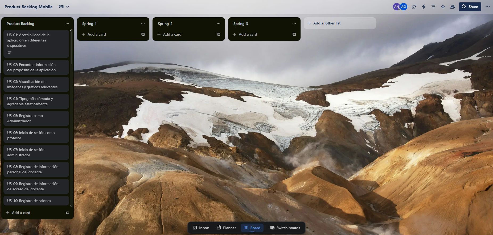
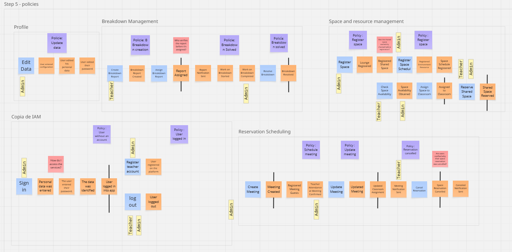
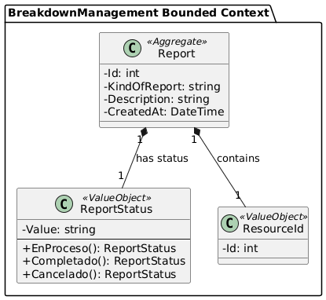

# Capítulo II: Requirements Elicitation & Analysis

## 2.1. Competidores

En esta sección tiene como objetivo, identificar cuales son los principales competidores directos con modelos de negocios fundamentados en productos digitales afines, o en su caso, competidores indirectos que ofrecen soluciones parcialmente comparables.

- **Facilio**: Es una plataforma de gestión de instalaciones que centraliza la
  operación y mantenimiento de edificios en una única interfaz. Ofrece soluciones
  para la gestión de activos, mantenimiento preventivo, monitoreo de energía y
  análisis de datos en tiempo real. Facilio se distingue por su enfoque en la
  eficiencia operativa y la sostenibilidad, lo que lo convierte en un
  competidor directo en la gestión integral de infraestructuras educativas.
  https://facilio.com/
- **FMX (Facilities Management eXpress)**: Es un software de gestión de instalaciones que proporciona herramientas
  para la programación de espacios, gestión de mantenimiento, inventarios, y órdenes
  de trabajo. Su interfaz intuitiva y su enfoque en la facilidad de uso lo hacen
  atractivo para instituciones educativas que buscan optimizar la administración de
  sus recursos y mejorar la coordinación del personal.https://www.gofmx.com/
- **Archibus**: es una plataforma completa de gestión de instalaciones que abarca desde
  la gestión de espacios y activos hasta el mantenimiento y la planificación de recursos.
  Es utilizada por grandes instituciones para mejorar la eficiencia en la gestión de
  infraestructuras, optimizando tanto el uso de espacios como la administración de inventarios
  y servicios. https://archibus.com/

### 2.1.1. Análisis competitivo

En esta sección se presenta el análisis competitivo realizado por el equipo de Vehix, en el cual se identifican y evalúan tres competidores principales. Este análisis permite establecer un marco de referencia para comprender el entorno del mercado y así formular estrategias que nos permitan posicionar mejor nuestra solución frente a la competencia.

<table border="1" cellpadding="10" cellspacing="0" style="margin-left: auto; margin-right: auto;">
  <tr>
    <th colspan="6">Competitive Analysis Landscape</th>
  </tr>
  <tr>
    <td colspan="2" rowspan="2">¿Por qué llevar a cabo este análisis?</td>
    <td colspan="4">Escriba en el recuadro la pregunta que busca responder o el objetivo de este análisis.</td>
  </tr>
  <tr>
    <td colspan="4">Texto</td>
  </tr>
  <tr>
   <td colspan="2">(En la cabecera colocar por cada competidor nombre y logo)</td>
    <td>EduSpace   </td>
    <td>Facilio  </td>
    <td>FMX  </td>
    <td>Archibus  </td> 
  </tr>
  <tr>
    <td rowspan="2">Perfil</td>
    <td>Overview</td>
    <td>EduSpace es una plataforma enfocada en la gestión integral de espacios educativos, 
      mejorando la coordinación del personal, la comunicación interna y el control de 
      inventarios y recursos.</td>
    <td>Facilio es una solución para la operación y mantenimiento centralizado de edificios, 
      optimizando la eficiencia y la sostenibilidad en la gestión de instalaciones.</td>
    <td>FMX proporciona herramientas para la gestión de instalaciones educativas, facilitando 
      la programación de espacios, mantenimiento, y la gestión de inventarios.</td>
    <td>Archibus es una plataforma completa para la gestión de instalaciones, enfocada en la 
      optimización del uso de espacios, activos y recursos.</td>
  </tr>
  <tr>
    <td>Ventaja competitiva ¿Qué valor ofrece a los clientes?</td>
    <td>Ofrece una solución integral específica para instituciones educativas, incluyendo 
      la automatización de cálculos salariales y un control detallado de inventarios.</td>
    <td>Enfoque en la sostenibilidad y eficiencia operativa, con capacidades avanzadas de 
      análisis de datos en tiempo real.</td>
    <td>Interfaz intuitiva y facilidad de uso, con un fuerte enfoque en la programación y 
      mantenimiento de espacios educativos.</td>
    <td>Capacidad de integrar múltiples aspectos de la gestión de instalaciones en una 
      única plataforma, ampliamente utilizada por grandes instituciones.</td>
  </tr>
  <tr>
    <td rowspan="2">Perfil de Marketing</td>
    <td>Mercado objetivo</td>
    <td>Instituciones educativas con grandes y pequeñas infraestructuras que buscan optimizar la 
      gestión de sus espacios y recursos.</td>
    <td>Grandes empresas e instituciones que buscan centralizar la gestión de sus 
      instalaciones con un enfoque en sostenibilidad.</td>
    <td>Instituciones educativas y organizaciones que requieren soluciones fáciles de 
      usar para la gestión de instalaciones.</td>
    <td>Grandes instituciones y empresas que necesitan una solución completa para la 
      gestión de sus instalaciones y recursos.</td>
  </tr>
  <tr>
    <td>Estrategias de marketing</td>
    <td>Marketing dirigido a administradores de grandes y de pequeñas instituciones educativas, destacando 
      la eficiencia y el control exhaustivo de recursos.</td>
    <td>Enfoque en la sostenibilidad y la eficiencia, con campañas dirigidas a administradores 
      de instalaciones y responsables de sostenibilidad.</td>
    <td>Enfoque en la simplicidad y efectividad, con marketing dirigido a usuarios que buscan 
      facilidad de uso en la gestión de instalaciones.</td>
    <td>Campañas dirigidas a grandes organizaciones que necesitan una solución robusta y completa 
      para la gestión de sus instalaciones.</td>
  </tr>
  <tr>
    <td rowspan="3">Perfil de Producto</td>
    <td>Productos & Servicios</td>
    <td>Gestión de espacios educativos, automatización de cálculos salariales, control de 
      inventarios, y comunicación interna.</td>
    <td>Gestión de instalaciones, análisis de datos en tiempo real, monitoreo de energía, y 
      mantenimiento preventivo.</td>
    <td>Gestión de espacios, mantenimiento preventivo, seguimiento de órdenes de trabajo, y 
      gestión de inventarios.</td>
    <td>Gestión de espacios y activos, planificación de recursos, mantenimiento, y 
      administración de servicios.</td>
  </tr>
  <tr>
    <td>Precios & Costos</td>
    <td>Planes de suscripción, basados en la escala de la institución educativa y el 
      número de funcionalidades utilizadas. </td>
    <td>Precios basados en suscripciones, ajustados según la cantidad de instalaciones y 
      funcionalidades requeridas.</td>
    <td>Planes de suscripción con diferentes niveles de servicio, ajustados según el tamaño 
      de la institución y sus necesidades.</td>
    <td>Precios personalizados basados en la escala y complejidad de la implementación para 
      grandes organizaciones.</td>
  </tr>
  <tr>
    <td>Canales de distribución (Web y/o Móvil)</td>
    <td>Plataforma web y móvil.</td>
    <td>Plataforma web con soporte para aplicaciones móviles y monitoreo en tiempo real.</td>
    <td>Plataforma web con una interfaz accesible desde dispositivos móviles.</td>
    <td>Plataforma web con soluciones móviles para acceso y gestión remota.</td>
  </tr>
  <tr>
    <td rowspan="5">Analisis SWOT</td>
    <td colspan="5">Realice esto para su startup y sus competidores. Sus fortalezas deberían apoyar sus
    oportunidades y contribuir a lo que ustedes definen como su posible ventaja
    competitiva. </td>
  </tr>
 <tr>
    <td>Fortalezas</td>
    <td>Especialización en la gestión de espacios educativos, con características adaptadas a 
      las necesidades del sector.</td>
    <td>Fuerte enfoque en sostenibilidad y eficiencia operativa, con capacidades avanzadas de 
      monitoreo y análisis.</td>
    <td>Facilidad de uso y enfoque claro en la gestión de instalaciones educativas, con una 
      interfaz intuitiva.</td>
    <td>Plataforma robusta y ampliamente reconocida, con una amplia gama de funcionalidades 
      para grandes instituciones.</td>
  </tr>
  <tr>
    <td>Debilidades</td>
    <td>Foco limitado en el sector educativo, lo que podría restringir la expansión a otros mercados.</td>
    <td>Puede ser percibido como complejo para pequeñas instituciones debido a su enfoque en 
      grandes infraestructuras.</td>
    <td>Limitaciones en la personalización avanzada para usuarios con necesidades muy específicas.</td>
    <td>Costos elevados y complejidad de implementación, lo que puede ser una barrera para 
      pequeñas y medianas instituciones.</td>
  </tr>
  <tr>
    <td>Oportunidades</td>
    <td>Expansión a otras áreas dentro del sector educativo, como la gestión de recursos 
      tecnológicos y de TI.</td>
    <td>Crecer en mercados emergentes que buscan soluciones sostenibles y eficientes para 
      la gestión de instalaciones.</td>
    <td>Expandir la oferta a otras industrias que valoran la simplicidad y la eficiencia 
      en la gestión de instalaciones.</td>
    <td>Integración con nuevas tecnologías emergentes para mejorar aún más la eficiencia 
      y la sostenibilidad en la gestión de instalaciones.</td>
  </tr>
  <tr>
    <td>Amenazas</td>
    <td>Competencia de plataformas más generales que podrían agregar funcionalidades educativas.</td>
    <td>Riesgo de que otras soluciones más económicas capten el interés de pequeñas instituciones.</td>
    <td>Competencia con plataformas que ofrecen soluciones más completas a precios competitivos.</td>
    <td>Rápido avance tecnológico que podría hacer obsoleta parte de su oferta actual si no se actualiza con regularidad.</td>
  </tr>
</table>

### 2.1.2. Estrategias y tácticas frente a competidores

En esta sección se examinarán las estrategias y tácticas que se implementarán para capitalizar las debilidades de la competencia y hacer frente a sus fortalezas. Asimismo, se abordarán las amenazas y oportunidades que presentan los competidores.

1. Estrategias para Aprovechar las Fortalezas de EduSpace

- **Especialización en el Sector Educativo**: Desarrollar contenido
  de marketing y estudios de caso específicos para instituciones
  educativas. Organizar webinars y eventos educativos que demuestren
  cómo EduSpace aborda los desafíos particulares del sector.

- **Automatización de Cálculos Salariales y Control de Inventarios**:
  Promocionar estas características en campañas de marketing y
  presentaciones a clientes potenciales. Crear tutoriales y
  demostraciones que muestren cómo estas funciones simplifican la
  gestión y ahorran tiempo.

2. Estrategias para Enfrentar las Debilidades de EduSpace

- **Foco Limitado en el Sector Educativo**: Explorar oportunidades para
  adaptar y expandir la plataforma a otros sectores que también
  requieran gestión de espacios y recursos, como el sector de
  servicios o el corporativo.

- **Competencia con Soluciones Generales**: Resaltar la especialización de
  EduSpace en la gestión de espacios educativos en comparación con
  plataformas más generales. Enfatizar cómo las características
  específicas de EduSpace están diseñadas para resolver
  problemas únicos en instituciones educativas.

3. Estrategias para Aprovechar las Oportunidades

- **Expansión a Otras Áreas del Sector Educativo**: Investigar y desarrollar nuevas
  funcionalidades que puedan ser útiles para la gestión de recursos tecnológicos
  y de TI dentro de las instituciones educativas. Mantenerse actualizado con las
  tendencias en tecnología educativa para integrar nuevas características relevantes.

- **Crecer en Mercados Emergentes**: Adaptar la plataforma a múltiples idiomas y
  ajustarla a las necesidades locales de los mercados emergentes. Crear
  estrategias de entrada específicas para estos mercados, incluyendo
  asociaciones con proveedores locales y campañas de concienciación.

4. Estrategias para Mitigar las Amenazas

- **Competencia de Plataformas Generales y Económicas**: Diferenciarse mediante
  una propuesta de valor clara que destaque la especialización y las
  funcionalidades avanzadas de EduSpace. Ofrecer demostraciones personalizadas
  para mostrar el valor añadido frente a nuestro plan premium.
- **Rápido Avance Tecnológico**: Crear un ciclo de feedback continuo con los
  usuarios para identificar áreas de mejora y priorizar actualizaciones
  basadas en sus necesidades y en las últimas innovaciones tecnológicas.

## 2.2. Entrevistas

En esta sección se realiza la investigación y la recolección de información a traves de las entrevistas de los usuarios para cada segmento objetivo, con el fin de conocer mejor a nuestros segmentos.

### 2.2.1. Diseño de entrevistas

En esta sección realizamos preguntas principales y complementarias para entrevistas dirigidas a cada uno de nuestros seegmentos objetivos, con el fin de recaudar la mayor cantidad de información necesaria.
Después de un análisis exhaustivo, se realizaron las siguientes preguntas para entrevistar a los siguientes segmentos objetivos.

<b> Segmento 1: Administradores de instituciones educativas</b>

#### **Preguntas Objetivas:**

##### **Características Demográficas:**

1. ¿Cuántos años tienes?
2. ¿En qué distrito o localidad resides?
3. ¿Cuál es tu estado civil?
4. ¿Cuál es tu ocupación específica dentro de la institución educativa?

##### **Ocupación y Responsabilidades:**

5. ¿Cuáles son tus principales responsabilidades en la institución?
6. ¿Cuántas personas forman parte de tu equipo y qué roles desempeñan?
7. ¿Con qué frecuencia necesitas gestionar el inventario de equipos y recursos?

##### **Uso de Tecnología:**

8. ¿Qué dispositivos móviles (smartphone, tablet) utilizas más para tu trabajo? ¿Cuál es el sistema operativo de tu teléfono (iOS o Android)?
9. ¿Qué aplicaciones o herramientas usas actualmente en tu móvil para organizar o gestionar tareas laborales?

#### **Preguntas Subjetivas:**

##### **Personalidad y Habilidades:**

10. ¿Cuáles consideras que son tus principales habilidades en la administración de recursos y personal?

##### **Objetivos y Frustraciones:**

11. ¿Qué objetivos tienes al gestionar los recursos y personal en la institución?
12. ¿Cuáles son los mayores desafíos que enfrentas en tu rol actual?
13. ¿Qué aspectos de la gestión de equipos y recursos encuentras más frustrantes?

##### **Preferencias y Canales Digitales:**

14. Si tuvieras una aplicación móvil para tu trabajo, ¿qué tareas te gustaría que pudieras hacer de forma más rápida y sencilla, incluso cuando no estás en tu escritorio?

##### **Visión del Futuro:**

15. ¿Cómo te gustaría que evolucionara el sistema actual de gestión de ambientes y personal?
16. ¿Qué cambios o mejoras te gustaría ver en la gestión administrativa?

<b> Segmento 2: Docentes y auxiliares</b>

#### **Preguntas Objetivas:**

##### **Características Demográficas:**

1. ¿Cuántos años tienes?
2. ¿En qué distrito o localidad resides?
3. ¿Cuál es tu estado civil?
4. ¿Cuál es tu ocupación específica dentro de la institución educativa?

##### **Ocupación y Responsabilidades:**

5. ¿Qué materias o cursos enseñas?
6. ¿Con qué frecuencia necesitas registrar reportes de averías o gestionar cambios de aula?
7. ¿Qué tipo de recursos utilizas más frecuentemente en tu aula?

##### **Uso de Tecnología:**

8. ¿Qué dispositivos móviles (smartphone, tablet) utilizas más para tu trabajo? ¿Cuál es el sistema operativo de tu teléfono (iOS o Android)?
9. ¿Qué aplicaciones o herramientas usas actualmente para gestionar tus clases o para comunicarte con la administración?

#### **Preguntas Subjetivas:**

##### **Personalidad y Habilidades:**

10. ¿Cómo describirías tu estilo de enseñanza y gestión en el aula?
11. ¿Qué habilidades consideras cruciales para tu rol como docente en relación con la gestión de recursos y espacios?

##### **Objetivos y Frustraciones:**

11. ¿Qué objetivos tienes en tu rol como docente en relación con la gestión de equipos y recursos?
12. ¿Cuáles son los mayores desafíos que enfrentas en la gestión de equipos y recursos en el aula?
13. ¿Qué aspectos de la administración y registro de recursos encuentras más frustrantes?

##### **Preferencias y Canales Digitales:**

14. ¿Cómo te gustaría que una aplicación móvil te ayudara a simplificar los procesos de solicitud de recursos o cambios de aula?

##### **Visión del Futuro:**

15. ¿Cómo te gustaría que evolucionara el sistema actual para facilitar tu trabajo?
16. ¿Qué cambios o mejoras crees que serían más beneficiosos para ti en la gestión de recursos y espacios?

### 2.2.2. Registro de entrevistas

En esta sección presentamos los registros de las entrevistas que realizamos para cada uno de nuestro segmento objectivo.

A continuación, se presentarán las entrevistas realizadas, desarrollando un resumen de cada una, extrayendo las respuestas e identificando las características objetivas y subjetivas.

link del video: 

**Segmento 1: Administradores de instituciones educativas**

Entrevista 1:

[00:00 - 04:48]

Duración: 4 minutos 48 segundos

Link de la entrevista:https://upcedupe-my.sharepoint.com/personal/u202315283_upc_edu_pe/_layouts/15/stream.aspx?id=%2Fpersonal%2Fu202315283_upc_edu_pe%2FDocuments%2Fupc-pre-202502-cc238-12617-Eduspace-needfinding-sprint-1%2Emp4&nav=eyJyZWZlcnJhbEluZm8iOnsicmVmZXJyYWxBcHAiOiJPbmVEcml2ZUZvckJ1c2luZXNzIiwicmVmZXJyYWxBcHBQbGF0Zm9ybSI6IldlYiIsInJlZmVycmFsTW9kZSI6InZpZXciLCJyZWZlcnJhbFZpZXciOiJNeUZpbGVzTGlua0NvcHkifX0&nav=eyJyZWZlcnJhbEluZm8iOnsicmVmZXJyYWxBcHAiOiJPbmVEcml2ZUZvckJ1c2luZXNzIiwicmVmZXJyYWxBcHBQbGF0Zm9ybSI6IldlYiIsInJlZmVycmFsTW9kZSI6InZpZXciLCJyZWZlcnJhbFZpZXciOiJNeUZpbGVzTGlua0NvcHkifX0&ga=1

Nombre: Paola

Apellidos: Alejandra Schmidt

Edad: 55 años

Distrito: Magdalena

resumen: Alejandra se encarga de todo lo que tiene que ver con poder orgizaniar y comuncar intereses de la institución educativa.Normalmente cada 15 dias gestiona enventario . Ella usa más apple además usa 
whatsapp para comunicarse . Sus principales habilidades es planificar y poner en accion los objetivos trazados. El principal objetivo de ella es tener una comunicacion clara con todo el centro educativo . 
El mayor problema es que no hay tanta comunicación como ella quisiera y que no todos están presentes .

Entrevista 2:

[04:48 - 10:04]

Duración: 5 minutos 14 segundos

Link de la entrevista:https://upcedupe-my.sharepoint.com/personal/u202315283_upc_edu_pe/_layouts/15/stream.aspx?id=%2Fpersonal%2Fu202315283_upc_edu_pe%2FDocuments%2Fupc-pre-202502-cc238-12617-Eduspace-needfinding-sprint-1%2Emp4&nav=eyJyZWZlcnJhbEluZm8iOnsicmVmZXJyYWxBcHAiOiJPbmVEcml2ZUZvckJ1c2luZXNzIiwicmVmZXJyYWxBcHBQbGF0Zm9ybSI6IldlYiIsInJlZmVycmFsTW9kZSI6InZpZXciLCJyZWZlcnJhbFZpZXciOiJNeUZpbGVzTGlua0NvcHkifX0&nav=eyJyZWZlcnJhbEluZm8iOnsicmVmZXJyYWxBcHAiOiJPbmVEcml2ZUZvckJ1c2luZXNzIiwicmVmZXJyYWxBcHBQbGF0Zm9ybSI6IldlYiIsInJlZmVycmFsTW9kZSI6InZpZXciLCJyZWZlcnJhbFZpZXciOiJNeUZpbGVzTGlua0NvcHkifX0&ga=1

Nombre: Jaime

Apellidos: Rafael Fernandez

Edad: 58 años

Distrito: Chorrillos
resumen:  Jaime nos comenta que el se ocupa de gestionar todo las necesidades que ocupa la institución educativa. Tambien que cada trimestre ocupa gestionar o cambiar ipads. Usa más su laptop para trabajar y usa aplicaciones como power point,excel,etc para apoyarse a tener una mejor gestión.El se considera una persona ordenada y responsable.Sus mayores desafios son el poder adaptarse a la tecnologia actual y poder comprender a los alumnos.

Entrevista 3:

[10:03 - 14:15]

Duración: 4 minutos 12 segundos

Link de la entrevista: https://upcedupe-my.sharepoint.com/personal/u202315283_upc_edu_pe/_layouts/15/stream.aspx?id=%2Fpersonal%2Fu202315283_upc_edu_pe%2FDocuments%2Fupc-pre-202502-cc238-12617-Eduspace-needfinding-sprint-1%2Emp4&nav=eyJyZWZlcnJhbEluZm8iOnsicmVmZXJyYWxBcHAiOiJPbmVEcml2ZUZvckJ1c2luZXNzIiwicmVmZXJyYWxBcHBQbGF0Zm9ybSI6IldlYiIsInJlZmVycmFsTW9kZSI6InZpZXciLCJyZWZlcnJhbFZpZXciOiJNeUZpbGVzTGlua0NvcHkifX0&nav=eyJyZWZlcnJhbEluZm8iOnsicmVmZXJyYWxBcHAiOiJPbmVEcml2ZUZvckJ1c2luZXNzIiwicmVmZXJyYWxBcHBQbGF0Zm9ybSI6IldlYiIsInJlZmVycmFsTW9kZSI6InZpZXciLCJyZWZlcnJhbFZpZXciOiJNeUZpbGVzTGlua0NvcHkifX0&ga=1

Nombre: Ariana

Apellidos: Yasan Laredo

Edad: 23 años

Distrito: San Juan de Miraflores

Resumen: Yasan es admnistradora de la insitrución academica.Ella nos indica que se fuestra y estresa cuando no cuadra el dinero .Tambien cuando trata de hablar con areas diferentes  pero no la entienden bien .Le gustaría poder gestionar de una manera más facil y sencilla desde la comonidad de su celular sin necesidad de ir a la oficina

**Segmento 2: Docentes y auxiliares**

Entrevista 4:

[14:15 - 19:40]

Duración: 5 minutos 25 segundos

Link de la entrevista: https://upcedupe-my.sharepoint.com/personal/u202315283_upc_edu_pe/_layouts/15/stream.aspx?id=%2Fpersonal%2Fu202315283_upc_edu_pe%2FDocuments%2Fupc-pre-202502-cc238-12617-Eduspace-needfinding-sprint-1%2Emp4&nav=eyJyZWZlcnJhbEluZm8iOnsicmVmZXJyYWxBcHAiOiJPbmVEcml2ZUZvckJ1c2luZXNzIiwicmVmZXJyYWxBcHBQbGF0Zm9ybSI6IldlYiIsInJlZmVycmFsTW9kZSI6InZpZXciLCJyZWZlcnJhbFZpZXciOiJNeUZpbGVzTGlua0NvcHkifX0&nav=eyJyZWZlcnJhbEluZm8iOnsicmVmZXJyYWxBcHAiOiJPbmVEcml2ZUZvckJ1c2luZXNzIiwicmVmZXJyYWxBcHBQbGF0Zm9ybSI6IldlYiIsInJlZmVycmFsTW9kZSI6InZpZXciLCJyZWZlcnJhbFZpZXciOiJNeUZpbGVzTGlua0NvcHkifX0&ga=1

Nombre: Manuel Alejandro

Apellidos: Molina Vasquez

Edad: 22 años

Distrito: San Martin de Porres

Resumen:El entrevistado nos indica que trabaja de docente en trilce dictando los cursos como algreba,geometria. Nos comenta que se comunica a través de la aplicación whatsapp para cualquier caso de cambio de salón o gestionar alguna otra area.Sin embargo no siempre responden rapido por lo que le gustaría gestionar rapido y tener las confirmaciones lo más rapido posible .

Entrevista 5:

[19:40 - 26:40]

Duración: 7 minutos

Link de la entrevista: https://upcedupe-my.sharepoint.com/personal/u202315283_upc_edu_pe/_layouts/15/stream.aspx?id=%2Fpersonal%2Fu202315283_upc_edu_pe%2FDocuments%2Fupc-pre-202502-cc238-12617-Eduspace-needfinding-sprint-1%2Emp4&nav=eyJyZWZlcnJhbEluZm8iOnsicmVmZXJyYWxBcHAiOiJPbmVEcml2ZUZvckJ1c2luZXNzIiwicmVmZXJyYWxBcHBQbGF0Zm9ybSI6IldlYiIsInJlZmVycmFsTW9kZSI6InZpZXciLCJyZWZlcnJhbFZpZXciOiJNeUZpbGVzTGlua0NvcHkifX0&nav=eyJyZWZlcnJhbEluZm8iOnsicmVmZXJyYWxBcHAiOiJPbmVEcml2ZUZvckJ1c2luZXNzIiwicmVmZXJyYWxBcHBQbGF0Zm9ybSI6IldlYiIsInJlZmVycmFsTW9kZSI6InZpZXciLCJyZWZlcnJhbFZpZXciOiJNeUZpbGVzTGlua0NvcHkifX0&ga=1

Nombre:Fabrizio

Apellidos: Recoba

Edad: 25 años

Distrito: Surco

Resumen:enseña filosifia e historia.El nos comenta que para registrar problemas del 1 al 10 es un 8 . Normalmente usa block de notas o plumos pero a veces usa su laptop. El usa su laptop para el trabajo y a veces su celular . Tiene un android commo sistema operativo y tambien un ios.Se le complica usar los materiales porque algunas cosas no funcionan como tal. Tambien al momento de gestionar los recursos de aulas se le complica.

Entrevista 6:

[26:40 - 35:54]

Duración: 7 minutos

Link de la entrevista: https://upcedupe-my.sharepoint.com/personal/u202315283_upc_edu_pe/_layouts/15/stream.aspx?id=%2Fpersonal%2Fu202315283_upc_edu_pe%2FDocuments%2Fupc-pre-202502-cc238-12617-Eduspace-needfinding-sprint-1%2Emp4&nav=eyJyZWZlcnJhbEluZm8iOnsicmVmZXJyYWxBcHAiOiJPbmVEcml2ZUZvckJ1c2luZXNzIiwicmVmZXJyYWxBcHBQbGF0Zm9ybSI6IldlYiIsInJlZmVycmFsTW9kZSI6InZpZXciLCJyZWZlcnJhbFZpZXciOiJNeUZpbGVzTGlua0NvcHkifX0&nav=eyJyZWZlcnJhbEluZm8iOnsicmVmZXJyYWxBcHAiOiJPbmVEcml2ZUZvckJ1c2luZXNzIiwicmVmZXJyYWxBcHBQbGF0Zm9ybSI6IldlYiIsInJlZmVycmFsTW9kZSI6InZpZXciLCJyZWZlcnJhbFZpZXciOiJNeUZpbGVzTGlua0NvcHkifX0&ga=1

Nombre: Renzo 

Apellidos: Calvo Yalan

Edad: 32 años

Distrito: Barranco

Resumen:
El entrevistado nos indica su perpectiva que es la de un docente universitario .Dicta cursos de la carrera de medicina humana y nos indica que en donde el trabaja los alumnos pueden acceder a ipads que presta la universidad , tambien que se fustra cada vez que el lecra no funciona . Su enseñanza es didactica y le gusta que sus alumnos le hagan preguntas y que investiguen .

### 2.2.3. Análisis de entrevistas

En esta sección se realiza el análisis de cada entrevista para cada segmento objetivo. Con el fin de obtener información para el desarrollo de nuestra aplicación. A continuación, se presenarán los análisis de entrevistas, los cuáles han sido hechos recaudando la información de las entrevistas previamente realizadas.

## 2.3. Needfinding

Con el fin de desarrollar un producto alineado con las necesidades específicas del cliente, nos hemos enfocado e identificar los User Persona, la User Task Matrix, los User Journey Maps y el Empathy Mapping.

### 2.3.1. User Personas

A partir del análisis de entrevistas y la recolección de información sobre las dinámicasen las instituciones educativas, se identificaron los principales perfiles de usuarios que interactúan directamente con la solución Veyra.EduSpace Estos perfiles representan los segmentos clave para el sistema, ya que concentran tanto la necesidad de gestión operativa como en tiempo real . La construcción de los User Persona permite al equipo de desarrollo comprender mejor sus motivaciones, frustraciones y hábitos, lo que resulta esencial para diseñar funcionalidades adecuadas y experiencias de usuario efectivas.
##  Segmento 1:

##  Segmento 2:

### 2.3.2. User Task Matrix

En esta sección, se presentan las tareas principales que los User Personas (Ariana Yasan, Administradora de Universidad, y Renzo Calvo, docente universitario) realizan para cumplir sus objetivos dentro del sector educativo en Lima, Perú. Es importante destacar que las tareas mencionadas no dependen de ninguna solución de software en particular, sino que reflejan las actividades que cada segmento realiza de manera habitual en sus procesos de producción y distribución de vinos.
<h2>User Task Matrix : Ariana Yasan (Administradora)</h2>
<table>
    <thead>
        <tr>
            <th>User Task</th>
            <th>Frecuencia</th>
            <th>Importancia</th>
        </tr>
    </thead>
    <tbody>
        <tr>
            <td>Monitorear el inventario en tiempo real</td>
            <td>Alta</td>
            <td>Alta</td>
        </tr>
        <tr>
            <td>Recibir notificaciones inmediatas</td>
            <td>Alta</td>
            <td>Alta</td>
        </tr>
        <tr>
            <td>Coordinar recursos y áreas desde el celular</td>
            <td>Alta</td>
            <td>Alta</td>
        </tr>
        <tr>
            <td>Aprobar solicitudes de recursos</td>
            <td>Media</td>
            <td>Alta</td>
        </tr>
        <tr>
            <td>Gestionar presupuesto de aulas y materiales</td>
            <td>Media</td>
            <td>Alta</td>
        </tr>
        <tr>
            <td>Supervisar entrega de materiales</td>
            <td>Alta</td>
            <td>Alta</td>
        </tr>
        <tr>
            <td>Organizar horarios y disponibilidad de espacios</td>
            <td>Media</td>
            <td>Media</td>
        </tr>
        <tr>
            <td>Reportar incidencias de equipos o aulas</td>
            <td>Media</td>
            <td>Media</td>
        </tr>
    </tbody>
</table>

<h2>User Task Matrix : Renzo Calvo (Docente Universitario)</h2>
<table>
    <thead>
        <tr>
            <th>User Task</th>
            <th>Frecuencia</th>
            <th>Importancia</th>
        </tr>
    </thead>
    <tbody>
        <tr>
            <td>Reserva de espacios/aulas</td>
            <td>Alta</td>
            <td>Alta</td>
        </tr>
        <tr>
            <td>Registro y solicitud de cambio de aula</td>
            <td>Media</td>
            <td>Alta</td>
        </tr>
        <tr>
            <td>Acceso a recursos del salón (equipos, materiales)</td>
            <td>Alta</td>
            <td>Alta</td>
        </tr>
        <tr>
            <td>Recepción de notificaciones inmediatas</td>
            <td>Alta</td>
            <td>Alta</td>
        </tr>
        <tr>
            <td>Planificación de clases</td>
            <td>Alta</td>
            <td>Alta</td>
        </tr>
        <tr>
            <td>Reportar fallas de equipos</td>
            <td>Media</td>
            <td>Media</td>
        </tr>
        <tr>
            <td>Consulta de disponibilidad de aulas/espacios</td>
            <td>Alta</td>
            <td>Alta</td>
        </tr>
        <tr>
            <td>Equilibrar gestión de aulas con carga laboral</td>
            <td>Media</td>
            <td>Alta</td>
        </tr>
    </tbody>
</table>

### 2.3.3. User Journey Mapping

### 2.3.4. Empathy Mapping

### 2.3.5. Ubiquitous Language
<dl>
    <dt>Classroom (Aula)</dt>
    <dd>Espacio destinado a la realización de clases presenciales o actividades académicas; incluye atributos como nombre, capacidad y equipamiento asociado.</dd>
    <dt>Shared Area (Área compartida)</dt>
    <dd>Espacio común utilizado por varios grupos o departamentos (por ejemplo biblioteca, laboratorio, sala polivalente) que puede reservarse o gestionarse centralmente.</dd>
    <dt>Resource (Recurso)</dt>
    <dd>Elemento físico o material disponible para uso en un espacio (proyector, computador, impresora, mobiliario) o recurso digital vinculado al uso educativo.</dd>
    <dt>Teacher (Profesor)</dt>
    <dd>Persona responsable de impartir una asignatura o actividad en un aula; su rol puede asociarse a horarios, asignaciones y permisos sobre espacios.</dd>
    <dt>Student (Estudiante)</dt>
    <dd>Usuario final del servicio educativo que asiste a actividades académicas; su presencia puede influir en la ocupación de espacios y en la demanda de recursos.</dd>
    <dt>Reservation (Reserva)</dt>
    <dd>Acción por la cual un usuario o responsable solicita y bloquea el uso de un espacio o recurso para una franja horaria específica.</dd>
    <dt>Booking (Reserva / Reserva de espacio)</dt>
    <dd>Término equivalente a "Reservation" usado para indicar la confirmación formal de uso de un espacio o recurso en una fecha y hora determinadas.</dd>
    <dt>Schedule (Horario / Programación)</dt>
    <dd>Conjunto de franjas temporales asignadas a actividades, clases o reservas que determinan cuándo un espacio o recurso está ocupado o disponible.</dd>
    <dt>Capacity (Capacidad)</dt>
    <dd>Número máximo de personas que un espacio puede alojar de forma segura y funcional, considerado para asignación de aulas y planificación.</dd>
    <dt>Availability (Disponibilidad)</dt>
    <dd>Estado que indica si un espacio o recurso puede ser usado en una franja horaria concreta; depende de reservas previas, mantenimiento u otras restricciones.</dd>
    <dt>Inventory (Inventario)</dt>
    <dd>Listado y registro de activos y recursos físicos disponibles en la institución, incluyendo cantidades, ubicaciones y estado general.</dd>
    <dt>Asset (Activo)</dt>
    <dd>Bien tangible propiedad de la institución (equipos, muebles, máquinas) que forma parte del inventario y requiere gestión de ciclo de vida.</dd>
    <dt>Maintenance (Mantenimiento)</dt>
    <dd>Conjunto de actividades para conservar, reparar o restaurar el funcionamiento de un activo o recurso, buscando minimizar fallas y prolongar vida útil.</dd>
    <dt>Preventive Maintenance (Mantenimiento preventivo)</dt>
    <dd>Acciones programadas y planificadas realizadas periódicamente para prevenir fallos antes de que ocurran (inspecciones, limpieza, calibraciones).</dd>
    <dt>Incident (Incidente)</dt>
    <dd>Evento no planificado que altera el funcionamiento normal de un espacio o recurso (avería, daño, fallo operativo) y requiere atención o reparación.</dd>
    <dt>Report (Reporte / Informe)</dt>
    <dd>Documento o registro que describe un incidente, su contexto y datos relevantes (fecha, recurso afectado, descripción) para su gestión y seguimiento.</dd>
    <dt>Work Order (Orden de trabajo)</dt>
    <dd>Solicitud formal para ejecutar una tarea de mantenimiento o reparación; incluye instrucciones, prioridad y responsable asignado.</dd>
    <dt>Downtime (Tiempo de inactividad)</dt>
    <dd>Período durante el cual un recurso o espacio no está operativo o disponible debido a fallas, mantenimiento o restricción de uso.</dd>
    <dt>Occupancy (Ocupación)</dt>
    <dd>Métrica o condición que indica cuántas personas están presentes en un espacio en un momento determinado, útil para control y planificación.</dd>
    <dt>Accessibility (Accesibilidad)</dt>
    <dd>Condición que asegura que un espacio o recurso pueda ser utilizado por personas con distintas capacidades, incluyendo cumplimiento de normativas y facilidades físicas.</dd>
    <dt>Service Request (Solicitud de servicio)</dt>
    <dd>Petición realizada por un usuario para recibir soporte, mantenimiento o atención sobre un recurso o espacio (por ejemplo: limpieza, reparación menor).</dd>
    <dt>Lifecycle (Ciclo de vida)</dt>
    <dd>Conjunto de etapas por las que pasa un activo o recurso desde su adquisición hasta su disposición final (compra, uso, mantenimiento, baja).</dd>
    <dt>Stakeholder (Parte interesada)</dt>
    <dd>Persona o grupo con interés directo en la gestión de espacios y recursos (administración, docentes, estudiantes, personal de mantenimiento, proveedores).</dd>
    <dt>Compliance (Cumplimiento)</dt>
    <dd>Conformidad con normativas, políticas internas y requisitos legales aplicables a instalaciones, seguridad y accesibilidad.</dd>
  </dl>
## 2.4. Requirements specification

### 2.4.1 User Stories

**Epics:**

<table style="width:100%; border-collapse: collapse;">
  <tr>
    <td style="border: 1px solid black; padding: 8px;">Story ID</td>
    <td style="border: 1px solid black; padding: 8px;">User</td>
    <td style="border: 1px solid black; padding: 8px;">Priority</td>
    <td style="border: 1px solid black; padding: 8px;">Epic</td>
  </tr>
  <tr>
    <td style="border: 1px solid black; padding: 8px; text-align: center;">1</td>
    <td style="border: 1px solid black; padding: 8px; text-align: center;"></td>
    <td style="border: 1px solid black; padding: 8px; text-align: center;"></td>
    <td style="border: 1px solid black; padding: 8px; text-align: center;">EP-01</td>
  </tr>
  <tr>
    <td style="border: 1px solid black; padding: 8px;">Title</td>
    <td colspan="3" style="border: 1px solid black; padding: 8px;">Accesibilidad de la Landing Page</td>
  </tr>
  <tr>
    <td colspan="4" style="border: 1px solid black; padding: 8px;">Description</td>
  </tr>
  <tr>
    <td colspan="4" style="border: 1px solid black; padding: 8px;">Como visitante de la landing page, quiero que la información sobre la aplicación sea fácil de entender para poder comprender rápidamente su propósito.</td>
  </tr>
  <tr>
    <td colspan="4" style="border: 1px solid black; padding: 8px; text-align: center;">Criterios de Aceptación</td>
  </tr>
  <tr>
    <td colspan="4" style="border: 1px solid black; padding: 8px;"></td>
  </tr>
</table>

<table style="width:100%; border-collapse: collapse;">
  <tr>
    <td style="border: 1px solid black; padding: 8px;">Story ID</td>
    <td style="border: 1px solid black; padding: 8px;">User</td>
    <td style="border: 1px solid black; padding: 8px;">Priority</td>
    <td style="border: 1px solid black; padding: 8px;">Epic</td>
  </tr>
  <tr>
    <td style="border: 1px solid black; padding: 8px; text-align: center;">2</td>
    <td style="border: 1px solid black; padding: 8px; text-align: center;"></td>
    <td style="border: 1px solid black; padding: 8px; text-align: center;"></td>
    <td style="border: 1px solid black; padding: 8px; text-align: center;">EP-02</td>
  </tr>
  <tr>
    <td style="border: 1px solid black; padding: 8px;">Title</td>
    <td colspan="3" style="border: 1px solid black; padding: 8px;">	Interfaz de la Landing Page</td>
  </tr>
  <tr>
    <td colspan="4" style="border: 1px solid black; padding: 8px;">Description</td>
  </tr>
  <tr>
    <td colspan="4" style="border: 1px solid black; padding: 8px;">Como visitante de la Landing Page, quiero la página sea visualmente agradable para que atraiga mi atención.</td>
  </tr>
  <tr>
    <td colspan="4" style="border: 1px solid black; padding: 8px; text-align: center;">Criterios de Aceptación</td>
  </tr>
  <tr>
    <td colspan="4" style="border: 1px solid black; padding: 8px;"></td>
  </tr>
</table>

<table style="width:100%; border-collapse: collapse;">
  <tr>
    <td style="border: 1px solid black; padding: 8px;">Story ID</td>
    <td style="border: 1px solid black; padding: 8px;">User</td>
    <td style="border: 1px solid black; padding: 8px;">Priority</td>
    <td style="border: 1px solid black; padding: 8px;">Epic</td>
  </tr>
  <tr>
    <td style="border: 1px solid black; padding: 8px; text-align: center;">3</td>
    <td style="border: 1px solid black; padding: 8px; text-align: center;"></td>
    <td style="border: 1px solid black; padding: 8px; text-align: center;"></td>
    <td style="border: 1px solid black; padding: 8px; text-align: center;">EP-03</td>
  </tr>
  <tr>
    <td style="border: 1px solid black; padding: 8px;">Title</td>
    <td colspan="3" style="border: 1px solid black; padding: 8px;">	Acceso a la aplicación</td>
  </tr>
  <tr>
    <td colspan="4" style="border: 1px solid black; padding: 8px;">Description</td>
  </tr>
  <tr>
    <td colspan="4" style="border: 1px solid black; padding: 8px;">Como usuario de la aplicación, quiero acceder con mi información para hacer uso de las características disponibles.</td>
  </tr>
  <tr>
    <td colspan="4" style="border: 1px solid black; padding: 8px; text-align: center;">Criterios de Aceptación</td>
  </tr>
  <tr>
    <td colspan="4" style="border: 1px solid black; padding: 8px;"></td>
  </tr>
</table>

<table style="width:100%; border-collapse: collapse;">
  <tr>
    <td style="border: 1px solid black; padding: 8px;">Story ID</td>
    <td style="border: 1px solid black; padding: 8px;">User</td>
    <td style="border: 1px solid black; padding: 8px;">Priority</td>
    <td style="border: 1px solid black; padding: 8px;">Epic</td>
  </tr>
  <tr>
    <td style="border: 1px solid black; padding: 8px; text-align: center;">4</td>
    <td style="border: 1px solid black; padding: 8px; text-align: center;"></td>
    <td style="border: 1px solid black; padding: 8px; text-align: center;"></td>
    <td style="border: 1px solid black; padding: 8px; text-align: center;">EP-04</td>
  </tr>
  <tr>
    <td style="border: 1px solid black; padding: 8px;">Title</td>
    <td colspan="3" style="border: 1px solid black; padding: 8px;">		Registro del docente</td>
  </tr>
  <tr>
    <td colspan="4" style="border: 1px solid black; padding: 8px;">Description</td>
  </tr>
  <tr>
    <td colspan="4" style="border: 1px solid black; padding: 8px;">Como administrador, quiero registrar información de los docentes de mi institución para que tengan acceso a la aplicación mobile</td>
  </tr>
  <tr>
    <td colspan="4" style="border: 1px solid black; padding: 8px; text-align: center;">Criterios de Aceptación</td>
  </tr>
  <tr>
    <td colspan="4" style="border: 1px solid black; padding: 8px;"></td>
  </tr>
</table>

<table style="width:100%; border-collapse: collapse;">
  <tr>
    <td style="border: 1px solid black; padding: 8px;">Story ID</td>
    <td style="border: 1px solid black; padding: 8px;">User</td>
    <td style="border: 1px solid black; padding: 8px;">Priority</td>
    <td style="border: 1px solid black; padding: 8px;">Epic</td>
  </tr>
  <tr>
    <td style="border: 1px solid black; padding: 8px; text-align: center;">5</td>
    <td style="border: 1px solid black; padding: 8px; text-align: center;"></td>
    <td style="border: 1px solid black; padding: 8px; text-align: center;"></td>
    <td style="border: 1px solid black; padding: 8px; text-align: center;">EP-05</td>
  </tr>
  <tr>
    <td style="border: 1px solid black; padding: 8px;">Title</td>
    <td colspan="3" style="border: 1px solid black; padding: 8px;">	Registro de ambientes y sus recursos</td>
  </tr>
  <tr>
    <td colspan="4" style="border: 1px solid black; padding: 8px;">Description</td>
  </tr>
  <tr>
    <td colspan="4" style="border: 1px solid black; padding: 8px;">Como administrador, quiero registrar aulas, espacios deportivos y ambientes compartidos para poder gestionarlos.</td>
  </tr>
  <tr>
    <td colspan="4" style="border: 1px solid black; padding: 8px; text-align: center;">Criterios de Aceptación</td>
  </tr>
  <tr>
    <td colspan="4" style="border: 1px solid black; padding: 8px;"></td>
  </tr>
</table>

<table style="width:100%; border-collapse: collapse;">
  <tr>
    <td style="border: 1px solid black; padding: 8px;">Story ID</td>
    <td style="border: 1px solid black; padding: 8px;">User</td>
    <td style="border: 1px solid black; padding: 8px;">Priority</td>
    <td style="border: 1px solid black; padding: 8px;">Epic</td>
  </tr>
  <tr>
    <td style="border: 1px solid black; padding: 8px; text-align: center;">6</td>
    <td style="border: 1px solid black; padding: 8px; text-align: center;"></td>
    <td style="border: 1px solid black; padding: 8px; text-align: center;"></td>
    <td style="border: 1px solid black; padding: 8px; text-align: center;">EP-06</td>
  </tr>
  <tr>
    <td style="border: 1px solid black; padding: 8px;">Title</td>
    <td colspan="3" style="border: 1px solid black; padding: 8px;">	Registro de reuniones</td>
  </tr>
  <tr>
    <td colspan="4" style="border: 1px solid black; padding: 8px;">Description</td>
  </tr>
  <tr>
    <td colspan="4" style="border: 1px solid black; padding: 8px;">Como administrador, quiero registrar reuniones para que los docentes estén enterados de cuándo y dónde es.</td>
  </tr>
  <tr>
    <td colspan="4" style="border: 1px solid black; padding: 8px; text-align: center;">Criterios de Aceptación</td>
  </tr>
  <tr>
    <td colspan="4" style="border: 1px solid black; padding: 8px;"></td>
  </tr>
</table>

<table style="width:100%; border-collapse: collapse;">
  <tr>
    <td style="border: 1px solid black; padding: 8px;">Story ID</td>
    <td style="border: 1px solid black; padding: 8px;">User</td>
    <td style="border: 1px solid black; padding: 8px;">Priority</td>
    <td style="border: 1px solid black; padding: 8px;">Epic</td>
  </tr>
  <tr>
    <td style="border: 1px solid black; padding: 8px; text-align: center;">7</td>
    <td style="border: 1px solid black; padding: 8px; text-align: center;"></td>
    <td style="border: 1px solid black; padding: 8px; text-align: center;"></td>
    <td style="border: 1px solid black; padding: 8px; text-align: center;">EP-07</td>
  </tr>
  <tr>
    <td style="border: 1px solid black; padding: 8px;">Title</td>
    <td colspan="3" style="border: 1px solid black; padding: 8px;">	Recepción de actualizaciones de los docentes</td>
  </tr>
  <tr>
    <td colspan="4" style="border: 1px solid black; padding: 8px;">Description</td>
  </tr>
  <tr>
    <td colspan="4" style="border: 1px solid black; padding: 8px;">Como administrador, quiero recibir actualizaciones de los docentes, para mantenerme comunicado con ellos.</td>
  </tr>
  <tr>
    <td colspan="4" style="border: 1px solid black; padding: 8px; text-align: center;">Criterios de Aceptación</td>
  </tr>
  <tr>
    <td colspan="4" style="border: 1px solid black; padding: 8px;"></td>
  </tr>
</table>

<table style="width:100%; border-collapse: collapse;">
  <tr>
    <td style="border: 1px solid black; padding: 8px;">Story ID</td>
    <td style="border: 1px solid black; padding: 8px;">User</td>
    <td style="border: 1px solid black; padding: 8px;">Priority</td>
    <td style="border: 1px solid black; padding: 8px;">Epic</td>
  </tr>
  <tr>
    <td style="border: 1px solid black; padding: 8px; text-align: center;">8</td>
    <td style="border: 1px solid black; padding: 8px; text-align: center;"></td>
    <td style="border: 1px solid black; padding: 8px; text-align: center;"></td>
    <td style="border: 1px solid black; padding: 8px; text-align: center;">EP-08</td>
  </tr>
  <tr>
    <td style="border: 1px solid black; padding: 8px;">Title</td>
    <td colspan="3" style="border: 1px solid black; padding: 8px;">	Gestión de docentes encargados de un ambiente</td>
  </tr>
  <tr>
    <td colspan="4" style="border: 1px solid black; padding: 8px;">Description</td>
  </tr>
  <tr>
    <td colspan="4" style="border: 1px solid black; padding: 8px;">Como administrador, quiero gestionar quién está a cargo de un ambiente, para contactarlo ante cualquier emergencia.</td>
  </tr>
  <tr>
    <td colspan="4" style="border: 1px solid black; padding: 8px; text-align: center;">Criterios de Aceptación</td>
  </tr>
  <tr>
    <td colspan="4" style="border: 1px solid black; padding: 8px;"></td>
  </tr>
</table>

<table style="width:100%; border-collapse: collapse;">
  <tr>
    <td style="border: 1px solid black; padding: 8px;">Story ID</td>
    <td style="border: 1px solid black; padding: 8px;">User</td>
    <td style="border: 1px solid black; padding: 8px;">Priority</td>
    <td style="border: 1px solid black; padding: 8px;">Epic</td>
  </tr>
  <tr>
    <td style="border: 1px solid black; padding: 8px; text-align: center;">10</td>
    <td style="border: 1px solid black; padding: 8px; text-align: center;"></td>
    <td style="border: 1px solid black; padding: 8px; text-align: center;"></td>
    <td style="border: 1px solid black; padding: 8px; text-align: center;">EP-010</td>
  </tr>
  <tr>
    <td style="border: 1px solid black; padding: 8px;">Title</td>
    <td colspan="3" style="border: 1px solid black; padding: 8px;">		Recepción de actualizaciones de los administradores</td>
  </tr>
  <tr>
    <td colspan="4" style="border: 1px solid black; padding: 8px;">Description</td>
  </tr>
  <tr>
    <td colspan="4" style="border: 1px solid black; padding: 8px;">Como docente, quiero recibir actualizaciones por parte de administradores, para poder estar informado acerca de reuniones y otros eventos.</td>
  </tr>
  <tr>
    <td colspan="4" style="border: 1px solid black; padding: 8px; text-align: center;">Criterios de Aceptación</td>
  </tr>
  <tr>
    <td colspan="4" style="border: 1px solid black; padding: 8px;"></td>
  </tr>
</table>

<table style="width:100%; border-collapse: collapse;">
  <tr>
    <td style="border: 1px solid black; padding: 8px;">Story ID</td>
    <td style="border: 1px solid black; padding: 8px;">User</td>
    <td style="border: 1px solid black; padding: 8px;">Priority</td>
    <td style="border: 1px solid black; padding: 8px;">Epic</td>
  </tr>
  <tr>
    <td style="border: 1px solid black; padding: 8px; text-align: center;">11</td>
    <td style="border: 1px solid black; padding: 8px; text-align: center;"></td>
    <td style="border: 1px solid black; padding: 8px; text-align: center;"></td>
    <td style="border: 1px solid black; padding: 8px; text-align: center;">EP-11</td>
  </tr>
  <tr>
    <td style="border: 1px solid black; padding: 8px;">Title</td>
    <td colspan="3" style="border: 1px solid black; padding: 8px;">	Reserva de los espacios compartidos</td>
  </tr>
  <tr>
    <td colspan="4" style="border: 1px solid black; padding: 8px;">Description</td>
  </tr>
  <tr>
    <td colspan="4" style="border: 1px solid black; padding: 8px;">Como docente, quiero reservar un espacio si está disponible, para poder hacer uso de la misma.</td>
  </tr>
  <tr>
    <td colspan="4" style="border: 1px solid black; padding: 8px; text-align: center;">Criterios de Aceptación</td>
  </tr>
  <tr>
    <td colspan="4" style="border: 1px solid black; padding: 8px;"></td>
  </tr>
</table>

<table style="width:100%; border-collapse: collapse;">
  <tr>
    <td style="border: 1px solid black; padding: 8px;">Story ID</td>
    <td style="border: 1px solid black; padding: 8px;">User</td>
    <td style="border: 1px solid black; padding: 8px;">Priority</td>
    <td style="border: 1px solid black; padding: 8px;">Epic</td>
  </tr>
  <tr>
    <td style="border: 1px solid black; padding: 8px; text-align: center;">12</td>
    <td style="border: 1px solid black; padding: 8px; text-align: center;"></td>
    <td style="border: 1px solid black; padding: 8px; text-align: center;"></td>
    <td style="border: 1px solid black; padding: 8px; text-align: center;">EP-12</td>
  </tr>
  <tr>
    <td style="border: 1px solid black; padding: 8px;">Title</td>
    <td colspan="3" style="border: 1px solid black; padding: 8px;">	Registro de reportes</td>
  </tr>
  <tr>
    <td colspan="4" style="border: 1px solid black; padding: 8px;">Description</td>
  </tr>
  <tr>
    <td colspan="4" style="border: 1px solid black; padding: 8px;">Como docente, quiero registrar reportes para que la administración esté informada sobre diversos asuntos.</td>
  </tr>
  <tr>
    <td colspan="4" style="border: 1px solid black; padding: 8px; text-align: center;">Criterios de Aceptación</td>
  </tr>
  <tr>
    <td colspan="4" style="border: 1px solid black; padding: 8px;"></td>
  </tr>
</table>

 

 

**Users Stories:**
<table style="width:100%; border-collapse: collapse;">
  <tr>
    <td style="border: 1px solid black; padding: 8px;">Story ID</td>
    <td style="border: 1px solid black; padding: 8px;">User</td>
    <td style="border: 1px solid black; padding: 8px;">Priority</td>
    <td style="border: 1px solid black; padding: 8px;">Epic</td>
  </tr>
  <tr>
    <td style="border: 1px solid black; padding: 8px; text-align: center;">1</td>
    <td style="border: 1px solid black; padding: 8px; text-align: center;">US-01</td>
    <td style="border: 1px solid black; padding: 8px; text-align: center;">2</td>
    <td style="border: 1px solid black; padding: 8px; text-align: center;">EP-01</td>
  </tr>
  <tr>
    <td style="border: 1px solid black; padding: 8px;">Title</td>
    <td colspan="3" style="border: 1px solid black; padding: 8px;">Accesibilidad de la aplicación en diferentes dispositivos</td>
  </tr>
  <tr>
    <td colspan="4" style="border: 1px solid black; padding: 8px;">Description</td>
  </tr>
  <tr>
    <td colspan="4" style="border: 1px solid black; padding: 8px;">Como visitante, quiero que la aplicación se adapte a diferentes dispositivos para que pueda acceder a la plataforma desde cualquier lugar y en cualquier momento.</td>
  </tr>
  <tr>
    <td colspan="4" style="border: 1px solid black; padding: 8px; text-align: center;">Criterios de Aceptación</td>
  </tr>
  <tr>
    <td colspan="4" style="border: 1px solid black; padding: 8px;">
    Escenario 1: Acceso desde un dispositivo

 
Dado que el usuario se encuentra en la Landing Page,

 
Cuando abre la aplicación,

 
Entonces la interfaz debe adaptarse correctamente al tamaño de la pantalla del dispositivo,

 
Y todas las características deben ser accesibles y utilizables.</td>
  </tr>
</table>

<table style="width:100%; border-collapse: collapse;">
  <tr>
    <td style="border: 1px solid black; padding: 8px;">Story ID</td>
    <td style="border: 1px solid black; padding: 8px;">User</td>
    <td style="border: 1px solid black; padding: 8px;">Priority</td>
    <td style="border: 1px solid black; padding: 8px;">Epic</td>
  </tr>
  <tr>
    <td style="border: 1px solid black; padding: 8px; text-align: center;">2</td>
    <td style="border: 1px solid black; padding: 8px; text-align: center;">US-02</td>
    <td style="border: 1px solid black; padding: 8px; text-align: center;">1</td>
    <td style="border: 1px solid black; padding: 8px; text-align: center;">EP-01</td>
  </tr>
  <tr>
    <td style="border: 1px solid black; padding: 8px;">Title</td>
    <td colspan="3" style="border: 1px solid black; padding: 8px;">Encontrar información del propósito de la aplicación</td>
  </tr>
  <tr>
    <td colspan="4" style="border: 1px solid black; padding: 8px;">Description</td>
  </tr>
  <tr>
    <td colspan="4" style="border: 1px solid black; padding: 8px;">Como visitante, quiero saber sobre el propósito de la aplicación para entender qué beneficios y funcionalidades ofrece y decidir si es adecuada para mis necesidades.</td>
  </tr>
  <tr>
    <td colspan="4" style="border: 1px solid black; padding: 8px; text-align: center;">Criterios de Aceptación</td>
  </tr>
  <tr>
    <td colspan="4" style="border: 1px solid black; padding: 8px;">
    Escenario 1: Encontrar información desde la página de inicio

 
Dado que el visitante se encuentra en la Landing Page,

 
Cuando busca información sobre el propósito de la aplicación,

 
Entonces la interfaz debe mostrar una descripción clara y accesible del propósito en la página principal,

 
Además, debe haber enlaces o secciones destacadas que dirijan a más detalles si es necesario.</td>
  </tr>
</table>

<table style="width:100%; border-collapse: collapse;">
  <tr>
    <td style="border: 1px solid black; padding: 8px;">Story ID</td>
    <td style="border: 1px solid black; padding: 8px;">User</td>
    <td style="border: 1px solid black; padding: 8px;">Priority</td>
    <td style="border: 1px solid black; padding: 8px;">Epic</td>
  </tr>
  <tr>
    <td style="border: 1px solid black; padding: 8px; text-align: center;">3</td>
    <td style="border: 1px solid black; padding: 8px; text-align: center;">US-03</td>
    <td style="border: 1px solid black; padding: 8px; text-align: center;">3</td>
    <td style="border: 1px solid black; padding: 8px; text-align: center;">EP-02</td>
  </tr>
  <tr>
    <td style="border: 1px solid black; padding: 8px;">Title</td>
    <td colspan="3" style="border: 1px solid black; padding: 8px;">Visualización de imágenes y gráficos relevantes</td>
  </tr>
  <tr>
    <td colspan="4" style="border: 1px solid black; padding: 8px;">Description</td>
  </tr>
  <tr>
    <td colspan="4" style="border: 1px solid black; padding: 8px;">Como visitante, quiero que las imágenes y gráficos en la landing page sean de alta calidad y relevantes para captar mi interés.</td>
  </tr>
  <tr>
    <td colspan="4" style="border: 1px solid black; padding: 8px; text-align: center;">Criterios de Aceptación</td>
  </tr>
  <tr>
    <td colspan="4" style="border: 1px solid black; padding: 8px;">
    Escenario 1: Relevancia de gráficos en la página principal

 
Dado Que el visitante ha accedido a la landing page,

 
Cuando visualiza la página,

 
Entonces el sistema debe mostrar gráficos que con información relevante,

 
Y directamente relacionada con el contenido de la página.</td>
  </tr>
</table>

<table style="width:100%; border-collapse: collapse;">
  <tr>
    <td style="border: 1px solid black; padding: 8px;">Story ID</td>
    <td style="border: 1px solid black; padding: 8px;">User</td>
    <td style="border: 1px solid black; padding: 8px;">Priority</td>
    <td style="border: 1px solid black; padding: 8px;">Epic</td>
  </tr>
  <tr>
    <td style="border: 1px solid black; padding: 8px; text-align: center;">4</td>
    <td style="border: 1px solid black; padding: 8px; text-align: center;">US-04</td>
    <td style="border: 1px solid black; padding: 8px; text-align: center;">3</td>
    <td style="border: 1px solid black; padding: 8px; text-align: center;">EP-02</td>
  </tr>
  <tr>
    <td style="border: 1px solid black; padding: 8px;">Title</td>
    <td colspan="3" style="border: 1px solid black; padding: 8px;">Tipografía cómoda y agradable estéticamente</td>
  </tr>
  <tr>
    <td colspan="4" style="border: 1px solid black; padding: 8px;">Description</td>
  </tr>
  <tr>
    <td colspan="4" style="border: 1px solid black; padding: 8px;">Como visitante, quiero que la tipografía en la landing page sea legible y estéticamente agradable para facilitar la lectura y la navegación.</td>
  </tr>
  <tr>
    <td colspan="4" style="border: 1px solid black; padding: 8px; text-align: center;">Criterios de Aceptación</td>
  </tr>
  <tr>
    <td colspan="4" style="border: 1px solid black; padding: 8px;">
    EEscenario 1: Escenario 1: Legibilidad de la tipografía

 
Dado Que el visitante se encuentra en el landing page,

 
Cuando visualiza el contenido de la página,

 
Entonces el sistema debe usar una tipografía que sea clara, legible y estéticamente agradable.</td>
  </tr>
</table>

<table style="width:100%; border-collapse: collapse;">
  <tr>
    <td style="border: 1px solid black; padding: 8px;">Story ID</td>
    <td style="border: 1px solid black; padding: 8px;">User</td>
    <td style="border: 1px solid black; padding: 8px;">Priority</td>
    <td style="border: 1px solid black; padding: 8px;">Epic</td>
  </tr>
  <tr>
    <td style="border: 1px solid black; padding: 8px; text-align: center;">5</td>
    <td style="border: 1px solid black; padding: 8px; text-align: center;">US-05</td>
    <td style="border: 1px solid black; padding: 8px; text-align: center;">1</td>
    <td style="border: 1px solid black; padding: 8px; text-align: center;">EP-03</td>
  </tr>
  <tr>
    <td style="border: 1px solid black; padding: 8px;">Title</td>
    <td colspan="3" style="border: 1px solid black; padding: 8px;">Registro como Administrador</td>
  </tr>
  <tr>
    <td colspan="4" style="border: 1px solid black; padding: 8px;">Description</td>
  </tr>
  <tr>
    <td colspan="4" style="border: 1px solid black; padding: 8px;">Como administrador, quiero registrarme en la aplicación mobile, para hacer uso de las características disponibles.</td>
  </tr>
  <tr>
    <td colspan="4" style="border: 1px solid black; padding: 8px; text-align: center;">Criterios de Aceptación</td>
  </tr>
  <tr>
    <td colspan="4" style="border: 1px solid black; padding: 8px;">
    Escenario 1: Registro exitoso del administrador

 
Dado Que el administrador ha completado el formulario de registro con un correo institucional válido,

 
Cuando el administrador envía la solicitud de registro,

 
Entonces el sistema debe validar los datos ingresados, 

 
Además, debe enviar un correo de confirmación al correo institucional del administrador,

 
Y el sistema debe mostrar un mensaje de éxito indicando que el registro ha sido exitoso y que debe verificar su correo para activar la cuenta.

 
Escenario 2: Falta de campos obligatorios en el registro

 
Dado Que el administrador ha dejado campos obligatorios del formulario sin completar,

 
Cuando intenta enviar la solicitud de registro,

 
Entonces el sistema debe mostrar mensajes de error en los campos faltantes, 

 
Y el sistema no debe permitir finalizar el registro hasta que todos los campos obligatorios estén completos.

</td>
  </tr>
</table>

<table style="width:100%; border-collapse: collapse;">
  <tr>
    <td style="border: 1px solid black; padding: 8px;">Story ID</td>
    <td style="border: 1px solid black; padding: 8px;">User</td>
    <td style="border: 1px solid black; padding: 8px;">Priority</td>
    <td style="border: 1px solid black; padding: 8px;">Epic</td>
  </tr>
  <tr>
    <td style="border: 1px solid black; padding: 8px; text-align: center;">6</td>
    <td style="border: 1px solid black; padding: 8px; text-align: center;">US-06</td>
    <td style="border: 1px solid black; padding: 8px; text-align: center;">1</td>
    <td style="border: 1px solid black; padding: 8px; text-align: center;">EP-03</td>
  </tr>
  <tr>
    <td style="border: 1px solid black; padding: 8px;">Title</td>
    <td colspan="3" style="border: 1px solid black; padding: 8px;">Inicio de sesión como profesor</td>
  </tr>
  <tr>
    <td colspan="4" style="border: 1px solid black; padding: 8px;">Description</td>
  </tr>
  <tr>
    <td colspan="4" style="border: 1px solid black; padding: 8px;">Como profesor, quiero iniciar sesión en la aplicación, para acceder a las funcionalidades específicas para docentes.</td>
  </tr>
  <tr>
    <td colspan="4" style="border: 1px solid black; padding: 8px; text-align: center;">Criterios de Aceptación</td>
  </tr>
  <tr>
    <td colspan="4" style="border: 1px solid black; padding: 8px;">
    Escenario 1: Inicio de sesión exitoso

 
Dado Que el docente ha ingresado sus credenciales correctamente,

 
Cuando el docente envía la solicitud de inicio de sesión,

 
Entonces el sistema debe autenticar que las credenciales del docente sean las correctas,

 
Y el sistema debe permitir al docente acceder a las características y recursos específicos para su rol educativo.

 
Escenario 2: Manejo de errores de inicio de sesión

 
Dado Que el docente ha ingresado credenciales incorrectas,

 
Cuando el docente intenta iniciar sesión,

 
Entonces el sistema debe mostrar un mensaje de error indicando que las credenciales son inválidas.
</td>
  </tr>
</table>

<table style="width:100%; border-collapse: collapse;">
  <tr>
    <td style="border: 1px solid black; padding: 8px;">Story ID</td>
    <td style="border: 1px solid black; padding: 8px;">User</td>
    <td style="border: 1px solid black; padding: 8px;">Priority</td>
    <td style="border: 1px solid black; padding: 8px;">Epic</td>
  </tr>
  <tr>
    <td style="border: 1px solid black; padding: 8px; text-align: center;">7</td>
    <td style="border: 1px solid black; padding: 8px; text-align: center;">US-07</td>
    <td style="border: 1px solid black; padding: 8px; text-align: center;">1</td>
    <td style="border: 1px solid black; padding: 8px; text-align: center;">EP-03</td>
  </tr>
  <tr>
    <td style="border: 1px solid black; padding: 8px;">Title</td>
    <td colspan="3" style="border: 1px solid black; padding: 8px;">Inicio de sesión administrador</td>
  </tr>
  <tr>
    <td colspan="4" style="border: 1px solid black; padding: 8px;">Description</td>
  </tr>
  <tr>
    <td colspan="4" style="border: 1px solid black; padding: 8px;">Como administrador, quiero iniciar sesión en la aplicación, para gestionar la administración de ambientes y recursos.</td>
  </tr>
  <tr>
    <td colspan="4" style="border: 1px solid black; padding: 8px; text-align: center;">Criterios de Aceptación</td>
  </tr>
  <tr>
    <td colspan="4" style="border: 1px solid black; padding: 8px;">
    Escenario 1: Inicio de sesión exitoso

 
Dado Que el administrador ha ingresado sus credenciales,

 
Cuando el administrador envía la solicitud de inicio de sesión,

 
Entonces el sistema debe autenticar al administrador correctamente,

 
Y el sistema debe permitir al administrador acceder a las funcionalidades para gestionar la administración.

 
Escenario 2: Manejo de errores de inicio de sesión

 
Dado Que el administrador ha ingresado credenciales incorrectas,

 
Cuando el administrador intenta iniciar sesión,

 
Entonces el sistema debe mostrar un mensaje de error indicando que las credenciales no son válidas.
</td>
  </tr>
</table>

<table style="width:100%; border-collapse: collapse;">
  <tr>
    <td style="border: 1px solid black; padding: 8px;">Story ID</td>
    <td style="border: 1px solid black; padding: 8px;">User</td>
    <td style="border: 1px solid black; padding: 8px;">Priority</td>
    <td style="border: 1px solid black; padding: 8px;">Epic</td>
  </tr>
  <tr>
    <td style="border: 1px solid black; padding: 8px; text-align: center;">8</td>
    <td style="border: 1px solid black; padding: 8px; text-align: center;">US-08</td>
    <td style="border: 1px solid black; padding: 8px; text-align: center;">2</td>
    <td style="border: 1px solid black; padding: 8px; text-align: center;">EP-04</td>
  </tr>
  <tr>
    <td style="border: 1px solid black; padding: 8px;">Title</td>
    <td colspan="3" style="border: 1px solid black; padding: 8px;">Registro de información personal del docente</td>
  </tr>
  <tr>
    <td colspan="4" style="border: 1px solid black; padding: 8px;">Description</td>
  </tr>
  <tr>
    <td colspan="4" style="border: 1px solid black; padding: 8px;">Como administrador, quiero registrar la información personal del docente, para tener una base de datos actualizada.</td>
  </tr>
  <tr>
    <td colspan="4" style="border: 1px solid black; padding: 8px; text-align: center;">Criterios de Aceptación</td>
  </tr>
  <tr>
    <td colspan="4" style="border: 1px solid black; padding: 8px;">
    Escenario 1:Registro de información

 
Dado que el administrador ha ingresado datos con el formato correcto en el formulario de registro,

 
Cuando el administrador envía el registro,

 
Entonces el sistema almacena los datos ingresados en la base de datos.

 
Escenario 2: Información incompleta

 
Dado que el administrador ha ingresado la información de solo algunos campos,

 
Cuando el administrador envía el registro de información,

 
Entonces el sistema muestra un mensaje de error.
</td>
  </tr>
</table>

<table style="width:100%; border-collapse: collapse;">
  <tr>
    <td style="border: 1px solid black; padding: 8px;">Story ID</td>
    <td style="border: 1px solid black; padding: 8px;">User</td>
    <td style="border: 1px solid black; padding: 8px;">Priority</td>
    <td style="border: 1px solid black; padding: 8px;">Epic</td>
  </tr>
  <tr>
    <td style="border: 1px solid black; padding: 8px; text-align: center;">9</td>
    <td style="border: 1px solid black; padding: 8px; text-align: center;">US-09</td>
    <td style="border: 1px solid black; padding: 8px; text-align: center;">2</td>
    <td style="border: 1px solid black; padding: 8px; text-align: center;">EP-04</td>
  </tr>
  <tr>
    <td style="border: 1px solid black; padding: 8px;">Title</td>
    <td colspan="3" style="border: 1px solid black; padding: 8px;">Registro de información de acceso del docente</td>
  </tr>
  <tr>
    <td colspan="4" style="border: 1px solid black; padding: 8px;">Description</td>
  </tr>
  <tr>
    <td colspan="4" style="border: 1px solid black; padding: 8px;">Como administrador, quiero registrar las información de acceso del docente, para que puedan iniciar sesión en la plataforma mobile.</td>
  </tr>
  <tr>
    <td colspan="4" style="border: 1px solid black; padding: 8px; text-align: center;">Criterios de Aceptación</td>
  </tr>
  <tr>
    <td colspan="4" style="border: 1px solid black; padding: 8px;">
    Escenario 1: Información de acceso exitoso

 
Dado Que el formulario de registro del docente fue completado con datos de formato válido,

 
Cuando el docente envía el registro de información,

 
Entonces el sistema almacenará las credenciales del docente en la base de datos,

 
Y el docente podrá iniciar sesión correctamente.

 
Escenario 2: Información de acceso incorrecta

 
Dado Que el formulario de registro del docente fue completado con datos de formato inválido,

 
Cuando el docente envía el registro de información,

 
Entonces el sistema mostrará un mensaje de error y no se guardará nada en la base de datos.

 
Escenario 3: Información insuficiente

 
Dado Que el docente no ha completado todos los espacios obligatorios,

 
Cuando el docente envía el registro de información,

 
Entonces el sistema mostrará un mensaje de error y no se guardará nada en la base de datos.
</td>
  </tr>
</table>

<table style="width:100%; border-collapse: collapse;">
  <tr>
    <td style="border: 1px solid black; padding: 8px;">Story ID</td>
    <td style="border: 1px solid black; padding: 8px;">User</td>
    <td style="border: 1px solid black; padding: 8px;">Priority</td>
    <td style="border: 1px solid black; padding: 8px;">Epic</td>
  </tr>
  <tr>
    <td style="border: 1px solid black; padding: 8px; text-align: center;">10</td>
    <td style="border: 1px solid black; padding: 8px; text-align: center;">US-10</td>
    <td style="border: 1px solid black; padding: 8px; text-align: center;">2</td>
    <td style="border: 1px solid black; padding: 8px; text-align: center;">EP-05</td>
  </tr>
  <tr>
    <td style="border: 1px solid black; padding: 8px;">Title</td>
    <td colspan="3" style="border: 1px solid black; padding: 8px;">Registro de salones</td>
  </tr>
  <tr>
    <td colspan="4" style="border: 1px solid black; padding: 8px;">Description</td>
  </tr>
  <tr>
    <td colspan="4" style="border: 1px solid black; padding: 8px;">Como administrador, quiero registrar los salones de la institución, para que puedan ser gestionados y asignados en la plataforma mobile.</td>
  </tr>
  <tr>
    <td colspan="4" style="border: 1px solid black; padding: 8px; text-align: center;">Criterios de Aceptación</td>
  </tr>
  <tr>
    <td colspan="4" style="border: 1px solid black; padding: 8px;">
    Escenario 1: Registro exitoso de salones

 
Dado Que el administrador llenó todos los campos del formulario de registro con datos de formato válido,

 
Cuando el administrador envía el registro de salones,

 
Entonces todos los datos ingresados se almacenan correctamente,

 
Y se actualiza la lista de salones registrados.

 
Escenario 2: Información incorrecta de salones

 
Dado Que el administrador llenó solo algunos campos del formulario de registro,

 
Cuando el administrador envía el registro de salones,

 
Entonces el sistema muestra un mensaje de error.

 
Escenario 3: Información incorrecta de salones

 
Dado Que el administrador llenó solo ha rellenado algunos campos del registro,

 
Cuando el administrador envía el registro de salones,

 
Entonces el sistema muestra un mensaje de error.
</td>
  </tr>
</table>

<table style="width:100%; border-collapse: collapse;">
  <tr>
    <td style="border: 1px solid black; padding: 8px;">Story ID</td>
    <td style="border: 1px solid black; padding: 8px;">User</td>
    <td style="border: 1px solid black; padding: 8px;">Priority</td>
    <td style="border: 1px solid black; padding: 8px;">Epic</td>
  </tr>
  <tr>
    <td style="border: 1px solid black; padding: 8px; text-align: center;">11</td>
    <td style="border: 1px solid black; padding: 8px; text-align: center;">US-11</td>
    <td style="border: 1px solid black; padding: 8px; text-align: center;">2</td>
    <td style="border: 1px solid black; padding: 8px; text-align: center;">EP-05</td>
  </tr>
  <tr>
    <td style="border: 1px solid black; padding: 8px;">Title</td>
    <td colspan="3" style="border: 1px solid black; padding: 8px;">Registro de espacios compartidos</td>
  </tr>
  <tr>
    <td colspan="4" style="border: 1px solid black; padding: 8px;">Description</td>
  </tr>
  <tr>
    <td colspan="4" style="border: 1px solid black; padding: 8px;">Como administrador, quiero registrar los espacios compartidos, para que puedan ser gestionados en la plataforma mobile.</td>
  </tr>
  <tr>
    <td colspan="4" style="border: 1px solid black; padding: 8px; text-align: center;">Criterios de Aceptación</td>
  </tr>
  <tr>
    <td colspan="4" style="border: 1px solid black; padding: 8px;">
    Escenario 1: Registro de espacios compartidos exitosos

 
Dado Que el administrador está en la vista “Registro de Espacios Compartidos”,

 
Cuando el administrador envía el registro con el formato correcto,

 
Entonces los datos ingresados se almacenarán en la base de datos,

 
Y la vista de espacios registrados se actualizan.

 
Escenario 2: Información de espacios compartidos incorrectos

 
Dado que el administrador ha llenado el formulario de registro con datos de formato inválido,

 
Cuando el administrador envía el registro,

 
Entonces el sistema muestra un mensaje de error, no se guarda ningún dato
y se regresa a la vista “Registro de espacios compartidos”.

 
Escenario 3: Información insuficiente

 
Dado que el administrador ha llenado solo algunos campos del formulario,

 
Cuando el administrador envía el registro,

 
Entonces el sistema muestra un mensaje de error, no se guarda ningún dato
entonces el sistema muestra mensajes de error claros
y se redirecciona al usuario a la vista “Registro de espacios compartidos”.
</td>
  </tr>
</table>

<table style="width:100%; border-collapse: collapse;">
  <tr>
    <td style="border: 1px solid black; padding: 8px;">Story ID</td>
    <td style="border: 1px solid black; padding: 8px;">User</td>
    <td style="border: 1px solid black; padding: 8px;">Priority</td>
    <td style="border: 1px solid black; padding: 8px;">Epic</td>
  </tr>
  <tr>
    <td style="border: 1px solid black; padding: 8px; text-align: center;">12</td>
    <td style="border: 1px solid black; padding: 8px; text-align: center;">US-12</td>
    <td style="border: 1px solid black; padding: 8px; text-align: center;">3</td>
    <td style="border: 1px solid black; padding: 8px; text-align: center;">EP-05</td>
  </tr>
  <tr>
    <td style="border: 1px solid black; padding: 8px;">Title</td>
    <td colspan="3" style="border: 1px solid black; padding: 8px;">Registro de horarios de espacios compartidos</td>
  </tr>
  <tr>
    <td colspan="4" style="border: 1px solid black; padding: 8px;">Description</td>
  </tr>
  <tr>
    <td colspan="4" style="border: 1px solid black; padding: 8px;">Como administrador, quiero registrar los horarios en los que un espacio compartido está disponible, para que se puede gestionar su uso de manera eficiente.</td>
  </tr>
  <tr>
    <td colspan="4" style="border: 1px solid black; padding: 8px; text-align: center;">Criterios de Aceptación</td>
  </tr>
  <tr>
    <td colspan="4" style="border: 1px solid black; padding: 8px;">
    Escenario 1: Registro de horarios exitoso

 
Dado que el administrador ha llenado todos los campos del formulario de registro y con datos de formato válido,

 
Cuando el administrador envía el registro,

 
Entonces los datos ingresados de los horarios del espacio compartido se almacenan en la base de datos.

 
Escenario 2: Información de horarios incorrecto

 
Dado que el administrador ha llenado el campo de registro con datos de formato inválido,

 
Cuando el administrador envía el registro,

 
Entonces el sistema muestra un mensaje de error.
</td>
  </tr>
</table>

<table style="width:100%; border-collapse: collapse;">
  <tr>
    <td style="border: 1px solid black; padding: 8px;">Story ID</td>
    <td style="border: 1px solid black; padding: 8px;">User</td>
    <td style="border: 1px solid black; padding: 8px;">Priority</td>
    <td style="border: 1px solid black; padding: 8px;">Epic</td>
  </tr>
  <tr>
    <td style="border: 1px solid black; padding: 8px; text-align: center;">13</td>
    <td style="border: 1px solid black; padding: 8px; text-align: center;">US-13</td>
    <td style="border: 1px solid black; padding: 8px; text-align: center;">3</td>
    <td style="border: 1px solid black; padding: 8px; text-align: center;">EP-05</td>
  </tr>
  <tr>
    <td style="border: 1px solid black; padding: 8px;">Title</td>
    <td colspan="3" style="border: 1px solid black; padding: 8px;">Registro de recursos</td>
  </tr>
  <tr>
    <td colspan="4" style="border: 1px solid black; padding: 8px;">Description</td>
  </tr>
  <tr>
    <td colspan="4" style="border: 1px solid black; padding: 8px;">Como administrador, quiero registrar los recursos de los ambientes, para mantener un inventario actualizado y optimizar la gestión de los recursos disponibles.</td>
  </tr>
  <tr>
    <td colspan="4" style="border: 1px solid black; padding: 8px; text-align: center;">Criterios de Aceptación</td>
  </tr>
  <tr>
    <td colspan="4" style="border: 1px solid black; padding: 8px;">
    Escenario 1: Registro exitoso de un recurso

 
Dado Que el administrador está en la vista “Registro de Recursos”,

 
Cuando el administrador envía el registro con los datos en formato correcto,

 
Entonces el sistema registra el recurso de ambiente.

 
Escenario 2: Registro con datos incompletos

 
Dado Que el administrador está en la vista “Registro de Recursos”,

 
Cuando el administrador envía el registro con datos de formato inválido,

 
Entonces el sistema rechaza el registro y muestra un mensaje de error.
</td>
  </tr>
</table>

<table style="width:100%; border-collapse: collapse;">
  <tr>
    <td style="border: 1px solid black; padding: 8px;">Story ID</td>
    <td style="border: 1px solid black; padding: 8px;">User</td>
    <td style="border: 1px solid black; padding: 8px;">Priority</td>
    <td style="border: 1px solid black; padding: 8px;">Epic</td>
  </tr>
  <tr>
    <td style="border: 1px solid black; padding: 8px; text-align: center;">14</td>
    <td style="border: 1px solid black; padding: 8px; text-align: center;">US-14</td>
    <td style="border: 1px solid black; padding: 8px; text-align: center;">2</td>
    <td style="border: 1px solid black; padding: 8px; text-align: center;">EP-06</td>
  </tr>
  <tr>
    <td style="border: 1px solid black; padding: 8px;">Title</td>
    <td colspan="3" style="border: 1px solid black; padding: 8px;">Registro de hora de la hora y lugar de la reunión</td>
  </tr>
  <tr>
    <td colspan="4" style="border: 1px solid black; padding: 8px;">Description</td>
  </tr>
  <tr>
    <td colspan="4" style="border: 1px solid black; padding: 8px;">Como administrador, quiero registrar la hora y lugar de la reunión, para asegurar que todos los participantes tengan la información correcta sobre la reunión.</td>
  </tr>
  <tr>
    <td colspan="4" style="border: 1px solid black; padding: 8px; text-align: center;">Criterios de Aceptación</td>
  </tr>
  <tr>
    <td colspan="4" style="border: 1px solid black; padding: 8px;">
    Escenario 1: Registro exitoso de hora y lugar

 
Dado Que el administrador está en la vista “Registro de Reuniones”,

 
Cuando el administrador envía el registro con datos de formato válido,

 
Entonces el sistema registra la reunión con la hora y el lugar indicados.

 
Escenario 2: Registro con hora inválida

 
Dado Que el administrador está en la vista “Registro de Reuniones”,

 
Cuando el administrador envía el registro con algún dato de formato inválido,

 
Entonces el sistema rechaza el registro y muestra un mensaje de error.
</td>
  </tr>
</table>

<table style="width:100%; border-collapse: collapse;">
  <tr>
    <td style="border: 1px solid black; padding: 8px;">Story ID</td>
    <td style="border: 1px solid black; padding: 8px;">User</td>
    <td style="border: 1px solid black; padding: 8px;">Priority</td>
    <td style="border: 1px solid black; padding: 8px;">Epic</td>
  </tr>
  <tr>
    <td style="border: 1px solid black; padding: 8px; text-align: center;">15</td>
    <td style="border: 1px solid black; padding: 8px; text-align: center;">US-15</td>
    <td style="border: 1px solid black; padding: 8px; text-align: center;">2</td>
    <td style="border: 1px solid black; padding: 8px; text-align: center;">EP-06</td>
  </tr>
  <tr>
    <td style="border: 1px solid black; padding: 8px;">Title</td>
    <td colspan="3" style="border: 1px solid black; padding: 8px;">Registro de invitados de la reunión</td>
  </tr>
  <tr>
    <td colspan="4" style="border: 1px solid black; padding: 8px;">Description</td>
  </tr>
  <tr>
    <td colspan="4" style="border: 1px solid black; padding: 8px;">Como administrador, quiero invitar a docentes a la reunión, para asegurarme de que los participantes necesarios estén presentes.</td>
  </tr>
  <tr>
    <td colspan="4" style="border: 1px solid black; padding: 8px; text-align: center;">Criterios de Aceptación</td>
  </tr>
  <tr>
    <td colspan="4" style="border: 1px solid black; padding: 8px;">
    Escenario 1: Invitación exitosa a docentes

 
Dado Que el administrador está en la pantalla de invitación a reuniones,

 
Cuando los docentes han sido seleccionados para participar en la reunión,

 
Entonces los docentes seleccionados figuran como invitados confirmados en la reunión.</td>
  </tr>
</table>

<table style="width:100%; border-collapse: collapse;">
  <tr>
    <td style="border: 1px solid black; padding: 8px;">Story ID</td>
    <td style="border: 1px solid black; padding: 8px;">User</td>
    <td style="border: 1px solid black; padding: 8px;">Priority</td>
    <td style="border: 1px solid black; padding: 8px;">Epic</td>
  </tr>
  <tr>
    <td style="border: 1px solid black; padding: 8px; text-align: center;">16</td>
    <td style="border: 1px solid black; padding: 8px; text-align: center;">US-16</td>
    <td style="border: 1px solid black; padding: 8px; text-align: center;">2</td>
    <td style="border: 1px solid black; padding: 8px; text-align: center;">EP-07</td>
  </tr>
  <tr>
    <td style="border: 1px solid black; padding: 8px;">Title</td>
    <td colspan="3" style="border: 1px solid black; padding: 8px;">	Recibir notificación de reporte</td>
  </tr>
  <tr>
    <td colspan="4" style="border: 1px solid black; padding: 8px;">Description</td>
  </tr>
  <tr>
    <td colspan="4" style="border: 1px solid black; padding: 8px;">Como administrador, quiero recibir una notificación cuando el docente haga un reporte, para estar al tanto de los problemas o incidencias reportados por el personal.</td>
  </tr>
  <tr>
    <td colspan="4" style="border: 1px solid black; padding: 8px; text-align: center;">Criterios de Aceptación</td>
  </tr>
  <tr>
    <td colspan="4" style="border: 1px solid black; padding: 8px;">
    Escenario 1: Notificación de reporte enviada.

 
Dado Que el docente está en la pantalla de reportes,

 
Cuando el reporte ha sido completado y está listo para ser enviado,

 
Entonces el sistema muestra una notificación al administrador con el contenido del reporte.

 
Escenario 2: No recibir notificación si el reporte no es enviado

 
Dado Que el sistema está en funcionamiento y no se ha enviado ningún reporte,

 
Cuando no se realiza ninguna acción,

 
Entonces el sistema no envía ninguna notificación al administrador.
</td>
  </tr>
</table>

<table style="width:100%; border-collapse: collapse;">
  <tr>
    <td style="border: 1px solid black; padding: 8px;">Story ID</td>
    <td style="border: 1px solid black; padding: 8px;">User</td>
    <td style="border: 1px solid black; padding: 8px;">Priority</td>
    <td style="border: 1px solid black; padding: 8px;">Epic</td>
  </tr>
  <tr>
    <td style="border: 1px solid black; padding: 8px; text-align: center;">17</td>
    <td style="border: 1px solid black; padding: 8px; text-align: center;">US-17</td>
    <td style="border: 1px solid black; padding: 8px; text-align: center;">2</td>
    <td style="border: 1px solid black; padding: 8px; text-align: center;">EP-07</td>
  </tr>
  <tr>
    <td style="border: 1px solid black; padding: 8px;">Title</td>
    <td colspan="3" style="border: 1px solid black; padding: 8px;">Recibir notificación de de asistencia</td>
  </tr>
  <tr>
    <td colspan="4" style="border: 1px solid black; padding: 8px;">Description</td>
  </tr>
  <tr>
    <td colspan="4" style="border: 1px solid black; padding: 8px;">Como administrador, quiero recibir notificaciones cuando el docente confirme su asistencia a la reunión, para tener un registro actualizado de los participantes.</td>
  </tr>
  <tr>
    <td colspan="4" style="border: 1px solid black; padding: 8px; text-align: center;">Criterios de Aceptación</td>
  </tr>
  <tr>
    <td colspan="4" style="border: 1px solid black; padding: 8px;">
    Escenario 1: Notificación de confirmación de asistencia

 
Dado Que el docente está en la pantalla de confirmación de asistencia,

 
Cuando la asistencia del docente ha sido confirmada,

 
Entonces el sistema notifica al administrador sobre la confirmación de asistencia del docente.

 
Escenario 2: No recibir notificación si no se confirma asistencia

 
Dado Que el docente se encuentra en la pantalla de confirmación de asistencia,

 
Cuando el docente no selecciona el checkbox de confirmar su asistencia,

 
Entonces el sistema no envía ninguna notificación al administrador.
</td>
  </tr>
</table>

<table style="width:100%; border-collapse: collapse;">
  <tr>
    <td style="border: 1px solid black; padding: 8px;">Story ID</td>
    <td style="border: 1px solid black; padding: 8px;">User</td>
    <td style="border: 1px solid black; padding: 8px;">Priority</td>
    <td style="border: 1px solid black; padding: 8px;">Epic</td>
  </tr>
  <tr>
    <td style="border: 1px solid black; padding: 8px; text-align: center;">18</td>
    <td style="border: 1px solid black; padding: 8px; text-align: center;">US-18</td>
    <td style="border: 1px solid black; padding: 8px; text-align: center;">2</td>
    <td style="border: 1px solid black; padding: 8px; text-align: center;">EP-08</td>
  </tr>
  <tr>
    <td style="border: 1px solid black; padding: 8px;">Title</td>
    <td colspan="3" style="border: 1px solid black; padding: 8px;">Registrar docente encargado de un ambiente</td>
  </tr>
  <tr>
    <td colspan="4" style="border: 1px solid black; padding: 8px;">Description</td>
  </tr>
  <tr>
    <td colspan="4" style="border: 1px solid black; padding: 8px;">Como administrador, deseo registrar que docente está encargado de cada ambiente, para asignar responsabilidades y mejorar la gestión de los espacios.</td>
  </tr>
  <tr>
    <td colspan="4" style="border: 1px solid black; padding: 8px; text-align: center;">Criterios de Aceptación</td>
  </tr>
  <tr>
    <td colspan="4" style="border: 1px solid black; padding: 8px;">
    Escenario 1: Registro exitoso de un docente encargado

 
Dado Que el administrador está en la pantalla de asignación de docentes a ambientes,

 
Cuando un docente está asignado a un ambiente,

 
Entonces el sistema refleja que el docente ha sido registrado como el encargado del el docente ha accedido a la lista de espacios compartidos seleccionado.

 
Escenario 2: Registro sin seleccionar docente

 
Dado Que el administrador está en la pantalla de asignación de docentes a ambientes,

 
Cuando no hay ningún docente seleccionado para el ambiente,

 
Entonces el sistema muestra un mensaje indicando que es necesario seleccionar un docente para completar el registro.
</td>
  </tr>
</table>

<table style="width:100%; border-collapse: collapse;">
  <tr>
    <td style="border: 1px solid black; padding: 8px;">Story ID</td>
    <td style="border: 1px solid black; padding: 8px;">User</td>
    <td style="border: 1px solid black; padding: 8px;">Priority</td>
    <td style="border: 1px solid black; padding: 8px;">Epic</td>
  </tr>
  <tr>
    <td style="border: 1px solid black; padding: 8px; text-align: center;">19</td>
    <td style="border: 1px solid black; padding: 8px; text-align: center;">US-19</td>
    <td style="border: 1px solid black; padding: 8px; text-align: center;">3</td>
    <td style="border: 1px solid black; padding: 8px; text-align: center;">EP-08</td>
  </tr>
  <tr>
    <td style="border: 1px solid black; padding: 8px;">Title</td>
    <td colspan="3" style="border: 1px solid black; padding: 8px;">Actualizar docente encargado de un ambiente</td>
  </tr>
  <tr>
    <td colspan="4" style="border: 1px solid black; padding: 8px;">Description</td>
  </tr>
  <tr>
    <td colspan="4" style="border: 1px solid black; padding: 8px;">Como administrador, quiero actualizar que docente está encargado de cada ambiente, para reflejar cambios en la asignación de responsabilidades.</td>
  </tr>
  <tr>
    <td colspan="4" style="border: 1px solid black; padding: 8px; text-align: center;">Criterios de Aceptación</td>
  </tr>
  <tr>
    <td colspan="4" style="border: 1px solid black; padding: 8px;">
    Escenario 1: Actualización exitosa del docente encargado

 
Dado Que el docente está en la pantalla de actualización de encargado de ambientes,

 
Cuando un nuevo encargado ha sido seleccionado,

 
Entonces el sistema refleja que la información del ambiente ha sido actualizada con el nuevo encargado.

 
Escenario 2: Actualización sin seleccionar nuevo encargado

 
Dado Que el docente está en la pantalla de actualización de encargado de ambientes,

 
Cuando no hay un nuevo encargado seleccionado,

 
Entonces el sistema muestra un mensaje indicando que es necesario seleccionar un nuevo encargado para completar la actualización.
</td>
  </tr>
</table>

<table style="width:100%; border-collapse: collapse;">
  <tr>
    <td style="border: 1px solid black; padding: 8px;">Story ID</td>
    <td style="border: 1px solid black; padding: 8px;">User</td>
    <td style="border: 1px solid black; padding: 8px;">Priority</td>
    <td style="border: 1px solid black; padding: 8px;">Epic</td>
  </tr>
  <tr>
    <td style="border: 1px solid black; padding: 8px; text-align: center;">20</td>
    <td style="border: 1px solid black; padding: 8px; text-align: center;">US-20</td>
    <td style="border: 1px solid black; padding: 8px; text-align: center;">2</td>
    <td style="border: 1px solid black; padding: 8px; text-align: center;">EP-10</td>
  </tr>
  <tr>
    <td style="border: 1px solid black; padding: 8px;">Title</td>
    <td colspan="3" style="border: 1px solid black; padding: 8px;">Notificación de reunión</td>
  </tr>
  <tr>
    <td colspan="4" style="border: 1px solid black; padding: 8px;">Description</td>
  </tr>
  <tr>
    <td colspan="4" style="border: 1px solid black; padding: 8px;">Como docente, quiero recibir una notificación cuando haya una nueva reunión, para estar informado y poder asistir puntualmente.</td>
  </tr>
  <tr>
    <td colspan="4" style="border: 1px solid black; padding: 8px; text-align: center;">Criterios de Aceptación</td>
  </tr>
  <tr>
    <td colspan="4" style="border: 1px solid black; padding: 8px;">
    Escenario 1: Recepción de notificación al crear una nueva reunión

 
Dado Que el administrador ha creado una nueva reunión,

 
Cuando el docente está registrado y asignado a la reunión,

 
Entonces el sistema envía una notificación al docente informándole sobre la nueva reunión.
</td>
  </tr>
</table>

<table style="width:100%; border-collapse: collapse;">
  <tr>
    <td style="border: 1px solid black; padding: 8px;">Story ID</td>
    <td style="border: 1px solid black; padding: 8px;">User</td>
    <td style="border: 1px solid black; padding: 8px;">Priority</td>
    <td style="border: 1px solid black; padding: 8px;">Epic</td>
  </tr>
  <tr>
    <td style="border: 1px solid black; padding: 8px; text-align: center;">21</td>
    <td style="border: 1px solid black; padding: 8px; text-align: center;">US-21</td>
    <td style="border: 1px solid black; padding: 8px; text-align: center;">2</td>
    <td style="border: 1px solid black; padding: 8px; text-align: center;">EP-10</td>
  </tr>
  <tr>
    <td style="border: 1px solid black; padding: 8px;">Title</td>
    <td colspan="3" style="border: 1px solid black; padding: 8px;">Notificación de actualización de reunión</td>
  </tr>
  <tr>
    <td colspan="4" style="border: 1px solid black; padding: 8px;">Description</td>
  </tr>
  <tr>
    <td colspan="4" style="border: 1px solid black; padding: 8px;">Como docente, quiero recibir una notificación cuando haya un cambio en la reunión, para poder ajustar mi agenda y no perder información importante.</td>
  </tr>
  <tr>
    <td colspan="4" style="border: 1px solid black; padding: 8px; text-align: center;">Criterios de Aceptación</td>
  </tr>
  <tr>
    <td colspan="4" style="border: 1px solid black; padding: 8px;">
    Escenario 1: Recibir una notificación de actualización de reunión

 
Dado Que el docente está asignado a una reunión,

 
Cuando el administrador actualiza la fecha, hora o detalles de la reunión,

 
Entonces el sistema envía una notificación al docente informándole sobre los cambios.
</td>
  </tr>
</table>

<table style="width:100%; border-collapse: collapse;">
  <tr>
    <td style="border: 1px solid black; padding: 8px;">Story ID</td>
    <td style="border: 1px solid black; padding: 8px;">User</td>
    <td style="border: 1px solid black; padding: 8px;">Priority</td>
    <td style="border: 1px solid black; padding: 8px;">Epic</td>
  </tr>
  <tr>
    <td style="border: 1px solid black; padding: 8px; text-align: center;">22</td>
    <td style="border: 1px solid black; padding: 8px; text-align: center;">US-22</td>
    <td style="border: 1px solid black; padding: 8px; text-align: center;">3</td>
    <td style="border: 1px solid black; padding: 8px; text-align: center;">EP-11</td>
  </tr>
  <tr>
    <td style="border: 1px solid black; padding: 8px;">Title</td>
    <td colspan="3" style="border: 1px solid black; padding: 8px;">Visualización de espacios compartidos</td>
  </tr>
  <tr>
    <td colspan="4" style="border: 1px solid black; padding: 8px;">Description</td>
  </tr>
  <tr>
    <td colspan="4" style="border: 1px solid black; padding: 8px;">Como docente, quiero visualizar los espacios disponibles para poder planificar actividades, reuniones o clases adicionales.</td>
  </tr>
  <tr>
    <td colspan="4" style="border: 1px solid black; padding: 8px; text-align: center;">Criterios de Aceptación</td>
  </tr>
  <tr>
    <td colspan="4" style="border: 1px solid black; padding: 8px;">
    Escenario 1: Acceder a la visualización de espacios compartidos

 
Dado Que el docente está registrado en la aplicación,

 
Cuando accede a la sección de espacios compartidos,

 
Entonces el sistema muestra una lista con los espacios ocupados y disponibles.

 
Escenario 2: Ver detalles de los espacios disponibles

 
Dado Que el docente ha accedido a la lista de espacios compartidos,

 
Cuando un espacio compartido está seleccionado,

 
Entonces el sistema está en el estado de mostrar la ubicación, capacidad y disponibilidad de recursos adicionales del espacio.
</td>
  </tr>
</table>

<table style="width:100%; border-collapse: collapse;">
  <tr>
    <td style="border: 1px solid black; padding: 8px;">Story ID</td>
    <td style="border: 1px solid black; padding: 8px;">User</td>
    <td style="border: 1px solid black; padding: 8px;">Priority</td>
    <td style="border: 1px solid black; padding: 8px;">Epic</td>
  </tr>
  <tr>
    <td style="border: 1px solid black; padding: 8px; text-align: center;">23</td>
    <td style="border: 1px solid black; padding: 8px; text-align: center;">US-23</td>
    <td style="border: 1px solid black; padding: 8px; text-align: center;">2</td>
    <td style="border: 1px solid black; padding: 8px; text-align: center;">EP-11</td>
  </tr>
  <tr>
    <td style="border: 1px solid black; padding: 8px;">Title</td>
    <td colspan="3" style="border: 1px solid black; padding: 8px;">Reserva de espacios compartidos</td>
  </tr>
  <tr>
    <td colspan="4" style="border: 1px solid black; padding: 8px;">Description</td>
  </tr>
  <tr>
    <td colspan="4" style="border: 1px solid black; padding: 8px;">Como docente, quiero reservar un espacio, para asegurar su disponibilidad y organizar actividades o reuniones.</td>
  </tr>
  <tr>
    <td colspan="4" style="border: 1px solid black; padding: 8px; text-align: center;">Criterios de Aceptación</td>
  </tr>
  <tr>
    <td colspan="4" style="border: 1px solid black; padding: 8px;">
    Escenario 1: Acceder a la función de reserva de espacios compartidos

 
Dado Que el docente está registrado en la aplicación,

 
Cuando accede a la función de reserva de espacios,

 
Entonces el sistema le permite seleccionar un espacio disponible.

 
Escenario 2: Seleccionar un espacio para reserva

 
Dado Que el docente ha accedido a la función de reserva,

 
Cuando selecciona un espacio disponible,

 
Entonces el sistema muestra los detalles del espacio, incluyendo ubicación y recursos.

 
Escenario 3: Realizar una reserva

 
Dado Que el docente ha seleccionado un espacio disponible,

 
Cuando selecciona la fecha, hora y duración de la reserva,

 
Entonces el sistema confirma la reserva y envía una notificación de confirmación.

 
Escenario 4: Confirmación del proceso de reserva

 
Dado Que el usuario docente ha seleccionado un espacio disponible, la fecha, la hora y la duración de la reserva,

 
Cuando la reserva está en estado de pendiente de confirmación,

 
Entonces el sistema está en el estado de visualización de un pop-up de confirmación de reserva,

 
Y al estar en el estado de confirmación exitosa, el sistema refleja la reserva finalizada, seguido de una notificación de confirmación para el docente.

 
Escenario 5: Cancelación el proceso de reserva

 
Dado Que el docente ha iniciado el proceso de reserva,

 
Cuando decide cancelar la reserva,

 
Entonces el sistema muestra un pop-up para confirmar la cancelación y, si confirma, el proceso de reserva se cancela.
</td>
  </tr>
</table>

<table style="width:100%; border-collapse: collapse;">
  <tr>
    <td style="border: 1px solid black; padding: 8px;">Story ID</td>
    <td style="border: 1px solid black; padding: 8px;">User</td>
    <td style="border: 1px solid black; padding: 8px;">Priority</td>
    <td style="border: 1px solid black; padding: 8px;">Epic</td>
  </tr>
  <tr>
    <td style="border: 1px solid black; padding: 8px; text-align: center;">24</td>
    <td style="border: 1px solid black; padding: 8px; text-align: center;">US-24</td>
    <td style="border: 1px solid black; padding: 8px; text-align: center;">3</td>
    <td style="border: 1px solid black; padding: 8px; text-align: center;">EP-11</td>
  </tr>
  <tr>
    <td style="border: 1px solid black; padding: 8px;">Title</td>
    <td colspan="3" style="border: 1px solid black; padding: 8px;">Cancelación de reserva de espacios compartidos</td>
  </tr>
  <tr>
    <td colspan="4" style="border: 1px solid black; padding: 8px;">Description</td>
  </tr>
  <tr>
    <td colspan="4" style="border: 1px solid black; padding: 8px;">Como docente, deseo cancelar la reserva que hice de un espacio, para liberar el espacio y permitir que otros lo utilicen.</td>
  </tr>
  <tr>
    <td colspan="4" style="border: 1px solid black; padding: 8px; text-align: center;">Criterios de Aceptación</td>
  </tr>
  <tr>
    <td colspan="4" style="border: 1px solid black; padding: 8px;">
    Escenario 1: Cancelación aceptada de una reserva de espacio compartido

 
Dado Que el docente ha realizado una reserva de un espacio compartido,

 
Cuando la reserva está en estado de cancelación,

 
Entonces el sistema está en estado de confirmación de cancelación,

 
Y tras la aceptación, el sistema queda en estado de reserva cancelada, con el docente notificado.

 
Escenario 2: Cancelación rechazada de una reserva de espacio compartido

 
Dado Que el docente ha realizado una reserva de un espacio compartido,

 
Cuando la reserva está en estado de cancelación,

 
Entonces el sistema está en estado de confirmación de cancelación,

 
Y tras la negación, el sistema permanece en el estado original de la reserva, sin cambios, y retorna a la vista de espacios compartidos.

</td>
  </tr>
</table>

<table style="width:100%; border-collapse: collapse;">
  <tr>
    <td style="border: 1px solid black; padding: 8px;">Story ID</td>
    <td style="border: 1px solid black; padding: 8px;">User</td>
    <td style="border: 1px solid black; padding: 8px;">Priority</td>
    <td style="border: 1px solid black; padding: 8px;">Epic</td>
  </tr>
  <tr>
    <td style="border: 1px solid black; padding: 8px; text-align: center;">25</td>
    <td style="border: 1px solid black; padding: 8px; text-align: center;">US-25</td>
    <td style="border: 1px solid black; padding: 8px; text-align: center;">2</td>
    <td style="border: 1px solid black; padding: 8px; text-align: center;">EP-12</td>
  </tr>
  <tr>
    <td style="border: 1px solid black; padding: 8px;">Title</td>
    <td colspan="3" style="border: 1px solid black; padding: 8px;">Registro de reporte de avería</td>
  </tr>
  <tr>
    <td colspan="4" style="border: 1px solid black; padding: 8px;">Description</td>
  </tr>
  <tr>
    <td colspan="4" style="border: 1px solid black; padding: 8px;">Como docente, deseo reportar una avería, para asegurar que sea informada y próximamente reparada.</td>
  </tr>
  <tr>
    <td colspan="4" style="border: 1px solid black; padding: 8px; text-align: center;">Criterios de Aceptación</td>
  </tr>
  <tr>
    <td colspan="4" style="border: 1px solid black; padding: 8px;">
    Escenario 1: Acceso correcto a la función de reporte de avería

 
Dado Que el docente es un usuario registrado en la aplicación,

 
Cuando la aplicación se encuentra en estado de visualización de la sección de reporte de averías,

 
Entoncesel sistema está en estado de mostrar todas las averías registradas y la opción de registrar una nueva avería.

 
Escenario 2: Registro de Avería con verificación correcta de todas las áreas del formulario completadas

 
Dado Que el docente ha accedido a la función de registrar reporte de avería,

 
Cuando todas las secciones del formulario están completas,

 
Entonces el sistema se encuentra en estado de registro satisfactorio de la avería,

 
y el docente queda en estado de notificado sobre el registro exitoso.

 
Escenario 3: Formulario de reporte de avería incompleto

 
Dado Que el docente ha accedido a la función de registrar reporte de avería,

 
Cuando el formulario de registro está incompleto,

 
Entonces el sistema está en estado de alerta mostrando un mensaje de advertencia indicando campos obligatorios sin completar.

 
Escenario 4: Adjuntar evidencia de la avería

 
Dado Que el docente necesita proporcionar evidencia visual o documentos relacionados con la avería,

 
Cuando el sistema está en estado de permitir adjuntar archivos,

 
Entonces el sistema permite la adición de archivos para proporcionar información adicional sobre la avería.

 
Escenario 5: Ver el estado del reporte de avería

 
Dado Que el docente ha reportado una avería,

 
Cuando accede a la sección de reportes de avería,

 
Entonces el sistema está en estado de mostrar el estado actual del reporte.

 
Escenario 6: Actualizar o añadir información al reporte

 
Dado Que el docente ha registrado una avería y necesita proporcionar información adicional,

 
Cuando accede al reporte en específico,

 
Entonces el sistema está en estado de permitir la actualización del reporte y queda en estado de confirmación de dicha actualización.
</td>
  </tr>
</table>

 

 

**Technical Stories:**
<table>
    <tr>
        <td>Technical Stories</td>
        <td>Título</td>
        <td>Descripción</td>
        <td>Criterios de Aceptación</td>
        <td>Relacionado con (Epic ID)</td>
    </tr>
    <tr>
        <td>TS001</td>
        <td>Añadir administrador a través de un RESTful API</td>
        <td>Como desarrollador, quiero que se pueda añadir a un administrador a través de un API, para que el administrador registre a los docentes.</td>
        <td> <b>Scenario 1: Añadir administrador con DNI único</b>   Given: El endpoint “/api/v1/administradores” está disponible,   When: Se envía un POST request con los valores de nombre, apellido, correo, DNI, nombre de usuario y contraseña,   Then: Se recibe un response con un status 201,   And: El recurso del administrador es incluido en el body del response con un nuevo id y los valores registrados de su nombre, apellido y correo.     <b>Scenario 2: Añadir administrador con DNI repetido</b>   Given: El endpoint “/api/v1/administrators” está disponible,   When: Se envía un POST request con los valores de nombre, apellido, correo, DNI, nombre de usuario y contraseña,   And: Un recurso de administrador tiene el mismo valor de DNI que el que viene en el request,   Then: Se recibe un response con un status 400,   And: Un mensaje en el body del response dice: "Ya existe un administrador registrado con el mismo DNI."   </td>
        <td>EP-03</td>
    </tr>
    <tr>
        <td>TS002</td>
        <td>Añadir un docente a través de un RESTful API</td>
        <td>Como desarrollador, quiero que se pueda añadir a un docente a través de un API, para que este pueda interactuar con el administrador.</td>
        <td> <b>Scenario 1: Añadir docente con DNI único</b>   Given: El endpoint “/api/v1/docentes” está disponible,   When: Se envía un POST request con los valores de nombre, apellido, correo, DNI, especialidad, nombre de usuario y contraseña,   Then: Se recibe un response con un status 201,   And: El recurso del docente es incluido en el body del response con un nuevo id y los valores registrados de su nombre, apellido y especialidad.     <b>Scenario 2: Añadir docente con DNI repetido</b>   Given: El endpoint “/api/v1/teachers” está disponible,   When: Se envía un POST request con los valores de nombre, apellido, correo, DNI, especialidad, nombre de usuario y contraseña,   And: Un recurso de docente tiene el mismo valor de DNI que el que viene en el request,   Then: Se recibe un response con un status 400,   And: Un mensaje en el body del response dice: "Ya existe un docente registrado con el mismo DNI."   </td>
        <td>EP-04</td>
    </tr>
    <tr>
        <td>TS003</td>
        <td>Eliminar docente a través de un RESTful API</td>
        <td>Como desarrollador, quiero implementar la característica de eliminar un docente a través de una API RESTful, para gestionar correctamente la eliminación de registros de docentes según sea necesario.</td>
        <td> <b>Scenario 1: Eliminar docente con ID válido</b>   Given: El endpoint “/api/v1/teachers/{id}” está disponible,   When: Se envía un DELETE request con un ID de docente válido,   Then: Se recibe un response con un status 204,   And: El docente es eliminado del sistema.     <b>Scenario 2: Eliminar docente con ID inválido</b>   Given: El endpoint “/api/v1/teachers/{id}” está disponible,   When: Se envía un DELETE request con un ID de docente que no existe,   Then: Se recibe un response con un status 404,   And: Un mensaje en el body del response dice: "No se encontró el docente con el ID proporcionado."   </td>
        <td>EP-04</td>
    </tr>
    <tr>
        <td>TS004</td>
        <td>Eliminar administrador de un RESTful API</td>
        <td>Como desarrollador, quiero implementar la característica de eliminar un administrador a través de una API RESTful, de manera que el sistema pueda gestionar correctamente la eliminación de registros de administradores según sea necesario.</td>
        <td> <b>Scenario 1: Eliminar administrador con ID válido</b>  Given: El endpoint “/api/v1/administrators/{id}” está disponible,   When: Se envía un DELETE request con un ID de administrador válido,   Then: Se recibe un response con un status 204,   And: El administrador es eliminado del sistema.   <b>Scenario 2: Eliminar administrador con ID inválido</b>  Given: El endpoint “/api/v1/administrators/{id}” está disponible,   When: Se envía un DELETE request con un ID de administrador que no existe,   Then: Se recibe un response con un status 404,   And: Un mensaje en el body del response dice: "No se encontró el administrador con el ID proporcionado."   </td>
        <td>EP-04</td>
    </tr>
    <tr>
        <td>TS005</td>
        <td>Inicio de sesión a través de un RESTful API</td>
        <td>Como desarrollador, quiero implementar la característica de inicio de sesión a través de una API RESTful, para que los usuarios puedan autenticarse y acceder a las funcionalidades del sistema de manera segura.</td>
        <td> <b>Scenario 1: Inicio de sesión exitoso</b>   Given: El endpoint “/api/v1/login” está disponible,   When: Se envía un POST request con los valores de nombre de usuario y contraseña correctos,    Then: Se recibe un response con un status 200,   And: El token de autenticación es devuelto en el body del response.   <b>Scenario 2: Inicio de sesión fallido por credenciales incorrectas</b>   Given: El endpoint “/api/v1/login” está disponible,   When: Se envía un POST request con valores de nombre de usuario o contraseña incorrectos,   Then: Se recibe un response con un status 401,   And: Un mensaje en el body del response dice: "Credenciales incorrectas."   </td>
        <td>EP-03</td>
    </tr>
    <tr>
        <td>TS006</td>
        <td>Añadir información de acceso del docente a través de un RESTful API</td>
        <td>Como desarrollador, quiero implementar la característica de añadir la información de acceso del docente a través de un RESTful API PARA que este pueda hacer uso de las características de la aplicación Mobile</td>
        <td> <b>Scenario 1: Añadir información de acceso con éxito</b>   Given: El endpoint “/api/v1/teachers/account” está disponible,  When: Se envía un POST request con los valores de nombre de usuario y contraseña,   Then: Se recibe un response con un status 201,   And: La información de acceso del docente es incluida en el body del response con un nuevo id y el nombre de usuario registrado.   <b>Scenario 2: Añadir información de acceso con nombre de usuario repetido</b>   Given: El endpoint “/api/v1/teachers/account” está disponible,   When: Se envía un POST request con un nombre de usuario que ya está registrado en el sistema, </b> Then: Se recibe un response con un status 400,   And: Un mensaje en el body del response dice: "El nombre de usuario ya está en uso."   </td>
        <td>EP-04</td>
    </tr>
    <tr>
        <td>TS007</td>
        <td>Añadir información de salones a través de un RESTful API</td>
        <td>Como desarrollador, quiero implementar la característica de añadir la información de los salones a través de un RESTful API PARA que los usuarios puedan interactuar con su información.</td>
        <td> <b>Scenario 1: Añadir información de salones con éxito</b>   Given: El endpoint “/api/v1/classrooms” está disponible,  When: Se envía un POST request con los valores de nombre del salón, capacidad y ubicación,  Then: Se recibe un response con un status 201,  And: La información del salón es incluida en el body del response con un nuevo id y los valores registrados de nombre y capacidad.    <b>Scenario 2: Añadir información de salón con nombre duplicado</b>  Given: El endpoint “/api/v1/classrooms” está disponible,  When: Se envía un POST request con un nombre de salón que ya está registrado en el sistema,  Then: Se recibe un response con un status 400,  And: Un mensaje en el body del response dice: "El nombre del salón ya está en uso."   </td>
        <td>EP-05</td>
    </tr>
    <tr>
        <td>TS008</td>
        <td>Añadir información de espacios compartidos través de un RESTful API</td>
        <td>Como desarrollador, quiero implementar la característica de añadir la información de los espacios compartidos a través de un RESTful API PARA que los usuarios puedan interactuar con su información.</td>
        <td> <b>Scenario 1: Añadir información de espacios compartidos con éxito</b>  Given: El endpoint “/api/v1/shared-spaces” está disponible,  When: Se envía un POST request con los valores de nombre del espacio, capacidad y ubicación,  Then: Se recibe un response con un status 201,  And: La información del espacio compartido es incluida en el body del response con un nuevo id y los valores registrados de nombre y capacidad.    <b>Scenario 2: Añadir información de espacio compartido con nombre duplicado</b>  Given: El endpoint “/api/v1/shared-spaces” está disponible,  When: Se envía un POST request con un nombre de espacio que ya está registrado en el sistema,  Then: Se recibe un response con un status 400,  And: Un mensaje en el body del response dice: "El nombre del espacio compartido ya está en uso."  </td>
        <td>EP-05</td>
    </tr>
    <tr>
        <td>TS009</td>
        <td>Añadir información de horarios de los espacios compartidos través de un RESTful API</td>
        <td>Como desarrollador, quiero implementar la característica de añadir la información de los horarios de los espacios compartidos a través de un RESTful API PARA que los usuarios puedan interactuar con su información.</td>
        <td> <b>Scenario 1: Añadir información de horarios de espacios compartidos con éxito</b>   Given: El endpoint “/api/v1/shared-spaces/schedules” está disponible,  When: Se envía un POST request con los valores de espacio compartido, fecha, hora de inicio y hora de fin,  Then: Se recibe un response con un status 201,  And: La información del horario es incluida en el body del response con un nuevo id y los valores registrados de espacio compartido y horarios.   <b>Scenario 2: Añadir información de horario en conflicto con otro</b>  Given: El endpoint “/api/v1/shared-spaces/schedules” está disponible,  When: Se envía un POST request con un horario que se superpone con un horario ya existente en el sistema,  Then: Se recibe un response con un status 400,  And: Un mensaje en el body del response dice: "El horario ya está reservado para otro evento."</td>
        <td>EP-05</td>
    </tr>
    <tr>
        <td>TS010</td>
        <td>Añadir información de los recursos de un salón a través de un RESTful API</td>
        <td>Como desarrollador, quiero implementar la característica de añadir la información de los recursos de los salones a través de un RESTful API PARA que los docentes puedan puedan hacer reportes.</td>
        <td> <b>Scenario 1: Añadir recursos de salón con éxito</b>  Given: El endpoint “/api/v1/classrooms/resources” está disponible,  When: Se envía un POST request con los valores de nombre del recurso, cantidad y estado del recurso,  Then: Se recibe un response con un status 201,  And: La información de los recursos del salón es incluida en el body del response con un nuevo id y los valores registrados de nombre, cantidad y estado.   <b>Scenario 2: Añadir recursos con información incompleta</b>  Given: El endpoint “/api/v1/classrooms/resources” está disponible,  When: Se envía un POST request sin la cantidad o estado del recurso,  Then: Se recibe un response con un status 400,   And: Un mensaje en el body del response dice: "Faltan campos obligatorios para los recursos."  </td>
        <td>EP-05</td>
    </tr>
    <tr>
        <td>TS011</td>
        <td>Añadir información de hora y lugar de una reunión a través de un RESTful AP</td>
        <td>Como desarrollador, quiero implementar la característica de añadir la información de hora y lugar de una reunión a través de un RESTful API PARA que los docentes puedan recibir notificaciones acerca de la reunión.</td>
        <td> <b>Scenario 1: Añadir información de reunión con éxito</b>  Given: El endpoint “/api/v1/meetings/details” está disponible,  When: Se envía un POST request con los valores de fecha, hora, y lugar de la reunión,  Then: Se recibe un response con un status 201,  And: La información de la reunión es incluida en el body del response con un nuevo id y los valores registrados de fecha, hora y lugar.   <b>Scenario 2: Añadir información de reunión con datos faltantes</b>  Given: El endpoint “/api/v1/meetings/details” está disponible,  When: Se envía un POST request con valores incompletos, faltando la hora o el lugar de la reunión,  Then: Se recibe un response con un status 400,  And: Un mensaje en el body del response dice: "Faltan campos obligatorios para la reunión."   <b>Scenario 3: Añadir información de reunión con lugar y hora ya reservados</b>  Given: El endpoint “/api/v1/meetings/details” está disponible,  When: Se envía un POST request con los valores de fecha, hora, y lugar de la reunión, pero ya existe una reunión registrada para la misma fecha, hora y lugar,  Then: Se recibe un response con un status 409 (Conflict),  And: Un mensaje en el body del response dice: "El lugar y la hora ya están reservados para otra reunión."   </td>
        <td>EP-05</td>
    </tr>
    <tr>
        <td>TS012</td>
        <td>Añadir información de los invitados de una reunión a través de un RESTful API</td>
        <td>Como desarrollador, quiero implementar la característica de añadir la información de los invitados de una reunión a través de un RESTful API PARA que los administradores puedan seleccionar a los participantes de la reunión</td>
        <td> <b>Scenario 1: Añadir invitados a la reunión con éxito</b>  Given: El endpoint “/api/v1/meetings/invitees” está disponible,  When: Se envía un POST request con los valores de nombre, correo y rol de los invitados,  Then: Se recibe un response con un status 201,  And: La información de los invitados es incluida en el body del response con un nuevo id y los valores registrados de nombre y correo.   <b>Scenario 2: Añadir invitados con información duplicada</b>  Given: El endpoint “/api/v1/meetings/invitees” está disponible,  When: Se envía un POST request con un correo que ya está registrado para otro invitado en la misma reunión,  Then: Se recibe un response con un status 400,  And: Un mensaje en el body del response dice: "El invitado ya está registrado para esta reunión." </td>
        <td>EP-06</td>
    </tr>
    <tr>
        <td>TS013</td>
        <td>Obtener notificación de reporte a través de un RESTful API</td>
        <td>Como desarrollador, quiero implementar la opción para obtener la notificación de un reporte a través de una API RESTful, PARA que los administradores puedan visualizar los reportes de los docentes.</td>
        <td> <b>Scenario 1: Obtener notificación de reporte con éxito</b>  Given: El endpoint “/api/v1/reports/notifications” está disponible,  When: Se envía un GET request sin parámetros adicionales,  Then: Se recibe un response con un status 200  And: El body del response contiene una lista de notificaciones de reportes pendientes con los nombres de los docentes y las fechas.   <b>Scenario 2: No hay reportes disponibles</b>  Given: El endpoint “/api/v1/reports/notifications” está disponible,  When: Se envía un GET request y no hay reportes nuevos disponibles,  Then: Se recibe un response con un status 204,  And: No se devuelve contenido en el body del response. </td>
        <td>EP-07</td>
    </tr>
    <tr>
        <td>TS014</td>
        <td>Obtener notificación de asistencia a través de un RESTful API</td>
        <td>Como desarrollador, quiero implementar la opción para obtener la notificación de asistencia a la reunión a través de una API RESTful, PARA que los administradores puedan visualizar cuando un docente confirma su asistencia a la reunión.</td>
        <td> <b>Scenario 1: Obtener notificación de asistencia confirmada</b>  Given: El endpoint “/api/v1/meetings/attendance-notifications” está disponible,  When: Se envía un GET request sin parámetros adicionales,  Then: Se recibe un response con un status 200,  And: El body del response contiene una lista de docentes que han confirmado su asistencia a la reunión.   <b>Scenario 2: No hay confirmaciones de asistencia disponibles</b>  Given: El endpoint “/api/v1/meetings/attendance-notifications” está disponible,   When: Se envía un GET request y no hay confirmaciones de asistencia nuevas,  Then: Se recibe un response con un status 204  And: No se devuelve contenido en el body del response. </td>
        <td>EP-07</td>
    </tr>
    <tr>
        <td>TS015</td>
        <td>Obtener notificación de creación de reunión a través de un RESTful API</td>
        <td>Como desarrollador, quiero implementar la opción para obtener la notificación de una nueva reunión a través de una API RESTful, PARA que los docentes puedan visualizar una notificación cuando un administrador crea una reunión.</td>
        <td> <b>Scenario 1: Obtener notificación de nueva reunión con éxito</b>  Given: El endpoint “/api/v1/meetings/creation-notifications” está disponible,   When: Se envía un GET request sin parámetros adicionales,  Then: Se recibe un response con un status 200,  And: El body del response contiene los detalles de la nueva reunión, incluyendo la fecha, hora y lugar.   <b>Scenario 2: No hay nuevas reuniones disponibles</b>  Given: El endpoint “/api/v1/meetings/creation-notifications” está disponible,  When: Se envía un GET request y no hay reuniones nuevas registradas,  Then: Se recibe un response con un status 204,  And: No se devuelve contenido en el body del response. </td>
        <td>EP-10</td>
    </tr>
    <tr>
        <td>TS016</td>
        <td>Añadir información del encargado del aula a través de un RESTful API</td>
        <td>Como desarrollador, quiero implementar la característica de añadir al docente encargado del aula a través de un RESTful API PARA que los administradores puedan ver quien está a cargo de un aula específica</td>
        <td> <b>Escenario 1: Añadir encargado del aula con éxito</b>  Given: El endpoint “/api/v1/classrooms/teacher” está disponible,  When: Se envía un POST request con los valores de ID del aula y ID del docente,  Then: Se recibe un response con un status 201,  And: El docente asignado como encargado del aula es incluido en el body del response con el ID del aula y del docente.   <b>Escenario 2: Añadir encargado del aula sin ID de docente</b>  Given: El endpoint “/api/v1/classrooms/teacher” está disponible,  When: Se envía un POST request sin el ID del docente,  Then: Se recibe un response con un status 400,  And: Un mensaje en el body del response dice: "Faltan datos obligatorios para completar la asignación."   <b>Escenario 3: Añadir encargado del aula cuando el docente ya está encargado de otro salón</b>   Given: El endpoint “/api/v1/classrooms/teacher” está disponible,  When: Se envía un POST request con los valores de ID del aula y ID del docente, pero el docente ya está asignado como encargado de otro salón,  Then: Se recibe un response con un status 409 (Conflict),  And: Un mensaje en el body del response dice: "El docente ya está asignado como encargado de otro salón." </td>
        <td>EP-08</td>
    </tr>
    <tr>
        <td>TS017</td>
        <td>Actualizar información del encargado del aula a través de un RESTful API</td>
        <td>Como desarrollador, quiero implementar la característica de actualizar al docente encargado del aula a través de un RESTful API PARA que los administradores puedan cambiar al docente encargado del aula ante cualquier eventualidad</td>
        <td> <b>Escenario 1: Actualizar encargado del aula con éxito</b>  Given: El endpoint “/api/v1/classrooms/teacher/:id” está disponible,  When: Se envía un PUT request con los valores de ID del aula y nuevo ID del docente,  Then: Se recibe un response con un status 200,  And: La información del nuevo encargado del aula es actualizada en el body del response.   <b>Escenario 2: Actualizar encargado del aula con datos incompletos</b>  Given: El endpoint “/api/v1/classrooms/teacher/:id” está disponible,  When: Se envía un PUT request sin el nuevo ID del docente,  Then: Se recibe un response con un status 400,  And: Un mensaje en el body del response dice: "Faltan datos para realizar la actualización." </td>
        <td>EP-08</td>
    </tr>
    <tr>
        <td>TS018</td>
        <td>Añadir información del salario del docente través de un RESTful API</td>
        <td>Como desarrollador, quiero implementar la característica de añadir el salario del docente a través de un RESTful API PARA que los docentes puedan ver la información de su salario. </td>
        <td> <b>Escenario 1: Añadir salario con éxito</b>  Given: El endpoint “/api/v1/teachers/salary” está disponible  When: Se envía un POST request con los valores de salario bruto, deducciones e impuestos,  Then: Se recibe un response con un status 201,  And: La información del salario neto es incluida en el body del response.   <b>Escenario 2: Añadir salario con información incompleta</b>  Given: El endpoint “/api/v1/teachers/salary” está disponible,  When: Se envía un POST request sin algunos campos obligatorios, como deducciones o impuestos,   Then: Se recibe un response con un status 400,  And: Un mensaje en el body del response dice: "Faltan datos obligatorios para calcular el salario neto." </td>
        <td>EP-07</td>
    </tr>
    <tr>
        <td>TS019</td>
        <td>Actualizar información de la reunión a través de un RESTful API</td>
        <td>Como desarrollador, quiero implementar la característica de actualizar la información de la reunión a través de un RESTful API PARA que los administradores puedan cambiar la información de la reunión ante cualquier eventualidad. </td>
        <td> <b>Escenario 1: Actualizar reunión con éxito</b>  Given: El endpoint “/api/v1/meetings/:id” está disponible,  When: Se envía un PUT request con los nuevos valores de fecha, hora y lugar,  Then: Se recibe un response con un status 200,  And: La información de la reunión actualizada se refleja en el body del response.   <b>Escenario 2: Actualizar reunión con datos faltantes</b>  Given: El endpoint “/api/v1/meetings/:id” está disponible,  When: Se envía un PUT request sin algunos de los campos requeridos, como la hora o el lugar,  Then: Se recibe un response con un status 400,   And: Un mensaje en el body del response dice: "Faltan campos obligatorios para actualizar la reunión." </td>
        <td>EP-06</td>
    </tr>
    <tr>
        <td>TS020</td>
        <td>Obtener notificación de actualización de una reunión a través de un RESTful API</td>
        <td>Como desarrollador, quiero implementar la opción para obtener la notificación de una actualización de una reunión a través de una API RESTful, PARA que los docentes puedan visualizar una notificación cuando un administrador actualice información de una reunión.</td>
        <td>‌ <b>Escenario 1: Obtener notificación de actualización de reunión con éxito</b>  Given: El endpoint “/api/v1/meetings/update-notifications” está disponible,   When: Se envía un GET request sin parámetros adicionales,   Then: Se recibe un response con un status 200,   And: El body del response contiene los detalles de la actualización de la reunión, incluyendo la nueva fecha, hora y lugar.    Escenario 2: No hay actualizaciones de reuniones disponibles  Given: El endpoint “/api/v1/meetings/update-notifications” está disponible,   When: Se envía un GET request y no hay actualizaciones nuevas de reuniones registradas,  Then: Se recibe un response con un status 204,  And: No se devuelve contenido en el body del response.</td>
        <td>EP-10</td>
    </tr>
    <tr>
        <td>TS021</td>
        <td>Obtener notificación de actualización envío de salario a través de un RESTful API</td>
        <td>Como desarrollador, quiero implementar la opción para obtener la notificación de envío de salario a través de una API RESTful, PARA que los docentes puedan visualizar una notificación cuando un administrador les envie los datos de su salario.</td>
        <td> <b>Escenario 1: Obtener notificación de envío de salario con éxito</b>  Given: El endpoint “/api/v1/salaries/notifications/:id” está disponible,  When: Se envía un GET request sin parámetros adicionales,  Then: Se recibe un response con un status 200,  And: El body del response contiene una notificación con los detalles del salario enviado, como la cantidad neta y la fecha del envío.    Escenario 2: No hay notificaciones de envío de salario disponibles  Given: El endpoint “/api/v1/salaries/notifications/:id” está disponible,  When: Se envía un GET request y no hay notificaciones de envío de salario nuevas,  Then: Se recibe un response con un status 204,  And: No se devuelve contenido en el body del response.</td>
        <td>EP-07</td>
    </tr>
    <tr>
        <td>TS022</td>
        <td>Obtener información de la disponibilidad de espacios compartidos a través de un RESTful API</td>
        <td>Como desarrollador, quiero implementar la opción para obtener la disponibilidad de espacios compartidos a través de una API RESTful, PARA que los docentes y administradores puedan visualizar si un espacio compartido se encuentra disponible en un momento específico. </td>
        <td> <b>Escenario 1: Obtener disponibilidad de espacios compartidos con éxito</b>  Given: El endpoint “/api/v1/shared-spaces” está disponible,  When: Se envía un GET request con los parámetros de fecha y hora,  Then: Se recibe un response con un status 200,  And: El body del response contiene los detalles de los espacios compartidos disponibles en ese momento, como nombre, ubicación y capacidad.    <b>Escenario 2: No hay espacios disponibles en el momento solicitado</b>  Given: El endpoint “/api/v1/shared-spaces” está disponible,  When: Se envía un GET request con los parámetros de fecha y hora, pero no hay espacios disponibles en ese momento,  Then: Se recibe un response con un status 200,  And: El body del response dice: "No hay espacios disponibles para el momento solicitado."</td>
        <td>EP-11</td>
    </tr>
    <tr>
        <td>TS023</td>
        <td>Añadir reserva a un espacios compartido a través de un RESTful API</td>
        <td>Como desarrollador, quiero implementar la opción para añadir una reserva a un espacio compartidos a través de una API RESTful, PARA que los docentes puedan reservar un espacio compartido que se encuentre disponible en un momento específico.</td>
        <td>‌   <b>Escenario 1: Reserva de espacio compartido con éxito</b>  Given: El endpoint “/api/v1/shared-spaces/:id/reservations” está disponible,  When: Se envía un POST request con los valores de ID del espacio, fecha, hora de inicio y hora de fin,  Then: Se recibe un response con un status 201,  And: La reserva del espacio es confirmada y se incluye en el body del response con los detalles de la reserva.     <b>Escenario 2: Intentar reservar un espacio ya ocupado</b>  Given: El endpoint “/api/v1/shared-spaces/:id/reservations” está disponible,  When: Se envía un POST request para reservar un espacio en una fecha y hora que ya está reservada,  Then: Se recibe un response con un status 409 (Conflict),  And: Un mensaje en el body del response dice: "El espacio ya está reservado para esa fecha y hora." </td>
        <td>EP-11</td>
    </tr>
    <tr>
        <td>TS024</td>
        <td>Eliminar reserva a un espacios compartido a través de un RESTful API</td>
        <td>Como desarrollador, quiero implementar la opción para eliminar una reserva a un espacio compartido a través de una API RESTful, PARA que los docentes puedan reservar el espacio que ya no se usará.</td>
        <td>‌   <b>Escenario 1: Eliminación de reserva con éxito</b>  Given: El endpoint “/api/v1/shared-spaces/:id/reservations/:id” está disponible,  When: Se envía un DELETE request con el ID de la reserva a eliminar,  Then: Se recibe un response con un status 204,  And: La reserva es eliminada exitosamente del sistema.   <b>Escenario 2: Intentar eliminar una reserva inexistente</b>  Given: El endpoint “/api/v1/shared-spaces/:id/reservations/:id” está disponible,  When: Se envía un DELETE request con un ID de reserva que no existe,  Then: Se recibe un response con un status 404,  And: Un mensaje en el body del response dice: "No se encontró la reserva con el ID proporcionado." </td>
        <td>EP-11</td>
    </tr>
    <tr>
        <td>TS025</td>
        <td>Añadir información del reporte de avería a través de un RESTful API</td>
        <td>Como desarrollador, quiero implementar la característica de añadir la información de un reporte a través de un RESTful API PARA que los administradores puedan ver la información del reporte que hizo el docente. </td>
        <td>‌   <b>Escenario 1: Registro de reporte de avería con éxito</b>  Given: El endpoint “/api/v1/classroom/reports” está disponible,  When: Se envía un POST request con los detalles de la avería, como descripción, ubicación y prioridad,  Then: Se recibe un response con un status 201,  And: El reporte de la avería es registrado exitosamente y los detalles se incluyen en el body del response.     <b>Escenario 2: Registro de reporte de avería con información incompleta</b>  Given: El endpoint “/api/v1/classrooms/reports” está disponible, When: Se envía un POST request sin completar los campos obligatorios, como la descripción o la prioridad,  Then: Se recibe un response con un status 400,  And: Un mensaje en el body del response dice: "Faltan campos obligatorios para registrar el reporte de avería."   </td>
        <td>EP-12</td>
    </tr>
</table>

### 2.4.2 Impact Mapping

### 2.4.3 Product Backlog

En esta sección se presenta el Product Backlog de EduSpace, que contiene las historias de usuario priorizadas y sus respectivas estimaciones de esfuerzo en puntos de historia. Este backlog es una herramienta clave para la planificación y gestión del desarrollo del producto, permitiendo al equipo enfocarse en las funcionalidades más importantes y valiosas para los usuarios.

<table>
    <tr>
        <td># Order</td>
        <td>User Story ID</td>
        <td>Título</td>
        <td>Descripcion</td>
        <td>Story Points</td>
    </tr>
    <tr>
        <td>1</td>
        <td>US-02</td>
        <td>Encontrar información del propósito de la aplicación</td>
        <td>Como visitante, quiero saber sobre el propósito de la aplicación para entender qué beneficios y funcionalidades ofrece y decidir si es adecuada para mis necesidades.</td>
        <td>2</td>
    </tr>
    <tr>
        <td>2</td>
        <td>US-03</td>
        <td>Visualización de imágenes y gráficos relevantes</td>
        <td>Como visitante, quiero que las imágenes y gráficos en la landing page sean de alta calidad y relevantes para captar mi interés.</td>
        <td>2</td>
    </tr>
    <tr>
        <td>3</td>
        <td>US-04</td>
        <td>Tipografía cómoda y agradable estéticamente</td>
        <td>Como visitante, quiero que la tipografía en la landing page sea legible y estéticamente agradable para facilitar la lectura y la navegación.</td>
        <td>1</td>
    </tr>
    <tr>
        <td>4</td>
        <td>US-01</td>
        <td>Accesibilidad de la aplicación en diferentes dispositivos</td>
        <td>Como visitante, quiero que la aplicación se adapte a diferentes dispositivos para que pueda acceder a la plataforma desde cualquier lugar y en cualquier momento.</td>
        <td>5</td>
    </tr>
    <tr>
        <td>5</td>
        <td>US-08</td>
        <td>Registro de información personal del docente</td>
        <td>Como administrador, quiero registrar la información personal del docente, para tener una base de datos actualizada y poder gestionar al personal de manera eficiente.</td>
        <td>3</td>
    </tr>
    <tr>
        <td>6</td>
        <td>US-09</td>
        <td>Registro de información de acceso del docente</td>
        <td>Como administrador, quiero registrar la información de acceso del docente, para que puedan iniciar sesión en la plataforma web sin problemas.</td>
        <td>3</td>
    </tr>
    <tr>
        <td>7</td>
        <td>US-10</td>
        <td>Registro de salones</td>
        <td>Como administrador, quiero registrar los salones de la institución, para que puedan ser gestionados y asignados en la plataforma web de manera efectiva.</td>
        <td>8</td>
    </tr>
    <tr>
        <td>8</td>
        <td>US-11</td>
        <td>Registro de espacios compartidos</td>
        <td>Como administrador, quiero registrar los espacios compartidos, para que puedan ser gestionados y reservados en la plataforma mobile.</td>
        <td>8</td>
    </tr>
    <tr>
        <td>9</td>
        <td>US-12</td>
        <td>Registro de recursos</td>
        <td>Como administrador, quiero registrar los recursos de los ambientes, para mantener un inventario actualizado y optimizar la gestión de los recursos disponibles.</td>
        <td>5</td>
    </tr>
    <tr>
        <td>10</td>
        <td>US-13</td>
        <td>Registro de horarios de espacios compartidos</td>
        <td>Como administrador, quiero registrar los horarios en los que un espacio compartido está disponible, para gestionar su uso de manera eficiente y evitar conflictos.</td>
        <td>8</td>
    </tr>
    <tr>
        <td>11</td>
        <td>US-14</td>
        <td>Registro de la hora y lugar de la reunión</td>
        <td>Como administrador, quiero registrar la hora y lugar de la reunión, para asegurar que todos los participantes tengan la información correcta sobre la reunión.</td>
        <td>5</td>
    </tr>
    <tr>
        <td>12</td>
        <td>US-15</td>
        <td>Registro de invitados de la reunión</td>
        <td>Como administrador, quiero invitar a docentes a la reunión, para asegurarme de que los participantes necesarios estén presentes y puedan participar de manera efectiva.</td>
        <td>5</td>
    </tr>
    <tr>
        <td>13</td>
        <td>US-16</td>
        <td>Visualización de espacios compartidos</td>
        <td>Como docente, quiero visualizar los espacios disponibles para poder planificar actividades, reuniones o clases adicionales de manera eficiente.</td>
        <td>5</td>
    </tr>
    <tr>
        <td>14</td>
        <td>US-17</td>
        <td>Reserva de espacios compartidos</td>
        <td>Como docente, quiero reservar un espacio, para asegurar su disponibilidad y organizar actividades o reuniones de manera efectiva.</td>
        <td>8</td>
    </tr>
    <tr>
        <td>15</td>
        <td>US-18</td>
        <td>Cancelación de reserva de espacios compartidos</td>
        <td>Como docente, deseo cancelar la reserva que hice de un espacio, para liberar el espacio y permitir que otros lo utilicen.</td>
        <td>5</td>
    </tr>
    <tr>
        <td>16</td>
        <td>US-19</td>
        <td>Registrar docente encargado de un ambiente</td>
        <td>Como administrador, deseo registrar qué docente está encargado de cada ambiente, para asignar responsabilidades y mejorar la gestión de los espacios.</td>
        <td>5</td>
    </tr>
    <tr>
        <td>17</td>
        <td>US-20</td>
        <td>Ingreso de salarios del docente</td>
        <td>Como administrador, quiero ingresar el salario del docente, para que se calcule su salario neto después de las deducciones e impuestos.</td>
        <td>5</td>
    </tr>
    <tr>
        <td>18</td>
        <td>US-21</td>
        <td>Envío de salarios a docentes</td>
        <td>Como administrador, quiero enviar el salario neto a los docentes, para asegurar que reciban su compensación de manera oportuna y precisa.</td>
        <td>2</td>
    </tr>
    <tr>
        <td>19</td>
        <td>US-22</td>
        <td>Recibir notificación de reporte</td>
        <td>Como administrador, quiero recibir una notificación cuando el docente haga un reporte, para estar al tanto de los problemas o incidencias reportados por el personal.</td>
        <td>8</td>
    </tr>
    <tr>
        <td>20</td>
        <td>US-23</td>
        <td>Recibir notificación de asistencia</td>
        <td>Como administrador, quiero recibir notificaciones cuando el docente confirme su asistencia a la reunión, para tener un registro actualizado de los participantes.</td>
        <td>8</td>
    </tr>
    <tr>
        <td>21</td>
        <td>US-24</td>
        <td>Notificación de reunión</td>
        <td>Como docente, quiero recibir una notificación cuando haya una nueva reunión, para estar informado y poder asistir puntualmente.</td>
        <td>8</td>
    </tr>
    <tr>
        <td>22</td>
        <td>US-25</td>
        <td>Notificación de actualización de reunión</td>
        <td>Como docente, quiero recibir una notificación cuando haya un cambio en la reunión, para poder ajustar mi agenda y no perder información importante.</td>
        <td>8</td>
    </tr>
    <tr>
        <td>23</td>
        <td>US-26</td>
        <td>Notificación de envío de salario</td>
        <td>Como docente, quiero recibir una notificación cuando el administrador haya enviado la información de mi salario, para poder confirmar y verificar el monto recibido.</td>
        <td>8</td>
    </tr>
    <tr>
        <td>24</td>
        <td>US-27</td>
        <td>Registro de reporte de avería</td>
        <td>Como docente, deseo reportar una avería, para asegurar que sea informada y reparada a la brevedad.</td>
        <td>3</td>
    </tr>
    <tr>
        <td>25</td>
        <td>US-06</td>
        <td>Inicio de sesión como profesor</td>
        <td>Como profesor, quiero iniciar sesión en la aplicación, para acceder a las funcionalidades específicas para docentes.</td>
        <td>3</td>
    </tr>
    <tr>
        <td>26</td>
        <td>US-07</td>
        <td>Inicio de sesión administrador</td>
        <td>Como administrador, quiero iniciar sesión en la aplicación, para gestionar la administración de ambientes y recursos.</td>
        <td>3</td>
    </tr>
    <tr>
        <td>27</td>
        <td>US-05</td>
        <td>Registro como Administrador</td>
        <td>Como administrador, quiero registrarme en la aplicación mobile, para hacer uso de las características disponibles.</td>
        <td>3</td>
    </tr>
    <tr>
        <td>28</td>
        <td>US-28</td>
        <td>Actualizar docente encargado de un ambiente</td>
        <td>Como administrador, quiero actualizar qué docente está encargado de cada ambiente, para reflejar cambios en la asignación de responsabilidades.</td>
        <td>3</td>
    </tr>
    <tr>
        <td>29</td>
        <td>TS001</td>
        <td>Añadir administrador a través de un RESTful API</td>
        <td>Como desarrollador, quiero que se pueda añadir a un administrador a través de un API, para que el administrador registre a los docentes.</td>
        <td>2</td>
    </tr>
    <tr>
        <td>30</td>
        <td>TS002</td>
        <td>Añadir un docente a través de un RESTful API</td>
        <td>Como desarrollador, quiero que se pueda añadir a un docente a través de un API, para que este pueda interactuar con el administrador.</td>
        <td>3</td>
    </tr>
    <tr>
        <td>31</td>
        <td>TS003</td>
        <td>Eliminar docente a través de un RESTful API</td>
        <td>Como desarrollador, quiero implementar la característica de eliminar un docente a través de una API RESTful, para gestionar correctamente la eliminación de registros de docentes según sea necesario.</td>
        <td>2</td>
    </tr>
    <tr>
        <td>32</td>
        <td>TS004</td>
        <td>Eliminar administrador de un RESTful API</td>
        <td>Como desarrollador, quiero implementar la característica de eliminar un administrador a través de una API RESTful, de manera que el sistema pueda gestionar correctamente la eliminación de registros de administradores según sea necesario.</td>
        <td>2</td>
    </tr>
    <tr>
        <td>33</td>
        <td>TS005</td>
        <td>Inicio de sesión a través de un RESTful API</td>
        <td>Como desarrollador, quiero implementar la característica de inicio de sesión a través de una API RESTful, para que los usuarios puedan autenticarse y acceder a las funcionalidades del sistema de manera segura.</td>
        <td>5</td>
    </tr>
    <tr>
        <td>34</td>
        <td>TS006</td>
        <td>Añadir información de acceso del docente a través de un RESTful API</td>
        <td>Como desarrollador, quiero implementar la característica de añadir la información de acceso del docente a través de un RESTful API PARA que este pueda hacer uso de las características de la aplicación Mobile.</td>
        <td>3</td>
    </tr>
    <tr>
        <td>35</td>
        <td>TS007</td>
        <td>Añadir información de salones a través de un RESTful API</td>
        <td>Como desarrollador, quiero implementar la característica de añadir la información de los salones a través de un RESTful API PARA que los usuarios puedan interactuar con su información.</td>
        <td>3</td>
    </tr>
    <tr>
        <td>36</td>
        <td>TS008</td>
        <td>	Añadir información de espacios compartidos través de un RESTful API</td>
        <td>Como desarrollador, quiero implementar la característica de añadir la información de los espacios compartidos a través de un RESTful API PARA que los usuarios puedan interactuar con su información.</td>
        <td>3</td>
    </tr>
    <tr>
        <td>37</td>
        <td>TS009</td>
        <td>Añadir información de horarios de los espacios compartidos través de un RESTful API</td>
        <td>Como desarrollador, quiero implementar la característica de añadir la información de los horarios de los espacios compartidos a través de un RESTful API PARA que los usuarios puedan interactuar con su información.</td>
        <td>5</td>
    </tr>
    <tr>
        <td>38</td>
        <td>TS010</td>
        <td>Añadir información de los recursos de un salón a través de un RESTful API</td>
        <td>Como desarrollador, quiero implementar la característica de añadir la información de los recursos de los salones a través de un RESTful API PARA que los docentes puedan puedan hacer reportes.</td>
        <td>3</td>
    </tr>
    <tr>
        <td>39</td>
        <td>TS011</td>
        <td>Añadir información de hora y lugar de una reunión a través de un RESTful API</td>
        <td>Como desarrollador, quiero implementar la característica de añadir la información de hora y lugar de una reunión a través de un RESTful API PARA que los docentes puedan recibir notificaciones acerca de la reunión.</td>
        <td>5</td>
    </tr>
    <tr>
        <td>40</td>
        <td>TS012</td>
        <td>Añadir información de los invitados de una reunión a través de un RESTful API</td>
        <td>Como desarrollador, quiero implementar la característica de añadir la información de los invitados de una reunión a través de un RESTful API PARA que los administradores puedan seleccionar a los participantes de la reunión.</td>
        <td>3</td>
    </tr>
    <tr>
        <td>41</td>
        <td>TS013</td>
        <td>Obtener notificación de reporte a través de un RESTful API</td>
        <td>Como desarrollador, quiero implementar la opción para obtener la notificación de un reporte a través de una API RESTful, PARA que los administradores puedan visualizar los reportes de los docentes.</td>
        <td>2</td>
    </tr>
    <tr>
        <td>42</td>
        <td>TS014</td>
        <td>Obtener notificación de asistencia a través de un RESTful API</td>
        <td>Como desarrollador, quiero implementar la opción para obtener la notificación de asistencia a la reunión a través de una API RESTful, PARA que los administradores puedan visualizar cuando un docente confirma su asistencia a la reunión.</td>
        <td>2</td>
    </tr>
    <tr>
        <td>43</td>
        <td>TS015</td>
        <td>Obtener notificación de creación de reunión a través de un RESTful API</td>
        <td>Como desarrollador, quiero implementar la opción para obtener la notificación de una nueva reunión a través de una API RESTful, PARA que los docentes puedan visualizar una notificación cuando un administrador crea una reunión.</td>
        <td>2</td>
    </tr>
    <tr>
        <td>44</td>
        <td>TS016</td>
        <td>Añadir información del encargado del aula a través de un RESTful API</td>
        <td>Como desarrollador, quiero implementar la característica de añadir al docente encargado del aula a través de un RESTful API PARA que los administradores puedan ver quien está a cargo de un aula específica.</td>
        <td>5</td>
    </tr>
    <tr>
        <td>45</td>
        <td>TS017</td>
        <td>Actualizar información del encargado del aula a través de un RESTful API</td>
        <td>Como desarrollador, quiero implementar la característica de actualizar al docente encargado del aula a través de un RESTful API PARA que los administradores puedan cambiar al docente encargado del aula ante cualquier eventualidad.</td>
        <td>3</td>
    </tr>
    <tr>
        <td>46</td>
        <td>TS018</td>
        <td>Añadir información del salario del docente través de un RESTful API</td>
        <td>Como desarrollador, quiero implementar la característica de añadir el salario del docente a través de un RESTful API PARA que los docentes puedan ver la información de su salario.</td>
        <td>3</td>
    </tr>
    <tr>
        <td>47</td>
        <td>TS019</td>
        <td>Actualizar información de la reunión a través de un RESTful API</td>
        <td>Como desarrollador, quiero implementar la característica de actualizar la información de la reunión a través de un RESTful API PARA que los administradores puedan cambiar la información de la reunión ante cualquier eventualidad.</td>
        <td>3</td>
    </tr>
    <tr>
        <td>48</td>
        <td>TS020</td>
        <td>Obtener notificación de actualización de una reunión a través de un RESTful API</td>
        <td>Como desarrollador, quiero implementar la opción para obtener la notificación de una actualización de una reunión a través de una API RESTful, PARA que los docentes puedan visualizar una notificación cuando un administrador actualice información de una reunión.</td>
        <td>2</td>
    </tr>
    <tr>
        <td>49</td>
        <td>TS021</td>
        <td>Obtener notificación de actualización envío de salario a través de un RESTful API</td>
        <td>Como desarrollador, quiero implementar la opción para obtener la notificación de envío de salario a través de una API RESTful, PARA que los docentes puedan visualizar una notificación cuando un administrador les envie los datos de su salario.</td>
        <td>2</td>
    </tr>
    <tr>
        <td>50</td>
        <td>TS022</td>
        <td>Obtener información de la disponibilidad de espacios compartidos a través de un RESTful API</td>
        <td>Como desarrollador, quiero implementar la opción para obtener la disponibilidad de espacios compartidos a través de una API RESTful, PARA que los docentes y administradores puedan visualizar si un espacio compartido se encuentra disponible en un momento específico.</td>
        <td>5</td>
    </tr>
    <tr>
        <td>51</td>
        <td>TS023</td>
        <td>Añadir reserva a un espacios compartido a través de un RESTful API</td>
        <td>Como desarrollador, quiero implementar la opción para añadir una reserva a un espacio compartidos a través de una API RESTful, PARA que los docentes puedan reservar un espacio compartido que se encuentre disponible en un momento específico.</td>
        <td>5</td>
    </tr>
    <tr>
        <td>52</td>
        <td>TS024</td>
        <td>	Eliminar reserva a un espacios compartido a través de un RESTful API</td>
        <td>Como desarrollador, quiero implementar la opción para eliminar una reserva a un espacio compartido a través de una API RESTful, PARA que los docentes puedan reservar el espacio que ya no se usará.</td>
        <td>2</td>
    </tr>
    <tr>
        <td>53</td>
        <td>TS025</td>
        <td>Añadir información del reporte de avería a través de un RESTful API</td>
        <td>Como desarrollador, quiero implementar la característica de añadir la información de un reporte a través de un RESTful API PARA que los administradores puedan ver la información del reporte que hizo el docente.</td>
        <td>3</td>
    </tr>
</table>

A continuación, se presenta una captura de pantalla de la elaboración del product backlog de historias de usuario utilizando la herramnienta Trello.

Asimismo, se puede acceder a nuestro baclog mediante el siguiente enlace: 

Product Backlog en Trello: [https://tinyurl.com/mr2u266y](https://tinyurl.com/mr2u266y)

## 2.5. Strategic-Level Domain-Driven Design
Esta sección explica cómo dividimos nuestro software en bounded contexts usando las herramientas EventStorming y Bounded Context Canvas.

### 2.5.1 EventStorming
Para la elaboración del EventStorming, el equipo organizó una primera aproximación al modelo del dominmio de nuestro proyecto. Durante este proceso se realizaron una serie de 9 pasos.
 

**Paso 1: Collect Domain Events** 
 
En este primer paso, se identificó todos los eventos relevantes para el dominio para nuestro sistema. Estos eventos representan hechos importantes que suceden en el proceso de negocio y los recopilamos con pos-its de color naranja.

 

**Paso 2: Timeline** 
 
En este paso organizamos los eventos identificados en una línea temporal, colocándolos en orden cronológico para visualizar mejor el flujo del proceso y entender la secuencia natural de acciones en el sistema.

 

**Paso 3:  Pain and Pivotal points** 
 
En este paso se identificaron los pain points y los pivotal points del proceso. Esto significa que se encontraron las partes que necesitan mayor atención o que son cruciales para que el sistema funcione correctamente.

 

**Paso 4: Commands** 
 
En este paso se agregaron comandos (los post-its azules) para representar las acciones de los usuarios o sistemas que inician un cambio en el sistema.

 

**Paso 5: Policies** 
 
En este paso se definieron reglas de negocio (los post-its morados) que responden a ciertos eventos y generan nuevos eventos. Básicamente, estas reglas automatizan decisiones basadas en lo que sucedió antes.

 

**Paso 6: Read models** 
 
En este paso se identificaron las vistas o modelos de lectura que los usuarios necesitan. Esto se refiere a la información específica que debe estar accesible en ciertos momentos para que los usuarios puedan tomar decisiones.

 

**Paso 7: External System** 
 
En este paso se identificaron los sistemas externos (post-its rosados) que se conectan con nuestra solución. Estos son elementos que no controlamos directamente, pero que influyen en el proceso.

 

**Paso 8: Aggregates** 
 
En este paso se organizaron los comandos y eventos relacionados en grupos lógicos llamados agregados (los post-its amarillos). Cada grupo reúne un conjunto de funciones que trabajan juntas de manera coherente.

 

**Paso 9: Bounded Context** 
 
Al final, definimos las áreas de responsabilidad del sistema, también conocidas como bounded contexts.

#### 2.5.1.1 Candidate Context Discovery
Después de la sesión de EventStorming en Miro, nuestro equipo se enfocó en encontrar los bounded contexts de la solución. Para lograrlo, aplicamos una técnica que nos ayudó a identificar los look-for-pivotal-events en nuestro proceso.

 
Proceso de identificación
El equipo empezó a analizar el modelo completo que habían creado, centrándose especialmente en los eventos clave y en los agregados que ya se habían definido.

 
Detección de agrupaciones naturales: Se encontraron patrones y agrupaciones lógicas de comandos, eventos y reglas que se enfocaban en las mismas áreas o procesos.

 
Nos enfocamos en eventos claves como la gestión de espacios y recursos que marcan claramente transiciones entre diferentes contextos.

 
Definición de límites: Trazamos fronteras alredor de los grupos identificados, se definieron los límites iniciales de nuestros bounded contexts.

 
Nomenclatura y validación: Asignamos a cada bounded context un nombre que reflejara su función principal. También nos aseguramos de que cada uno tuviera una lógica interna coherente y límites bien definidos.

 
Como resultado de este proceso, identificamos las siguientes áreas clave para nuestra solución:

 
<ul>
  <li>Profile(Perfil): Este contexto se encarga de todo lo relacionado con la información del usuario. Su función principal es gestionar la creación, modificación y consulta de los perfiles de usuario.</li>
  <li>IAM(Identity and Access Management): Este contexto es responsable de la identidad y el acceso de los usuarios al sistema. Su objetivo es asegurar que solo los usuarios autenticados y autorizados puedan interactuar con la plataforma.</li>
  <li>Breakdown Management(Gestión de averías): Este contexto se centra en el manejo de las averías o incidentes. Su función es registrar, gestionar y resolver los problemas que surgen.</li>
  <li>Reservation Scheduling (Programación de reservaciones): Este contexto se dedica a la programación de las reuniones, clases o eventos. Su responsabilidad es coordinar los horarios y la disponibilidad.</li>
  <li>Space and Resource Management (Gestión de espacio y recursos): Este contexto maneja todo lo relacionado con la disponibilidad de espacios y recursos dentro de la institución, como aulas y salones.</li>
</ul>

 
Esta identificación nos proporcionó una base sólida para continuar con el modelado más detallado de cada contexto y sus interacciones.

#### 2.5.1.2 Domain Message Flows Modeling
Los Domain Message Flows representan cómo se comunican nuestros bounded contexts. A continuación, se detallan los flujos de comunicación para cuatro escenarios importantes de nuestra aplicación.

 

**Scenario 1: Create Meeting**

 

 

**Scenario 2: Cancel Reservation**

 

 

**Scenario 3: Edit Teacher Profile**

 

 

Estos flujos son cruciales para entender la interacción entre los componentes del sistema. Nos ayudan a encontrar y solucionar problemas de comunicación, además de asegurar que la arquitectura funcione bien para los casos más importantes.

#### 2.5.1.3 Bounded Context Canvases

### 2.5.2 Context Mapping

### 2.5.3. Software Architecture

#### 2.5.3.1 Software Architecture Context Level Diagrams

El diagrama de contexto muestra una vista de alto nivel de las relaciones entre el sistema de software EduSpace, los usuarios, y otros sistemas externos.

#### 2.5.3.2. Software Architecture Container Level Diagrams

El diagrama de contenedores muestra una vista de alto nivel de las relaciones entre las aplicaciones, fuentes de datos, y construcción de la Aplicación Mobile EduSpace.

#### 2.5.3.3. Software Architecture Deployment Diagrams

El diagrama de despliegue muestra una vista de alto nivel de la infraestructura tecnológica que soporta la Aplicación Mobile EduSpace y sus relaciones con otros sistemas externos.

## 2.6. Tactical-Level Domain-Driven Design

### 2.6.1 Bounded Context: Reservation Scheduling

#### 2.6.1.1 Domain Layer

Esta capa modela todos los conceptos y reglas de negocio necesarios para gestionar la reserva de reuniones o espacios. Su principal responsabilidad es garantizar que cualquier reserva sea siempre válida y consistente.

**1. Aggregate Root & Entities**

- **Aggregate Root: `Meeting`**

  - **Propósito:** Es la entidad central que representa una reserva. Controla todo el ciclo de vida y la consistencia de los datos de una reunión, incluyendo sus participantes.
  - **Estructura:** Se utiliza una clase `partial` para separar la gestión de los datos principales de la reunión (título, fecha, etc.) de la gestión de los participantes, lo que mejora la organización del código.
  - **Atributos Clave:**
    - `Title`, `Description`, `Date`, `StartTime`, `EndTime`: Propiedades que definen la reunión.
    - `AdministratorId`, `ClassroomId`: Value Objects que vinculan la reunión con un administrador y un aula.
    - `MeetingParticipants`: Colección de entidades `MeetingSession`.

- **Entity: `MeetingSession`**
  - **Propósito:** Es una entidad que modela la relación entre una `Meeting` y un `Teacher`, representando la asistencia de un profesor a una reunión. Su ciclo de vida es gestionado por el agregado `Meeting`.

**2. Value Objects**

- **Propósito:** Este dominio hace un uso ejemplar de los Value Objects para crear un modelo más robusto y expresivo.
- **Value Objects Identificados:**
  - **`AdministratorId`**, **`ClassroomId`**, **`TeacherId`**: Encapsulan los identificadores como `records`, proporcionando seguridad de tipos y evitando el uso de enteros simples (primitivos).
  - **`MeetingDate`**: Este es un Value Object particularmente bien diseñado.
    - **Encapsula Reglas de Negocio:** Dentro de su constructor, contiene toda la lógica de validación para una reserva:
      - No puede durar más de 2 horas.
      - No puede ser en el pasado.
      - Debe estar dentro del horario permitido (7 am a 8 pm).
      - La fecha de inicio no puede ser posterior a la de fin.
    - **Garantía de Validez:** Al concentrar estas reglas aquí, el modelo garantiza que es **imposible** crear un objeto `MeetingDate` inválido. Cualquier `Meeting` que tenga un `MeetingDate` es, por definición, una reserva que cumple con las reglas de negocio de tiempo.

**3. Repository (Interfaces)** - _Implícitas_

Para la persistencia, se infiere la necesidad de las siguientes interfaces:

- **`IMeetingRepository`**: Definiría el contrato para guardar, buscar y eliminar agregados `Meeting`.
- **`IMeetingSessionRepository`**: Podría existir para gestionar específicamente a los participantes si las operaciones fueran complejas, aunque lo más común es que se gestionen a través del `IMeetingRepository`.

**4. Domain Services (Interfaces)** - _Implícitas_

Para la orquestación, se necesitarían las interfaces de servicio CQS:

- **`IMeetingCommandService` y `IMeetingQueryService`**: Manejarían la lógica de aplicación para los comandos (crear, actualizar) y consultas (obtener reuniones).

**5. Commands & Queries (Data Structures)**

Se ha definido un conjunto completo de DTOs que representan todas las operaciones posibles sobre las reuniones.

- **Ejemplos de Comandos:** `CreateMeetingCommand`, `UpdateMeetingCommand`, `AddTeacherToMeetingCommand`.
- **Ejemplos de Consultas:** `GetMeetingByIdQuery`, `GetAllMeetingByAdminIdQuery`, `GetAllMeetingByTeacherIdQuery`.

#### 2.6.1.2 Interface Layer

Esta capa expone una API REST bien definida para interactuar con el dominio de reservas. Su diseño se centra en rutas claras y DTOs específicos para cada operación, lo que facilita su uso por parte de los clientes.

**1. Controllers**

- **Propósito:** Son los responsables de manejar las peticiones HTTP. Se han separado las responsabilidades en dos controladores distintos, lo cual es una excelente práctica para mantener la cohesión.
- **Clases Identificadas:**
  - `MeetingsController`: Gestiona el ciclo de vida principal del agregado `Meeting` (Crear, Leer, Actualizar, Borrar). La ruta para la creación (`POST /administrators/{administratorId}/classrooms/{classroomId}/meetings`) es un buen ejemplo de diseño RESTful, ya que establece claramente el contexto en el que se crea la nueva reunión.
  - `MeetingParticipantsController`: Se dedica exclusivamente a gestionar las relaciones entre una reunión y sus participantes. La ruta (`POST /meetings/{meetingId}/teachers/{teacherId}`) es muy intuitiva y sigue las convenciones REST para añadir un recurso secundario (un profesor) a un recurso principal (una reunión).

**2. Resources (DTOs)**

- **Propósito:** Definen el contrato de datos (el formato JSON) para la API. Hay DTOs específicos para cada tipo de interacción (creación, actualización, respuesta), lo que asegura que solo se expongan o se soliciten los datos necesarios para cada operación.
- **Recursos Identificados:**
  - `CreateMeetingResource`: Contiene los campos necesarios para crear una nueva reunión.
  - `UpdateMeetingResource`: Define los datos que se pueden modificar en una reunión existente.
  - `MeetingResource`: Representa la vista completa de una reunión que se devuelve al cliente.
  - `AddTeacherToMeetingResource`: Un DTO simple para la operación de añadir un profesor a una reunión.

**3. Assemblers (Transformadores)**

- **Propósito:** Son clases estáticas que actúan como traductores entre la capa de Interfaz y la capa de Dominio. Su función es crucial para mantener el desacoplamiento, asegurando que los `Resources` de la API no se filtren a las capas internas y viceversa.
- **Flujos de Traducción:**
  - **De Resource a Command:** Convierten los DTOs de la API (ej. `CreateMeetingResource`) en comandos que la capa de aplicación puede procesar (ej. `CreateMeetingCommand`).
  - **De Entity a Resource:** Transforman las entidades del dominio (ej. `Meeting`) en los DTOs que se serializan como JSON para el cliente (ej. `MeetingResource`).

#### 2.6.1.3 Application Layer

La principal responsabilidad de esta capa es orquestar los flujos de trabajo de la aplicación. No implementa reglas de negocio complejas, sino que dirige a los objetos de dominio y coordina con servicios externos para asegurar que todas las precondiciones de un caso de uso se cumplan.

**1. Command Handlers (Internal Command Services)**

- **Propósito:** La clase `MeetingCommandService` maneja todos los comandos que modifican el estado de las reservas. Su función principal es la **orquestación y validación** antes de ejecutar una acción.
- **Flujo de Trabajo Típico (ej. `CreateMeetingCommand`):**
  1.  Recibe el comando desde la capa de Interfaz.
  2.  **Coordina con otros Bounded Contexts:** Antes de intentar crear la reunión, utiliza los servicios de ACL (`IRExternalProfileService` y `IExternalClassroomService`) para validar que el administrador y el aula especificados realmente existen en sus respectivos contextos.
  3.  **Delega al Dominio:** Si las validaciones son exitosas, crea el agregado `Meeting`, pasándole el comando. El agregado se encarga de aplicar sus propias reglas de negocio internas (como las validaciones de fecha y hora).
  4.  **Persiste los Cambios:** Utiliza el `IMeetingRepository` para registrar el nuevo agregado y el `IUnitOfWork` para confirmar la transacción en la base de datos.
- **Clase Identificada:**
  - `MeetingCommandService`: Implementa la lógica para crear, actualizar, eliminar y añadir participantes a una reunión, siempre validando las dependencias externas primero.

**2. Query Handlers (Internal Query Services)**

- **Propósito:** La clase `MeetingQueryService` se encarga de los casos de uso de solo lectura, siguiendo el principio de CQS.
- **Responsabilidades:** Su única función es recibir una `Query`, llamar al método correspondiente en `IMeetingRepository` para recuperar los datos y devolverlos.
- **Clase Identificada:**
  - `MeetingQueryService`: Provee la lógica para obtener todas las reuniones, una por ID o filtradas por administrador.

**3. Outbound Services (ACL - Anti-Corruption Layer)**

- **Propósito:** Esta es una de las partes más importantes de este Bounded Context. Actúa como cliente de las fachadas (Facades) de otros contextos para obtener la información que necesita.
- **Componentes Identificados:**
  - `RExternalProfileServices`: Se comunica con el Bounded Context de **Profile Management** (a través de `IProfilesContextFacade`) para validar la existencia de administradores y profesores.
  - `ExternalClassroomServices`: Se comunica con el Bounded Context de **Space and Resource Management** (a través de `ISpacesAndResourceManagementFacade`) para validar la existencia de las aulas.
- **Importancia:** Estas clases (ACLs) son cruciales porque aíslan a **Reservation Scheduling** de los detalles internos de los otros contextos. Si el contexto de perfiles cambia su forma de validar, solo habría que actualizar `RExternalProfileServices`, sin tocar la lógica de `MeetingCommandService`.

#### 2.6.1.4 Infrastructure Layer

Esta capa es la implementación concreta de las abstracciones de persistencia. Se encarga de la comunicación directa con la base de datos, traduciendo las solicitudes del dominio a un lenguaje que el motor de base de datos entiende.

**1. Repository Implementation**

- **Propósito:** La clase `MeetingRepository` implementa la interfaz `IMeetingRepository` definida en el dominio. Es la responsable de todas las operaciones de acceso a datos para el agregado `Meeting`.
- **Tecnología:** Utiliza **Entity Framework Core** a través del `AppDbContext` para ejecutar las operaciones contra la base de datos.
- **Implementación:**
  - Hereda de una clase `BaseRepository<Meeting>` para reutilizar la lógica CRUD básica.
  - Implementa métodos de consulta específicos, como `FindAllByAdminIdAsync`, utilizando **LINQ**. Esta consulta (`.Where(f =>f.AdministratorId.AdministratorIdentifier == adminId)`) es un ejemplo claro de cómo la capa de infraestructura traduce una necesidad del dominio a una consulta de base de datos concreta.

#### 2.6.1.5 Bounded Context Software Architecture Component Level Diagrams

#### 2.6.1.6. Bounded Context Software Architecture Code Level Diagrams

##### 2.6.1.6.1. Bounded Context Domain Layer Class Diagrams

##### 2.6.1.6.2. Bounded Context Database Design Diagram

### 2.6.2 Bounded Context: Profile management

#### 2.6.2.1 Domain Layer

Esta capa modela los conceptos de negocio relacionados con la identidad y los datos de los usuarios del sistema. Una característica clave de este dominio es el uso de **herencia** para diferenciar los tipos de perfiles.

**1. Aggregate Root & Entities**

- **Aggregate Root (Base): `Profile`**

  - **Propósito:** Actúa como la entidad raíz y la clase base para todos los perfiles en el sistema. Agrupa la información fundamental y común a cualquier tipo de usuario.
  - **Atributos Clave:**
    - `Id` (int): Identificador único.
    - `ProfileName` (ProfileName): Un objeto de valor que encapsula el nombre y apellido.
    - `ProfilePrivateInformation` (ProfilePrivateInformation): Un objeto de valor que agrupa la información de contacto privada.
    - `AccountId` (AccountId): Un objeto de valor que vincula el perfil con una cuenta de usuario.
  - **Observación:** La clase `Profile` no es abstracta, lo que podría permitir la creación de perfiles genéricos si fuera necesario.

- **Entidades Especializadas:**
  - **`AdminProfile`**: Hereda de `Profile` y representa a un usuario administrador. No añade propiedades adicionales, pero su tipo lo distingue en el sistema.
  - **`TeacherProfile`**: Hereda de `Profile` y representa a un profesor.
    - **Atributos Adicionales:**
      - `AdministratorId` (int): Almacena el ID del administrador que creó o gestiona a este profesor, estableciendo una relación jerárquica.

**2. Value Objects**

- **Propósito:** El dominio hace un uso extensivo de objetos de valor (`record`) para agrupar atributos relacionados, mejorar la semántica y garantizar la inmutabilidad de ciertos datos.
- **Value Objects Identificados:**
  - **`ProfileName`**: Encapsula `FirstName` y `LastName`. Proporciona lógica derivada, como la propiedad `FullName`, garantizando un formato consistente.
  - **`ProfilePrivateInformation`**: Agrupa datos sensibles como `Email`, `Dni`, `Address` y `Phone`. Tratar esta información como una unidad cohesiva simplifica el modelo y el manejo de datos privados.
  - **`AccountId`**: Representa el identificador de una cuenta de manera explícita, evitando el uso de un `int` simple (primitivo) y añadiendo significado al dominio.

**3. Repository (Interfaces)** - _Implícitas_

Basado en los agregados, podemos inferir la necesidad de las siguientes interfaces de repositorio:

- **`IAdminProfileRepository` y `ITeacherProfileRepository`**: Definirían los contratos para las operaciones de persistencia de cada tipo de perfil. Podrían incluir métodos como `FindByIdAsync`, `FindByEmailAsync`, `AddAsync`, etc. O podría existir una única `IProfileRepository` que maneje la lógica para los diferentes tipos.

**4. Domain Services (Interfaces)** - _Implícitas_

Siguiendo el patrón CQS, se necesitarían interfaces de servicio para orquestar las operaciones:

- **`IProfileCommandService` y `IProfileQueryService`**: Interfaces que manejarían los comandos y consultas para los perfiles.

**5. Commands & Queries (Data Structures)**

Se proporcionó un conjunto claro de DTOs para la comunicación con el dominio:

- **Propósito:** Representan las intenciones de realizar acciones o solicitar datos de manera formal y desacoplada.
- **Ejemplos de Comandos:**
  - `CreateAdministratorProfileCommand(...)`
  - `CreateTeacherProfileCommand(...)`
- **Ejemplos de Consultas:**
  - `GetTeacherProfileByIdQuery(int ProfileId)`
  - `GetAllTeachersProfileQuery()`

#### 2.6.2.2 Interface Layer

Esta capa expone las funcionalidades del Bounded Context al mundo exterior a través de una API REST. Se encarga de la presentación, la recepción de solicitudes y la delegación de tareas a las capas internas, asegurando que la comunicación sea clara y desacoplada del dominio.

**1. Controllers**

- **Propósito:** Actúan como los puntos de entrada para las solicitudes HTTP. Se ha adoptado un enfoque de un controlador por tipo de perfil, lo que organiza de manera muy efectiva las responsabilidades de la API.
- **Clases Identificadas:**
  - `AdministratorProfilesController`: Gestiona exclusivamente los endpoints para crear y consultar perfiles de **administradores**.
  - `TeachersProfilesController`: Maneja las rutas y operaciones específicas para los perfiles de **profesores**.

**2. Resources (DTOs)**

- **Propósito:** Son los Objetos de Transferencia de Datos que definen el contrato público de la API (el formato del JSON). Se utilizan para modelar tanto los datos de entrada (`Create...`) como los de salida.
- **Recursos Identificados:**
  - `CreateAdminProfileResource` / `CreateTeacherProfileResource`: Definen los datos necesarios que un cliente debe enviar en el cuerpo de una petición `POST` para crear un nuevo perfil. Notablemente, incluyen datos de autenticación (`Username`, `Password`) que probablemente serán manejados por una capa de aplicación o un servicio de identidad.
  - `AdminProfileResource` / `TeacherProfileResource`: Modelan la estructura de los datos de un perfil que se devuelve al cliente, excluyendo información sensible como la contraseña.

**3. Assemblers (Transformadores)**

- **Propósito:** Son clases estáticas de utilidad que realizan la traducción crucial entre las capas. Aíslan la capa de Interfaz del Dominio, permitiendo que cada una evolucione de forma independiente.
- **Flujos de Traducción:**
  - **Resource a Command:** Convierten los DTOs de creación (ej. `CreateAdminProfileResource`) en comandos que la capa de aplicación puede entender (ej. `CreateAdministratorProfileCommand`).
  - **Entity a Resource:** Transforman las entidades del dominio (ej. `AdminProfile`) en los DTOs de respuesta que se enviarán al cliente como JSON (ej. `AdminProfileResource`).

**4. ACL (Anti-Corruption Layer) Facade**

- **Propósito:** La `IProfilesContextFacade` y su implementación `ProfilesContextFacade` son el punto de entrada formal y controlado para que **otros Bounded Contexts** puedan interactuar con Profile Management.
- **Funcionalidad Clave:** Expone métodos de validación (`ValidateTeacherProfileIdExistence`, `ValidateAdminProfileIdExistence`) que permiten a otros contextos (como el de _Space and Resource Management_ que vimos antes) verificar la existencia de perfiles sin necesidad de conocer la estructura interna de este dominio.

#### 2.6.2.3 Application Layer

La función de esta capa es implementar los casos de uso específicos del Bounded Context. Actúa como mediadora, recibiendo solicitudes (en forma de Comandos y Consultas), utilizando las entidades de dominio para ejecutar la lógica de negocio y coordinando con servicios externos, como un sistema de gestión de identidades (IAM).

**1. Command Handlers (Internal Command Services)**

- **Propósito:** Estas clases manejan los comandos que alteran el estado del sistema, como la creación de nuevos perfiles. Una responsabilidad clave aquí es la **orquestación de servicios**.
- **Clases Identificadas:**
  - `AdminProfileCommandService`: Orquesta el caso de uso "Crear Perfil de Administrador". Su flujo de trabajo es un excelente ejemplo de coordinación entre Bounded Contexts:
    1.  Recibe el `CreateAdministratorProfileCommand`.
    2.  Llama al `IExternalIamService` para delegar la creación de una cuenta de usuario (usuario y contraseña) en el Bounded Context de IAM.
    3.  Si la creación de la cuenta es exitosa, recibe un `AccountId`.
    4.  Crea la entidad `AdminProfile` en su propio dominio, asociándola con el `AccountId` recién creado.
    5.  Utiliza el `IUnitOfWork` para persistir el nuevo perfil en su propia base de datos.
  - `TeacherProfileCommandService`: Sigue exactamente el mismo patrón que el servicio de administrador, pero para la creación de perfiles de profesores.

**2. Query Handlers (Internal Query Services)**

- **Propósito:** Implementan los casos de uso de solo lectura. Su única tarea es procesar una `Query`, solicitar los datos al repositorio correspondiente y devolver las entidades a la capa de Interfaz.
- **Clases Identificadas:**
  - `AdminProfileQueryService`: Maneja las solicitudes para obtener perfiles de administrador, ya sea todos o uno por su ID.
  - `TeacherProfileQueryService`: Se encarga de las consultas para recuperar los perfiles de los profesores.

**3. Outbound Services (ACL - Anti-Corruption Layer)**

- **Propósito:** Esta es la parte de la capa de aplicación que se comunica con otros Bounded Contexts. Encapsula la lógica necesaria para interactuar con sistemas externos, protegiendo el dominio de detalles de implementación ajenos.
- **Componentes Identificados:**
  - `IExternalIamService` (Interfaz): Define un contrato claro para las operaciones que el Bounded Context de perfiles necesita del Bounded Context de IAM, en este caso, `CreateAccount`.
  - `ExternalIamService` (Implementación): Es la clase concreta que implementa la interfaz. Utiliza la fachada expuesta por el Bounded Context de IAM (`IIamContextFacade`) para realizar la llamada. Esta clase traduce la solicitud y la respuesta, aislando al resto de la capa de aplicación de cómo funciona internamente la creación de cuentas.

#### 2.6.2.4 Infrastructure Layer

**1. Repository Implementations**

- **Propósito:** Son las clases que implementan los contratos de persistencia (`IAdminProfileRepository`, `ITeacherProfileRepository`). Su función es interactuar directamente con la base de datos a través de un ORM (Object-Relational Mapper), en este caso, **Entity Framework Core**.
- **Clases Identificadas:**
  - `AdminProfileRepository`: Proporciona la lógica de acceso a datos para la entidad `AdminProfile`. Implementa métodos específicos como `ExistsByAdminProfileId` utilizando consultas **LINQ** (`.Any(...)`) que EFC traducirá a SQL eficiente.
  - `TeacherProfileRepository`: Implementa las operaciones de persistencia para `TeacherProfile`. Contiene lógica de consulta más compleja, como `FindAllTeachersByAdministratorIdAsync`, que demuestra cómo esta capa se encarga de filtrar los datos según las necesidades del dominio.
- **Patrón Clave:** Al igual que en el contexto anterior, se hereda de una clase `BaseRepository<T>` para centralizar la lógica CRUD común, manteniendo estas implementaciones limpias y enfocadas en sus consultas especializadas.

#### 2.6.2.5 Bounded Context Software Architecture Component Level Diagrams

#### 2.6.2.6. Bounded Context Software Architecture Code Level Diagrams

##### 2.6.2.6.1. Bounded Context Domain Layer Class Diagrams

##### 2.6.2.6.2. Bounded Context Database Design Diagram

### 2.6.3 Bounded Context: Space and resource management

#### 2.6.3.1 Domain Layer

**1. Aggregate Roots & Entities**

A continuación, se presentan y detallan las clases identificadas en esta capa:

- **Aggregate Root: `Classroom`**

  - **Propósito:** Es la entidad principal que representa un aula. Agrupa y gestiona la información y el ciclo de vida de los recursos (`Resource`) que contiene, asegurando la consistencia del modelo.
  - **Atributos:**
    - `Id` (int): Identificador único.
    - `Name` (string): Nombre del aula.
    - `Description` (string): Descripción detallada.
    - `TeacherId` (TeacherId): Objeto de valor que representa al profesor responsable.
    - `Resources` (ICollection\<Resource\>): Colección de las entidades `Resource` que pertenecen a esta aula.
  - **Métodos Clave:**
    - Constructores que aceptan comandos (`CreateClassroomCommand`, `UpdateClassroomCommand`) para crear o modificar el agregado de forma controlada.
    - Métodos como `UpdateName`, `UpdateDescription`, y `UpdateTeacherId` para realizar cambios de estado específicos.

- **Entity: `Resource`**

  - **Propósito:** Representa un recurso físico o digital (ej. proyector, pizarra, software) que pertenece a un `Classroom`. Su existencia y ciclo de vida dependen del aula.
  - **Atributos:**
    - `Id` (int): Identificador único.
    - `Name` (string): Nombre del recurso.
    - `KindOfResource` (string): Tipo de recurso.
    - `ClassroomId` (int): Clave foránea que lo asocia a su `Classroom`.
  - **Métodos Clave:** Constructores y métodos de actualización (`UpdateName`, `UpdateKindOfResource`) derivados de los comandos correspondientes.

- **Aggregate Root: `SharedArea`**

  - **Propósito:** Es una entidad principal que representa un espacio común o compartido que no es un aula (ej. biblioteca, laboratorio). Funciona como un agregado independiente.
  - **Atributos:**
    - `Id` (int): Identificador único.
    - `Name` (string): Nombre del área.
    - `Capacity` (int): Capacidad máxima de personas.
    - `Description` (string): Descripción del área.
  - **Métodos Clave:** Constructores y métodos de actualización que toman comandos (`CreateSharedAreaCommand`, `UpdateSharedAreaCommand`) para gestionar su estado.

**2. Value Objects**

- **`TeacherId`**
  - **Propósito:** Encapsula el identificador de un profesor. Al ser un objeto de valor (`record`), garantiza la inmutabilidad y se compara por su valor (`TeacherIdentifier`) y no por su referencia. Esto evita el uso de tipos primitivos (como `int`) directamente en el modelo de dominio, aportando más significado.
  - **Atributos:**
    - `TeacherIdentifier` (int): El valor del identificador.

**3. Repository (Interfaces)** - _Implícitas_

Aunque no se proporcionaron los archivos de las interfaces, basándonos en los agregados, podemos inferir que el contrato de persistencia se definirá a través de interfaces como:

- **`IClassroomRepository`**: Definirá métodos para persistir y recuperar agregados `Classroom` (ej. `FindByIdAsync`, `FindByTeacherIdAsync`, `AddAsync`, `Remove`).
- **`ISharedAreaRepository`**: Definirá métodos para las operaciones de persistencia de `SharedArea`.
- **`IResourceRepository`**: Definirá métodos para la persistencia de entidades `Resource`.

**4. Domain Services (Interfaces)** - _Implícitas_

De manera similar, para orquestar la lógica de negocio se necesitarán interfaces de servicio que sigan el patrón CQS:

- **`IClassroomCommandService` y `IClassroomQueryService`**: Para manejar los comandos y consultas relacionados con `Classroom`.
- **`ISharedAreaCommandService` y `ISharedAreaQueryService`**: Para las operaciones de `SharedArea`.
- **`IResourceCommandService` y `IResourceQueryService`**: Para la lógica de `Resource`.

**5. Commands & Queries (Data Structures)**

Se proporcionó un conjunto completo de DTOs inmutables (`record`) que representan todas las intenciones y solicitudes de datos para este Bounded Context:

- **Propósito:** Sirven como el lenguaje formal para comunicarse con el dominio. Los **Commands** (`Create...`, `Update...`, `Delete...`) expresan la intención de cambiar el estado, mientras que las **Queries** (`Get...`, `GetAll...`) solicitan información sin producir efectos secundarios.
- **Ejemplos de Comandos:**
  - `CreateClassroomCommand(string Name, string Description, int TeacherId)`
  - `UpdateResourceCommand(int Id, string Name, ...)`
  - `DeleteSharedAreaCommand(int SharedAreaId)`
- **Ejemplos de Consultas:**
  - `GetAllClassroomsQuery()`
  - `GetResourceByIdQuery(int ResourceId)`
  - `GetAllClassroomsByTeacherIdQuery(int TeacherId)`

#### 2.6.3.2 Interface Layer

Esta capa actúa como la puerta de entrada al Bounded Context. Es responsable de manejar las interacciones externas (en este caso, a través de una API REST), traducir las solicitudes entrantes en comandos y consultas que el dominio pueda entender, y transformar los resultados del dominio en un formato adecuado para el cliente.

**1. Controllers**

- **Propósito:** Son los componentes centrales que manejan las solicitudes HTTP. Cada controlador expone una serie de _endpoints_ (rutas) que se corresponden con las operaciones sobre los agregados. Utilizan inyección de dependencias para recibir las implementaciones de los servicios de comando y consulta (`I...CommandService`, `I...QueryService`).
- **Clases Identificadas:**
  - `ClassroomsController`: Gestiona las operaciones CRUD para las aulas y las consultas específicas, como buscar aulas por profesor (`/api/v1/classrooms`).
  - `ResourceController`: Maneja las operaciones CRUD para los recursos (`/api/v1/classrooms/resources` y `/api/v1/classrooms/{classroomId}/resources`).
  - `SharedAreaController`: Expone los endpoints para crear, leer, actualizar y eliminar las áreas compartidas (`/api/v1/shared-area`).
  - `ClassroomResourcesController`: Un controlador específico que sigue las convenciones REST para recursos anidados, permitiendo obtener todos los recursos de un aula específica a través de la ruta `/api/v1/classrooms/{id}/resources`.

**2. Resources (DTOs)**

- **Propósito:** Son los Objetos de Transferencia de Datos (Data Transfer Objects) que definen el "contrato" público de la API. Su estructura determina cómo debe ser el JSON que el cliente envía (ej. `Create...Resource`) o recibe (ej. `...Resource`). Esto es clave para desacoplar la representación externa de los modelos internos del dominio.
- **Tipos de Resources:**
  - **Para Creación (`Create...Resource`):** Contienen solo los datos necesarios para crear una nueva entidad. Ejemplo: `CreateClassroomResource(string Name, string Description)`.
  - **Para Actualización (`Update...Resource`):** Incluyen los campos que se pueden modificar en una entidad existente.
  - **Para Respuesta (`...Resource`):** Representan la vista completa de una entidad que se devuelve al cliente, incluyendo su `Id`. Ejemplo: `ClassroomResource(int Id, string Name, ...)`.

**3. Assemblers (Transformadores)**

- **Propósito:** Son clases de utilidad, estáticas y sin estado, cuya única responsabilidad es la **traducción** entre las capas. Son fundamentales para mantener el aislamiento entre la capa de Interfaz y la de Dominio.
- **Flujos de Traducción:**
  - **De Resource a Command:** Convierten un DTO de la API (ej. `CreateClassroomResource`) en un objeto de comando que la capa de aplicación puede procesar (ej. `CreateClassroomCommand`). Ejemplo: `CreateClassroomCommandFromResourceAssembler`.
  - **De Entity a Resource:** Convierten una entidad de dominio (ej. `Classroom`) en un DTO que puede ser serializado a JSON y enviado como respuesta al cliente (ej. `ClassroomResource`). Ejemplo: `ClassroomResourceFromEntityAssembler`.

**4. ACL (Anti-Corruption Layer) Facade**

- **Propósito:** La interfaz `ISpacesAndResourceManagementFacade` actúa como una "fachada" (Facade) que expone capacidades específicas y simplificadas de este Bounded Context para que otros Bounded Contexts puedan consumirlas de forma segura y controlada, sin necesidad de conocer los detalles internos.
- **Métodos Clave:**
  - `ValidateClassroomIdExistence(int classroomId)`: Un ejemplo perfecto donde otro contexto (como uno de "Reservas") podría necesitar verificar si un aula es válida antes de crear una reserva para ella.

#### 2.6.3.3 Application Layer

Esta capa contiene la lógica de aplicación que orquesta las operaciones del dominio. Se divide en tres secciones principales: Command Handlers, Query Handlers y Outbound Services (ACL).

**1. Command Handlers (Internal Command Services)**

- **Propósito:** Estas clases implementan los casos de uso que **modifican el estado** del sistema. Reciben un objeto `Command` desde la capa de Interfaz, utilizan los repositorios para obtener los agregados de dominio, ejecutan las operaciones correspondientes sobre dichos agregados y, finalmente, utilizan la Unidad de Trabajo (`IUnitOfWork`) para persistir todos los cambios de forma atómica y transaccional.
- **Clases Identificadas:**
  - `ClassroomCommandService`: Orquesta la creación, actualización y eliminación de aulas. Es un excelente ejemplo de un servicio de aplicación, ya que no solo interactúa con su propio repositorio, sino que también **coordina con un servicio externo** (`IExternalProfileService`) para validar la existencia de un profesor antes de crear o actualizar un aula.
  - `ResourceCommandService`: Gestiona el ciclo de vida de los recursos. Antes de crear un recurso, verifica que el `Classroom` al que pertenecerá exista, manteniendo así la consistencia del sistema.
  - `SharedAreaCommandService`: Maneja los comandos para las áreas compartidas, aplicando validaciones como la no existencia de un área con el mismo nombre.

**2. Query Handlers (Internal Query Services)**

- **Propósito:** Implementan los casos de uso de **solo lectura**. Su responsabilidad es simple y directa: recibir un objeto `Query`, utilizar el método apropiado del repositorio para recuperar los datos solicitados y devolverlos a la capa de Interfaz. Siguen estrictamente el principio de Separación de Comandos y Consultas (CQS).
- **Clases Identificadas:**
  - `ClassroomQueryService`: Provee la lógica para obtener aulas por ID, obtener todas las aulas o filtrarlas por el ID del profesor.
  - `ResourceQueryService`: Se encarga de manejar las consultas para obtener recursos por ID, por aula o todos en general.
  - `SharedAreaQueryService`: Gestiona la recuperación de datos para las áreas compartidas.

**3. Outbound Services (ACL - Anti-Corruption Layer)**

- **Propósito:** Esta sección de la capa de aplicación gestiona la comunicación con otros Bounded Contexts. Actúa como un cliente para las fachadas (Facades) expuestas por otros contextos.
- **Componentes Identificados:**
  - `IExternalProfileService` (Interfaz): Define el contrato para los servicios que necesitan verificar perfiles en un contexto externo.
  - `ExternalProfileService` (Implementación): Es la implementación concreta que consume la fachada del Bounded Context de "Profiles" (`IProfilesContextFacade`). Esta clase encapsula y aísla por completo la complejidad de la comunicación entre contextos, permitiendo que el `ClassroomCommandService` simplemente pregunte `profileService.VerifyProfile(...)` sin saber cómo se realiza esa verificación.

#### 2.6.3.4 Infrastructure Layer

Esta capa es donde las abstracciones definidas en la capa de Dominio (como las interfaces de los repositorios) se convierten en código concreto y funcional. Se encarga de todas las preocupaciones técnicas externas, como el acceso a la base de datos, el sistema de archivos o la comunicación por red.

**1. Repository Implementations**

- **Propósito:** Son las clases que implementan los contratos (`I...Repository`) definidos en la capa de Dominio. Su responsabilidad es traducir las operaciones de negocio (ej. "buscar un aula por ID") a consultas y comandos específicos de la tecnología de persistencia utilizada, en este caso, **Entity Framework Core (EFC)**.
- **Clases Identificadas:**
  - `ClassroomRepository`: Implementa `IClassroomRepository`. Utiliza el `AppDbContext` de EFC para construir consultas LINQ que se traducen a SQL, permitiendo buscar, listar y verificar la existencia de aulas en la base de datos.
  - `ResourceRepository`: Implementa `IResourceRepository`. Además de las operaciones básicas, utiliza el método `.Include(resource => resource.Classroom)` de EFC. Esto es un detalle técnico importante de esta capa, ya que se encarga de la carga ansiosa (_eager loading_) de entidades relacionadas para asegurar que los datos necesarios estén disponibles.
  - `SharedAreaRepository`: Implementa `ISharedAreaRepository`, encargándose de la persistencia del agregado `SharedArea`.
- **Patrón Clave:** Todas las implementaciones heredan de una clase genérica `BaseRepository<T>`, lo cual es una excelente práctica para reutilizar el código común de las operaciones CRUD (Crear, Leer, Actualizar, Borrar) y mantener el código de los repositorios específicos más limpio y enfocado en sus consultas particulares.

#### 2.6.3.5 Bounded Context Software Architecture Component Level Diagrams

#### 2.6.3.6. Bounded Context Software Architecture Code Level Diagrams

##### 2.6.3.6.1. Bounded Context Domain Layer Class Diagrams

##### 2.6.3.6.2. Bounded Context Database Design Diagram

### 2.6.4 Bounded Context: Breakdown Management

#### 2.6.4.1 Domain Layer

A continuación, se presentan y detallan las clases identificadas en esta capa:

**1. Aggregate Root & Entity: `Report`**

- **Propósito:** Es la entidad principal y la raíz del agregado. Representa un informe de avería o incidencia en el sistema. Agrupa toda la información y el estado cohesivo de un reporte, asegurando que se mantengan las reglas de negocio y la consistencia de los datos en cada transacción.
- **Atributos:**
  - `Id` (int): El identificador único del informe.
  - `KindOfReport` (string): Describe el tipo de informe (ej. "Falla Eléctrica", "Fuga de Agua").
  - `Description` (string): Una descripción detallada de la avería.
  - `ResourceId` (ResourceId): Un objeto de valor que representa el identificador del recurso afectado.
  - `CreatedAt` (DateTime): La fecha y hora en que se creó el informe.
  - `Status` (ReportStatus): Un objeto de valor que indica el estado actual del informe (ej. "en proceso", "completado").
- **Métodos Clave:**
  - `Report(CreateReportCommand command)`: Un constructor que funciona como una fábrica, permitiendo crear una instancia válida de `Report` a partir de un comando, garantizando que el objeto se cree en un estado consistente y con un estado inicial de "En Proceso".

**2. Value Object: `ReportStatus`**

- **Propósito:** Es un objeto de valor inmutable que representa los posibles estados de un `Report` (En Proceso, Completado, Cancelado). Al ser un objeto de valor, se enfoca en _qué es_ en lugar de _quién es_, y se compara por su valor (`Value`) y no por su identidad.
- **Atributos:**
  - `Value` (string): El valor textual del estado.
- **Métodos Clave:**
  - `EnProceso`, `Completado`, `Cancelado`: Propiedades estáticas que actúan como fábricas para obtener instancias predefinidas y seguras del estado, evitando el uso de "magic strings" en el código.

**3. Value Object: `ResourceId`**

- **Propósito:** Es un objeto de valor que encapsula el identificador de un recurso externo. Asegura que el ID sea siempre un número positivo, conteniendo así una regla de validación intrínseca.
- **Atributos:**
  - `Id` (int): El valor numérico del identificador del recurso.

**4. Repository (Interface): `IReportRepository`**

- **Propósito:** Define el contrato (la abstracción) para las operaciones de persistencia del agregado `Report`. Dicta qué métodos deben existir para guardar, buscar y recuperar informes, pero no se preocupa por la tecnología subyacente (SQL, NoSQL, etc.). Esto desacopla completamente el dominio de la infraestructura.
- **Métodos Clave:**
  - `FindByIdAsync(int id)`: Define cómo buscar un `Report` por su identificador único.
  - `FindAllAsync()`: Define cómo obtener todos los informes.
  - `FindAllByResourceIdAsync(int resourceId)`: Define cómo buscar todos los informes asociados a un recurso específico.

**5. Domain Services (Interfaces): `IReportCommandService` y `IReportQueryService`**

- **Propósito:** Estas interfaces definen operaciones de dominio que no pertenecen naturalmente a la entidad `Report`. Siguen el patrón de **Separación de Comandos y Consultas (CQS)**.
  - `IReportCommandService`: Define operaciones que cambian el estado del sistema, como la creación de un nuevo informe. Su único método recibe un `Command`.
  - `IReportQueryService`: Define operaciones que solo leen el estado del sistema sin modificarlo. Sus métodos reciben objetos `Query` y devuelven datos.
- **Métodos Clave (`IReportCommandService`):**
  - `Handle(CreateReportCommand command)`: Orquesta la creación de un nuevo `Report`.
- **Métodos Clave (`IReportQueryService`):**
  - `Handle(GetAllReportsQuery query)`: Orquesta la recuperación de todos los informes.
  - `Handle(GetAllReportsByResourceIdQuery query)`: Orquesta la recuperación de informes filtrados por `ResourceId`.

**6. Commands & Queries (Data Structures):**

- **Propósito:** Son objetos inmutables y de transferencia de datos (DTOs) que representan una intención (comando) o una solicitud de información (consulta). No contienen lógica de negocio.
  - `CreateReportCommand`: Encapsula todos los datos necesarios para crear un nuevo `Report`.
  - `GetAllReportsQuery`: Representa la intención de obtener todos los informes.
  - `GetAllReportsByResourceIdQuery`: Representa la intención de obtener informes para un recurso específico.

#### 2.6.4.2 Interface Layer

A continuación, se presentan y detallan las clases identificadas en esta capa:

**1. Controller: `ReportsController`**

- **Propósito:** Es el componente central de esta capa. Actúa como el manejador de las solicitudes HTTP entrantes para la ruta `/api/v1/Reports`. Se encarga de recibir las peticiones, invocar los servicios de la capa de aplicación correspondientes (`IReportCommandService` y `IReportQueryService`) y devolver una respuesta HTTP adecuada al cliente.
- **Métodos Clave (Endpoints):**
  - `POST /`: Recibe un `CreateReportResource` en el cuerpo de la petición para crear un nuevo informe. Utiliza el `CreateReportCommandFromResourceAssembler` para convertir el recurso en un comando y lo envía al `reportCommandService`.
  - `GET /`: Maneja la solicitud para obtener todos los informes existentes. Invoca al `reportQueryService` y utiliza el `ReportResourceFromEntityAssembler` para transformar la lista de entidades de dominio en una lista de recursos para el cliente.
  - `GET /resources/{resourceId}`: Maneja la solicitud para obtener todos los informes asociados a un `resourceId` específico, filtrando los resultados a través del `reportQueryService`.

**2. Resources (DTOs): `CreateReportResource` y `ReportResource`**

- **Propósito:** Son objetos de transferencia de datos (Data Transfer Objects) que definen el "contrato" público de la API. Su estructura determina cómo debe ser el JSON que el cliente envía o recibe.
  - `CreateReportResource`: Modela los datos requeridos para crear un nuevo informe: `KindOfReport`, `Description`, `ResourceId` y `CreatedAt`.
  - `ReportResource`: Modela los datos de un informe que se devuelven al cliente, incluyendo su `Id` y `Status`.

**3. Assemblers (Transformadores): `CreateReportCommandFromResourceAssembler` y `ReportResourceFromEntityAssembler`**

- **Propósito:** Son clases de utilidad estáticas responsables de la traducción entre los objetos de la capa de Interfaz (Resources) y los objetos de la capa de Dominio (Commands y Entities). Esta traducción es fundamental para mantener el desacoplamiento entre las capas.
  - `CreateReportCommandFromResourceAssembler`: Convierte un `CreateReportResource` (proveniente de la API) en un `CreateReportCommand` (que la capa de aplicación puede procesar).
  - `ReportResourceFromEntityAssembler`: Convierte una entidad de dominio `Report` en un `ReportResource` que puede ser serializado a JSON y enviado como respuesta al cliente.

#### 2.6.4.3 Application Layer

A continuación, se presentan y detallan las clases identificadas en esta capa:

**1. Command Handler: `ReportCommandService`**

- **Propósito:** Implementa la interfaz `IReportCommandService` y gestiona los comandos que modifican el estado del sistema. Su función es recibir un `Command`, utilizar los objetos de dominio para ejecutar la acción y coordinar la persistencia de los cambios a través del repositorio y la unidad de trabajo (Unit of Work).
- **Dependencias:**
  - `IReportRepository`: Para acceder a los métodos de persistencia y añadir el nuevo agregado `Report` a la base de datos.
  - `IUnitOfWork`: Para asegurar que todas las operaciones de escritura se completen de manera atómica en una única transacción. Llama a `CompleteAsync()` para confirmar los cambios.
- **Métodos Clave:**
  - `Handle(CreateReportCommand command)`: Orquesta el caso de uso de "Crear un Informe". Los pasos que sigue son:
    1.  Crea una nueva instancia del agregado `Report` a partir de los datos del comando.
    2.  Utiliza el `_reportRepository` para registrar el nuevo informe para su adición.
    3.  Invoca al `_unitOfWork` para guardar todos los cambios en la base de datos de forma transaccional.
    4.  Devuelve el informe recién creado.

**2. Query Handler: `ReportQueryService`**

- **Propósito:** Implementa la interfaz `IReportQueryService` y se encarga de manejar las consultas que solicitan información del sistema sin alterarlo. Su única responsabilidad es recuperar datos utilizando el repositorio y devolverlos a la capa de interfaz.
- **Dependencias:**
  - `IReportRepository`: Para acceder a los métodos de lectura de datos.
- **Métodos Clave:**
  - `Handle(GetAllReportsQuery query)`: Ejecuta el caso de uso de "Obtener todos los informes". Delega la llamada directamente al método `ListAsync()` del repositorio para recuperar la lista completa de informes.
  - `Handle(GetAllReportsByResourceIdQuery query)`: Ejecuta el caso de uso de "Obtener informes por ID de recurso". Pasa el `ResourceId` de la consulta al método `FindAllByResourceIdAsync()` del repositorio para obtener los informes filtrados.

#### 2.6.4.4 Infrastructure Layer

A continuación, se presenta y detalla la clase identificada en esta capa:

**1. Repository Implementation: `ReportRepository`**

- **Propósito:** Es la implementación concreta de la interfaz `IReportRepository` definida en la capa de dominio. Esta clase se encarga de la persistencia y recuperación de los agregados `Report` utilizando una base de datos relacional a través del Object-Relational Mapper (ORM) **Entity Framework Core (EFC)**. Traduce las operaciones definidas en la interfaz a consultas de base de datos reales.
- **Dependencias:**
  - `AppDbContext`: Recibe una instancia del contexto de la base de datos de Entity Framework, que representa la sesión con la base de datos y permite consultar y guardar instancias de las entidades.
- **Métodos Clave:**
  - `FindByIdAsync(int id)`: Implementa la búsqueda de un `Report` por su clave primaria utilizando el método `FindAsync` de EFC.
  - `FindAllAsync()`: Recupera todos los registros de `Report` de la base de datos convirtiendo el `DbSet<Report>` en una lista.
  - `FindAllByResourceIdAsync(int resourceId)`: Construye y ejecuta una consulta a la base de datos utilizando LINQ (`.Where(...)`) para filtrar y devolver todos los informes que pertenecen a un `resourceId` específico.

#### 2.6.4.5 Bounded Context Software Architecture Component Level Diagrams

#### 2.6.4.6. Bounded Context Software Architecture Code Level Diagrams

##### 2.6.4.6.1. Bounded Context Domain Layer Class Diagrams

##### 2.6.4.6.2. Bounded Context Database Design Diagram

