# Capítulo IV: Product Implementation & Validation

## 4. Product Implementation & Validation

### 4.1. Software Configuration Management

A continuación, presentaremos el proceso por el cual organizamos, gestionamos y controlamos los cambios en el desarrollo de este proyecto.

#### 4.1.1. Software Development Environment Configuration

Requirements Management

1. Trello: Es una herramienta utilizada para gestionar el flujo de trabajo de proyectos principalmente basados en marcos de
   trabajos ágiles. Será empleado para visualizar y actualizar el estado actual de las tareas e historias de usuario
   pertenecientes al sprint a desarrollar.  
   Ruta de referencia: https://trello.com/es

Product UX/UI Design

1. Figma: Plataforma de elaboración de prototipos y edición gráfica, principalmente utilizado para el diseño digital. En el
   caso del proyecto, será utilizado para el prototipado de la aplicación y sus versiones de Desktop y Mobile Web Browser.

   Ruta de referencia: https://www.figma.com/login

2. Lucidchart: Aplicación para diagramar flujos. Será empleado para el diseño de wireflows, user-flows y el diagrama de
   clases asociado a la aplicación.

   Ruta de referencia: https://www.lucidchart.com/

Software Development

1. WebStorm: Entorno de desarrollo integrado elegido por su soporte completo para tecnologías web como JavaScript, HTML, CSS. Ofrece refactorización avanzada, depuración, integración con Git y la posibilidad de agregar plugins. Es compatible con varios sistemas operativos, facilitando la colaboración en equipo.

   Ruta de referencia: https://www.jetbrains.com/webstorm/
    

2. HTML5: HyperText Markup Language, o por sus siglas HTML, es un lenguaje de etiquetado para páginas web. Será
   empleado en el desarrollo del proyecto para la presentación del contenido en la aplicación.

   Ruta de referencia: https://www.w3schools.com/html/html5_syntax.asp  
    

3. CSS: Cascading Style Sheets es un lenguaje que maneja el diseño y presentación de las páginas web, el cual va de la mano
   con HTML.

   Ruta de referencia: https://google.github.io/styleguide/htmlcssguide.html
    
    

4. JavaScript: Es un lenguaje de programación interpretado y orientado a objetos. Se utilizará para elaborar la interfaz de
   usuario dentro de la aplicación.

   Ruta de referencia: https://developer.mozilla.org/es/docs/Web/JavaScript

  

5. Git: Una herramienta de control de versiones que facilita el registro y la gestión de las distintas versiones del programa. Su propósito es mantener un historial de cambios y simplificar la corrección de errores. Los integrantes del equipo
   accederán a través de la línea de comandos en sus sistemas locales.

Ruta de referencia: https://git-scm.com/
 
 
Software Documentation and Project Management 6. Github: Una plataforma en la nube que hospedará los repositorios de código del proyecto. Permitirá la colaboración en
tiempo real y la revisión de contribuciones de cada miembro del equipo. Los integrantes del equipo podrán acceder a través de sus navegadores web.

Ruta de referencia: https://github.com/

 

Software Deployment

1. Github Pages: GitHub Pages es un servicio de alojamiento web que permite a los usuarios crear y publicar sitios web estáticos directamente desde sus repositorios de GitHub. Es especialmente útil para proyectos personales, portafolios, documentación de proyectos o blogs.

Ruta de referencia: https://pages.github.com/

#### 4.1.2. Source Code Management

El proyecto seguirá las convenciones del flujo de trabajo establecido por el modelo GitFlow para el control de versiones, empleando GitHub como plataforma y sistema de control de versiones. A continuación, se describirá la implementación de GitFlow como un flujo de trabajo para el control de versiones.

Repositorio de GitHub:

- Enlace para acceder a la organización en GitHub: https://github.com/AplicacionesMovilesOrg
- Enlace para acceder al repositorio de la landing Page: https://github.com/AplicacionesMovilesOrg/landing-page
- Enlace para acceder al repositorio del reporte: https://github.com/AplicacionesMovilesOrg/report
- Enlace para acceder al repositorio del back end:

Flujo de trabajo GitFlow

El flujo de trabajo a ser implementado para el desarrollo del proyecto se basará en el modelo propuesto por Vincent Driessen en "A successful Git branching model".

Estructura de branches (Ramas):

1. Main branch (Rama principal): Esta rama servirá como la principal para la aplicación, alojando versiones estables y finales del desarrollo. Únicamente se aceptarán cambios que hayan sido previamente probados y verificados en los features y de ahí en Developer.
2. Develop branch (Rama de desarrollo): El propósito de esta rama es facilitar los avances del proyecto en equipo y mantener los archivos centrales del desarrollo continuo.
3. Feature branch(Ramas de funcionalidad): Cada capitulo desarrollado por el equipo, o separada del enfoque actual del desarrollo, tendrá su propia rama. Una vez que una funcionalidad esté completamente trabajada, se fusionará con la rama de desarrollo del proyecto. Las convenciones para nombrar las ramas de funcionalidad seguirán un patrón descriptivo y único, por ejemplo, "feature/chapter-#".

#### 4.1.3. Source Code Style Guide & Conventions

#### HTML

Algunas de las prácticas que deben seguirse para alcanzar un código coherente, sostenible y ordenado son las siguientes:

1. Cerrar todos los elementos HTML: Por ejemplo, `
Esto es un párrafo.
`.
2. Siempre declarar el tipo de documento en la primera línea del documento, para HTML es `<!DOCTYPE html>`.
3. Escribir en una línea los comentarios cortos.
4. Utilizar comillas en caso de que los atributos contengan espacios entre sí.
5. Procurar especificar el texto `alt` y las dimensiones `width` y `height` de las imágenes, ya que de esta manera se facilitará la disponibilidad del contenido. Por ejemplo:
6. Se nos recomienda no usar el espacio al momento de utilizar los signos porque es más fácil de leerlo de esta forma.

Referencia: [HTML5 Syntax](https://www.w3schools.com/html/html5_syntax.asp)

#### CSS

Entre las prácticas empleadas se menciona:

1. Se nos recomienda tener una sangría por 2 espacios a la vez, no debemos utilizar tabulaciones ni mezclarlas tabulaciones con espacios para la sangría.
2. Todo el código debe estar en minúscula.
3. Eliminar los espacios en blanco.
4. Usar comentarios para explicar el código.
5. Utilizar nombres de clase significativos o genéricos, nombres que reflejen el propósito de su elemento.

Referencia: [Google HTML/CSS Style Guide](https://google.github.io/styleguide/htmlcssguide.html)

#### JavaScript

Algunas de las mejores prácticas para programar incluyen:

1. Utilizar nombres de variables claros: Es importante que los nombres reflejen el propósito de la variable.
2. Ser consistente con las comillas: Elegir entre comillas simples o dobles y mantener esa elección a lo largo del código.
3. Incluir comentarios explicativos: Usar comentarios para aclarar bloques de código, especialmente en secciones complejas, facilita la comprensión.
4. Minimizar el uso de variables globales: Limitar el ámbito de las variables para evitar conflictos y mejorar la mantenibilidad del código.
5. Encapsular lógica en funciones: Mantener el código modular y reutilizable mediante el uso de funciones.
6. Seguir un estilo de codificación uniforme: Mantener un formato consistente mejora la legibilidad del código.

Referencia: [JavaScript Best Practices](https://www.w3schools.com/js/DEFAULT.asp)

#### C# (Domain-Driven Design)

Para asegurar que el código en C# siga los principios de Domain-Driven Design (DDD), se recomiendan las siguientes prácticas:

1. Utilizar nombres de dominio significativos: Los nombres de las clases, métodos y variables deben reflejar el lenguaje del dominio.
2. Mantener la lógica de negocio en el dominio: La lógica de negocio debe residir en el modelo de dominio y no en la infraestructura o en la interfaz de usuario.
3. Usar agregados para gestionar la consistencia: Los agregados son entidades que se agrupan para garantizar la consistencia de los cambios en el modelo.
4. Implementar repositorios para el acceso a datos: Los repositorios son responsables de la persistencia y recuperación de los agregados.
5. Aplicar patrones de diseño adecuados: Utilizar patrones de diseño como CQRS, Event Sourcing y DDD para estructurar el código de manera efectiva.
   Referencia: [Domain-Driven Design](https://www.domainlanguage.com/ddd/reference/)

#### 4.1.4. Software Deployment Configuration

#### Landing Page Deployment

La landing page del proyecto se ha desplegado utilizando GitHub Pages, lo que permite alojar el sitio web de manera gratuita y sencilla directamente desde el repositorio de GitHub:

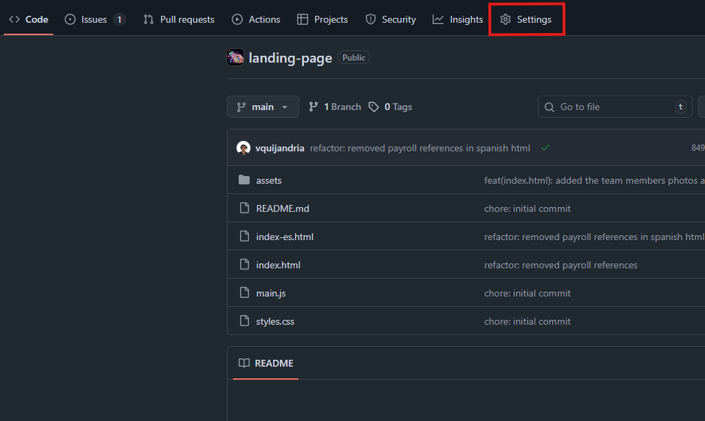
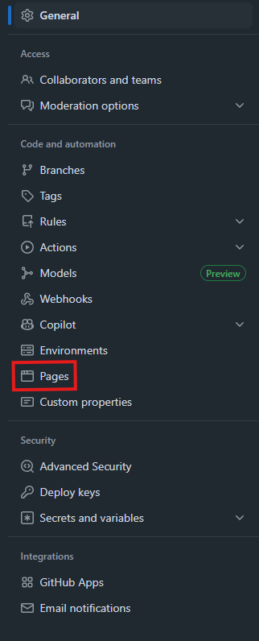
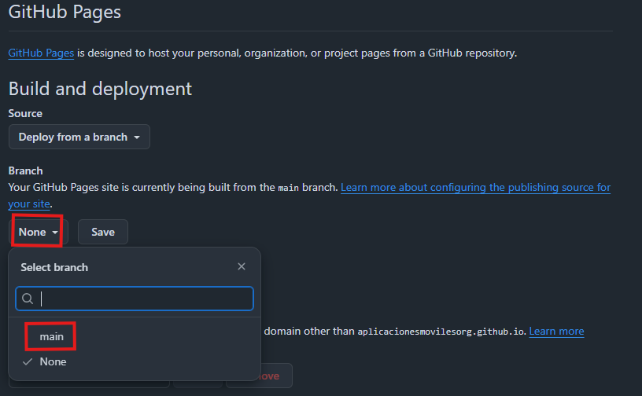
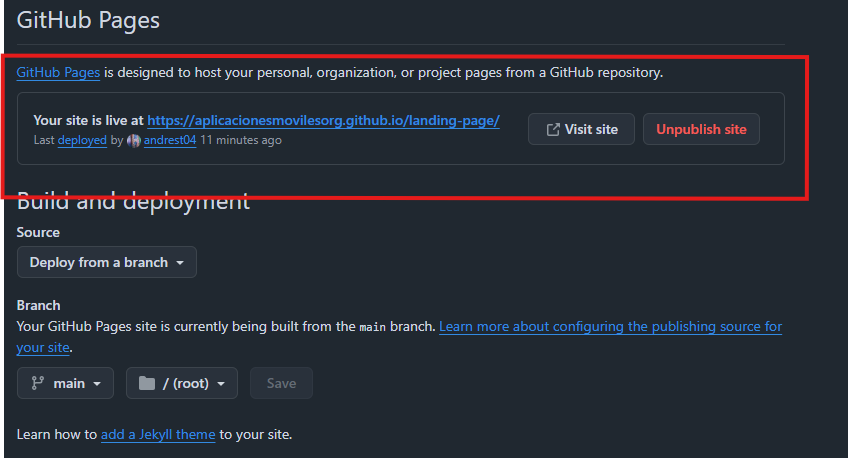

Link de la lading page desplegada: https://aplicacionesmovilesorg.github.io/landing-page/

### 4.2. Landing Page & Mobile Application Implementation

#### 4.2.1. Sprint 1

##### 4.2.1.1. Sprint Planning 1

Para este primer sprint nos enfocaremos en los tasks para la
elaboración del producto. Nos dividiremos entre nosotros cada
una de las tareas identificadas para el sprint.

| Sprint #                        | Sprint 1                                                                                                                                                                                                                                                                                                     |
| ------------------------------- | ------------------------------------------------------------------------------------------------------------------------------------------------------------------------------------------------------------------------------------------------------------------------------------------------------------ |
| Sprint Planning Background      |                                                                                                                                                                                                                                                                                                              |
| Date                            | 01/10/2025                                                                                                                                                                                                                                                                                                   |
| Time                            | 06:00 PM                                                                                                                                                                                                                                                                                                     |
| Location                        | Servidor de Discord del Equipo                                                                                                                                                                                                                                                                               |
| Prepared By                     | Andres Torres                                                                                                                                                                                                                                                                                                |
| Attendees (to planning meeting) | Andres Torres / Dayro Rios / Vicente Quijandria / Renato Calvo / Antonio Navarro                                                                                                                                                                                                                             |
| Sprint 1 Review Summary         | En esta primera seccion se planteo el desarrollo para el proyecto, se hizo la creacion de la landing page, el diseño de la aplicación movil y del 70% del desarrollo de la API RESTful.                                                                                                                      |
| Sprint 1 Retrospective Summary  | En esta seccion todos los integrantes mencionaron tener aciertos en partes del codigo y en otras partes poder mejorar sus habilidades realizando la Landing Page, aplicacion movil y la API RESTful.                                                                                                         |
| Sprint Goal & User Stories      |                                                                                                                                                                                                                                                                                                              |
| Sprint 1 Goal                   | Desarrollar, desplegar y hacer visible la landing page, aplicacion movil y la API RESTful, integrando todos sus componentes clave y garantizando una apariencia coherente con los mockups de la aplicación. El éxito se logrará cuando la página esté completamente funcional y accesible para los usuarios. |
| Sprint 1 Velocity               | 42 Velocity                                                                                                                                                                                                                                                                                                  |
| Sum of Story Points             | 42 Story Points.                                                                                                                                                                                                                                                                                             |

##### 4.2.1.2. Sprint Backlog 1

| Orden                 | User Story / Technical Story Id | Título                                                                                      | Descripción                                                                                                                                                                                                                                                               | Story Points (1 / 2 / 3 / 5 / 8) | Estimation (hours) | Assigned To        | Status |
| :-------------------- | :------------------------------ | :------------------------------------------------------------------------------------------ | :------------------------------------------------------------------------------------------------------------------------------------------------------------------------------------------------------------------------------------------------------------------------ | :------------------------------: | :----------------: | :----------------- | :----- |
| **User Stories**      |
| 1                     | US-01                           | Accesibilidad de la aplicación en diferentes dispositivos                                   | Como visitante, quiero que la aplicación se adapte a diferentes dispositivos para que pueda acceder a la plataforma desde cualquier lugar y en cualquier momento.                                                                                                         |                5                 |         1          | Vicente Quijandria | Done   |
| 2                     | US-02                           | Encontrar información del propósito de la aplicación                                        | Como visitante, quiero saber sobre el propósito de la aplicación para entender qué beneficios y funcionalidades ofrece y decidir si es adecuada para mis necesidades.                                                                                                     |                2                 |         3          | Vicente Quijandria | Done   |
| 3                     | US-03                           | Visualización de imágenes y gráficos relevantes                                             | Como visitante, quiero que las imágenes y gráficos en la landing page sean de alta calidad y relevantes para captar mi interés.                                                                                                                                           |                2                 |         3          | Vicente Quijandria | Done   |
| 4                     | US-04                           | Tipografía cómoda y agradable estéticamente                                                 | Como visitante, quiero que la tipografía en la landing page sea legible y estéticamente agradable para facilitar la lectura y la navegación.                                                                                                                              |                1                 |         2          | Vicente Quijandria | Done   |
| **Technical Stories** |
| 5                     | TS001                           | Añadir administrador a través de un RESTful API                                             | Como desarrollador, quiero que se pueda añadir a un administrador a través de un API, para que el administrador registre a los docentes.                                                                                                                                  |                2                 |         3          | Andres Torres      | Done   |
| 6                     | TS002                           | Añadir un docente a través de un RESTful API                                                | Como desarrollador, quiero que se pueda añadir a un docente a través de un API, para que este pueda interactuar con el administrador.                                                                                                                                     |                3                 |         4          | Andres Torres      | Done   |
| 7                     | TS005                           | Inicio de sesión a través de un RESTful API                                                 | Como desarrollador, quiero implementar la característica de inicio de sesión a través de una API RESTful, para que los usuarios puedan autenticarse y acceder a las funcionalidades del sistema de manera segura.                                                         |                5                 |         6          | Andres Torres      | Done   |
| 8                     | TS007                           | Añadir información de salones a través de un RESTful API                                    | Como desarrollador, quiero implementar la característica de añadir la información de los salones a través de un RESTful API PARA que los usuarios puedan interactuar con su información.                                                                                  |                3                 |         4          | Andres Torres      | Done   |
| 9                     | TS008                           | Añadir información de espacios compartidos través de un RESTful API                         | Como desarrollador, quiero implementar la característica de añadir la información de los espacios compartidos a través de un RESTful API PARA que los usuarios puedan interactuar con su información.                                                                     |                3                 |         4          | Andres Torres      | Done   |
| 10                    | TS010                           | Añadir información de los recursos de un salón a través de un RESTful API                   | Como desarrollador, quiero implementar la característica de añadir la información de los recursos de los salones a través de un RESTful API PARA que los docentes puedan puedan hacer reportes.                                                                           |                3                 |         4          | Andres Torres      | Done   |
| 11                    | TS011                           | Añadir información de hora y lugar de una reunión a través de un RESTful API                | Como desarrollador, quiero implementar la característica de añadir la información de hora y lugar de una reunión a través de un RESTful API PARA que los docentes puedan recibir notificaciones acerca de la reunión.                                                     |                5                 |         6          | Andres Torres      | Done   |
| 12                    | TS012                           | Añadir información de los invitados de una reunión a través de un RESTful API               | Como desarrollador, quiero implementar la característica de añadir la información de los invitados de una reunión a través de un RESTful API PARA que los administradores puedan seleccionar a los participantes de la reunión.                                           |                3                 |         4          | Andres Torres      | Done   |
| 13                    | TS013                           | Obtener notificación de reporte a través de un RESTful API                                  | Como desarrollador, quiero implementar la opción para obtener la notificación de un reporte a través de una API RESTful, PARA que los administradores puedan visualizar los reportes de los docentes.                                                                     |                2                 |         3          | Andres Torres      | Done   |
| 14                    | TS019                           | Actualizar información de la reunión a través de un RESTful API                             | Como desarrollador, quiero implementar la característica de actualizar la información de la reunión a través de un RESTful API PARA que los administradores puedan cambiar la información de la reunión ante cualquier eventualidad.                                      |                3                 |         4          | Andres Torres      | Done   |
| 15                    | TS022                           | Obtener información de la disponibilidad de espacios compartidos a través de un RESTful API | Como desarrollador, quiero implementar la opción para obtener la disponibilidad de espacios compartidos a través de una API RESTful, PARA que los docentes y administradores puedan visualizar si un espacio compartido se encuentra disponible en un momento específico. |                5                 |         6          | Andres Torres      | Done   |
| 16                    | TS023                           | Añadir reserva a un espacios compartido a través de un RESTful API                          | Como desarrollador, quiero implementar la opción para añadir una reserva a un espacio compartidos a través de una API RESTful, PARA que los docentes puedan reservar un espacio compartido que se encuentre disponible en un momento específico.                          |                5                 |         6          | Andres Torres      | Done   |
| 17                    | TS025                           | Añadir información del reporte de avería a través de un RESTful API                         | Como desarrollador, quiero implementar la característica de añadir la información de un reporte a través de un RESTful API PARA que los administradores puedan ver la información del reporte que hizo el docente.                                                        |                3                 |         4          | Andres Torres      | Done   |

##### 4.2.1.3. Development Evidence for Sprint Review

| Commit Id | Commit Message                                                                                                                   | Author                       | Committed on |
| :-------- | :------------------------------------------------------------------------------------------------------------------------------- | :--------------------------- | :----------- |
| 3598c48   | feat: added conclusions and introduction                                                                                         | Dayro Richard Rios Piñan     | 2025-10-09   |
| 01a56d6   | feat: added conclusions and introduction                                                                                         | Dayro                        | 2025-10-09   |
| 7d2fb9d   | docs(readme): add Insights tp                                                                                                    | Renato Guillermo Calvo Yalan | 2025-10-09   |
| 0352049   | docs(readme): add Insights tp                                                                                                    | RenatoCY                     | 2025-10-09   |
| 366d224   | Merge pull request #132 from AplicacionesMovilesOrg/fix/solution-profile                                                         | AntonioNavarro24             | 2025-10-09   |
| ae43340   | docs(solution-profile): fix background and problems sections                                                                     | AntonioNavarro24             | 2025-10-09   |
| cabe3fb   | feature: added validation interviews                                                                                             | Dayro Richard Rios Piñan     | 2025-10-09   |
| 35e8d7c   | feat: added validation interviews and heuristics                                                                                 | Dayro                        | 2025-10-09   |
| a7a50b9   | feat: added images                                                                                                               | Dayro                        | 2025-10-09   |
| 9ed234a   | refactor: fixed an error on the section title 4.3.3                                                                              | vquijandria                  | 2025-10-09   |
| def3abd   | docs: added the 5.3.3 heuristics version                                                                                         | vquijandria                  | 2025-10-09   |
| 61f09a6   | docs: added interview design section for the last 2 interviewed people                                                           | vquijandria                  | 2025-10-09   |
| 7b5f674   | Merge pull request #130 from AplicacionesMovilesOrg/feature/team-collaboration-insights-during-sprint                            | AntonioNavarro24             | 2025-10-09   |
| f5ad953   | docs: add team collaboration insights during sprint                                                                              | AntonioNavarro24             | 2025-10-09   |
| 7ef78e2   | chore: add insights images                                                                                                       | AntonioNavarro24             | 2025-10-09   |
| d5a8e43   | Merge pull request #129 from AplicacionesMovilesOrg/feature/software-deployment-evidence-for-sprint-review                       | AntonioNavarro24             | 2025-10-09   |
| 5942c9a   | docs: add software deployment evidence for sprint review                                                                         | AntonioNavarro24             | 2025-10-09   |
| 46dc92b   | Merge branch 'main' into develop                                                                                                 | Dayro Richard Rios Piñan     | 2025-10-09   |
| 2fe7e18   | feat: added interview log for segment 1 and one interview for segment 2                                                          | Dayro                        | 2025-10-09   |
| 9790276   | feat: added images for validation interview log                                                                                  | Dayro                        | 2025-10-09   |
| f5f55d6   | chore: add evidence backend repository image                                                                                     | AntonioNavarro24             | 2025-10-09   |
| 944a5d7   | chore: add evidence backend deployment image                                                                                     | AntonioNavarro24             | 2025-10-09   |
| df6e23e   | Merge pull request #127 from AplicacionesMovilesOrg/feature/services-documentation-evidence-for-sprint-review                    | AntonioNavarro24             | 2025-10-08   |
| 5275543   | docs: add services documentation evidence for sprint review                                                                      | AntonioNavarro24             | 2025-10-08   |
| 318592f   | feat: interview design added                                                                                                     | Dayro Richard Rios Piñan     | 2025-10-08   |
| a7e61b6   | feat: interview design added                                                                                                     | Dayro                        | 2025-10-08   |
| d6d2cc8   | Merge pull request #125 from AplicacionesMovilesOrg/feature/execution-evidence-for-sprint-review                                 | AntonioNavarro24             | 2025-10-08   |
| 1be289e   | docs: add execution evidence for sprint review                                                                                   | AntonioNavarro24             | 2025-10-08   |
| 484f2a5   | chore: add backend image                                                                                                         | AntonioNavarro24             | 2025-10-08   |
| 79ffdeb   | chore: add landing page deployed image                                                                                           | AntonioNavarro24             | 2025-10-08   |
| cde99fb   | Merge pull request #124 from AplicacionesMovilesOrg/feature/testing-suite-evidence-for-sprint-review                             | AntonioNavarro24             | 2025-10-08   |
| ffab71b   | docs: add testing suite evidence for sprint review                                                                               | AntonioNavarro24             | 2025-10-08   |
| e381faf   | docs: added landing page desktop and mobile mockups                                                                              | vquijandria                  | 2025-10-07   |
| 2035670   | docs: added landing page mobile wireframe                                                                                        | vquijandria                  | 2025-10-07   |
| e6291c0   | docs: added landing page desktop wireframe                                                                                       | vquijandria                  | 2025-10-07   |
| 5f95537   | docs(chapter3):add style Guidelines and general style Guidelines                                                                 | Renato Guillermo Calvo Yalan | 2025-10-05   |
| 0e34865   | docs: add 3.1.1.1 General Style Guidelines (#67)                                                                                 | Renato Guillermo Calvo Yalan | 2025-10-05   |
| cd4f933   | docs: add 3.1.1.1 General Style Guidelines (#67)                                                                                 | Renato Guillermo Calvo Yalan | 2025-10-05   |
| ae1d2c0   | docs: add 3.1.1.1 General Style Guidelines (#67)                                                                                 | Renato Guillermo Calvo Yalan | 2025-10-05   |
| bc44ef0   | docs (chapter3): add section 3.1.1.1 General Style Guidelines (#67)                                                              | Renato Guillermo Calvo Yalan | 2025-10-05   |
| 7dfce48   | feat: added mobile applications prototyping                                                                                      | Dayro Richard Rios Piñan     | 2025-10-04   |
| e16c619   | feat: added mobile applications prototyping                                                                                      | Dayro                        | 2025-10-04   |
| 46c025e   | Merge pull request #119 from AplicacionesMovilesOrg/feature/sprint-backlog-1                                                     | Andrés Torres                | 2025-10-01   |
| 4a0e3a3   | feat: add sprint backlog details with user and technical stories                                                                 | Andres Torres                | 2025-10-01   |
| e9e8779   | Merge pull request #118 from AplicacionesMovilesOrg/feature/sprint-planning-1                                                    | Andrés Torres                | 2025-10-01   |
| 949a4a2   | feat: add sprint planning details and summaries for Sprint 1                                                                     | Andres Torres                | 2025-10-01   |
| c103038   | feat: wireflow diagrams added                                                                                                    | Dayro Richard Rios Piñan     | 2025-09-30   |
| a9e61bd   | feat: added wireflow diagrams                                                                                                    | Dayro                        | 2025-09-30   |
| 8e89773   | feat: added imgs for wireflows                                                                                                   | Dayro                        | 2025-09-30   |
| ac71ece   | feature: mobile applications user flow diagrams added                                                                            | Dayro Richard Rios Piñan     | 2025-09-30   |
| 6c5c32c   | feat: added user flow diagrams                                                                                                   | Dayro                        | 2025-09-30   |
| 040a81b   | feat: added imgs for user flow                                                                                                   | Dayro                        | 2025-09-29   |
| a540879   | feat: added mobile applications mock-ups                                                                                         | Dayro Richard Rios Piñan     | 2025-09-29   |
| 739c75d   | feat: added 3.1.4.3 paragraph                                                                                                    | Dayro                        | 2025-09-29   |
| 7f91c84   | feat: imgs route fixed                                                                                                           | Dayro                        | 2025-09-29   |
| 045ba7c   | Merge pull request #114 from AplicacionesMovilesOrg/feature/navigation-systems                                                   | AntonioNavarro24             | 2025-09-29   |
| a0f2a75   | docs: add navigation systems information                                                                                         | AntonioNavarro24             | 2025-09-29   |
| bc6269d   | Merge pull request #113 from AplicacionesMovilesOrg/feature/searching-systems                                                    | AntonioNavarro24             | 2025-09-29   |
| d5db723   | docs: add searching systems information                                                                                          | AntonioNavarro24             | 2025-09-29   |
| bde13e1   | feat: added mobile mock-ups                                                                                                      | Dayro                        | 2025-09-29   |
| dc8fee2   | feat: added imgs for mobile mock-ups                                                                                             | Dayro                        | 2025-09-29   |
| f9d9756   | Merge pull request #112 from AplicacionesMovilesOrg/feature/seo-tags-and-meta-tags                                               | AntonioNavarro24             | 2025-09-29   |
| 8d01f94   | docs: add seo tags and meta tags information                                                                                     | AntonioNavarro24             | 2025-09-29   |
| 652ce9b   | Merge pull request #111 from AplicacionesMovilesOrg/feature/labelling-systems                                                    | AntonioNavarro24             | 2025-09-29   |
| 20e5718   | docs: add labelling systems information                                                                                          | AntonioNavarro24             | 2025-09-29   |
| a8f26ee   | feat: added mobile applications wireframes                                                                                       | Dayro Richard Rios Piñan     | 2025-09-28   |
| 5538af9   | feat: added mobile applications wireframes                                                                                       | Dayro                        | 2025-09-28   |
| e7b1e0d   | feat: added imgs for mobile applications wireframes                                                                              | Dayro                        | 2025-09-28   |
| d6930a6   | Merge pull request #109 from AplicacionesMovilesOrg/feature/organization-systems                                                 | AntonioNavarro24             | 2025-09-28   |
| e4837ff   | docs: add organization systems information                                                                                       | AntonioNavarro24             | 2025-09-28   |
| 12cbfb4   | Merge pull request #108 from AplicacionesMovilesOrg/feature/information-architecture                                             | AntonioNavarro24             | 2025-09-28   |
| 6d34b2e   | docs: add information architecture description                                                                                   | AntonioNavarro24             | 2025-09-28   |
| 71ba1af   | Merge pull request #107 from AplicacionesMovilesOrg/feat/software-configuration-management                                       | Andrés Torres                | 2025-09-25   |
| c9d3d19   | feat: add images for landing page deployment in chapter IV                                                                       | Andres Torres                | 2025-09-25   |
| 836bc11   | Merge pull request #106 from AplicacionesMovilesOrg/develop                                                                      | Andrés Torres                | 2025-09-25   |
| bce8425   | feat: add chapters III and IV for Solution UI/UX Design and Product Implementation & Validation                                  | Andres Torres                | 2025-09-25   |
| d378479   | Merge pull request #105 from AplicacionesMovilesOrg/docs/test-issue                                                              | Andrés Torres                | 2025-09-24   |
| 9642f70   | fix: correct formatting and spacing issues in chapter2.md                                                                        | Andres Torres                | 2025-09-24   |
| cbe16e9   | feat: merged develop                                                                                                             | Dayro Richard Rios Piñan     | 2025-09-19   |
| 807e1d5   | feat: added insights                                                                                                             | Dayro Richard Rios Piñan     | 2025-09-19   |
| d48477f   | feat: added insights                                                                                                             | Dayro                        | 2025-09-19   |
| 18fb682   | Merge pull request #20 from AplicacionesMovilesOrg/feature/chapter2                                                              | AntonioNavarro24             | 2025-09-19   |
| e92c8dc   | feature(user journey mapping): add description and journey mapping image                                                         | AntonioNavarro24             | 2025-09-19   |
| 4a01532   | feat: user journey mapping added                                                                                                 | AntonioNavarro24             | 2025-09-19   |
| 811f264   | feature: merged chapter1                                                                                                         | Dayro Richard Rios Piñan     | 2025-09-19   |
| 93428db   | feat: update readme                                                                                                              | Dayro                        | 2025-09-19   |
| 7f5bb37   | feature: merge chapter2                                                                                                          | Dayro Richard Rios Piñan     | 2025-09-19   |
| 679cc22   | feature: empathy mapping                                                                                                         | Dayro Richard Rios Piñan     | 2025-09-19   |
| 692559c   | feature: chapter2                                                                                                                | Dayro Richard Rios Piñan     | 2025-09-19   |
| 2b97ecd   | feat: add empathy mapping                                                                                                        | AntonioNavarro24             | 2025-09-19   |
| 3cdd1e8   | feature: interview analysis added                                                                                                | Dayro Richard Rios Piñan     | 2025-09-19   |
| 6984743   | feat: add analysis interview                                                                                                     | Dayro                        | 2025-09-19   |
| 99e2f30   | chore                                                                                                                            | AntonioNavarro24             | 2025-09-19   |
| 0e9e8bb   | feat: interview analysis added segment 1                                                                                         | Dayro                        | 2025-09-19   |
| d0199db   | Feature/chapter2                                                                                                                 | Dayro Richard Rios Piñan     | 2025-09-19   |
| ec331e5   | feat: updated links from interviews                                                                                              | Dayro Richard Rios Piñan     | 2025-09-19   |
| 8948ff8   | feat: canvases and context mapping added                                                                                         | Dayro                        | 2025-09-19   |
| 54399a9   | feature(chapter2): add Domain Message Flows Modeling.                                                                            | AntonioNavarro24             | 2025-09-19   |
| 15d579c   | feature(chapter2): add EventStorming                                                                                             | AntonioNavarro24             | 2025-09-19   |
| 5b44445   | Develop                                                                                                                          | Renato Guillermo Calvo Yalan | 2025-09-19   |
| 29ec3cd   | feature/chapter2                                                                                                                 | Renato Guillermo Calvo Yalan | 2025-09-19   |
| 6827ef7   | docs(chapter2):add Ubiquitous Language                                                                                           | Renato Guillermo Calvo Yalan | 2025-09-19   |
| 4b136a4   | feature/interview-log                                                                                                            | Renato Guillermo Calvo Yalan | 2025-09-19   |
| 8724149   | docs(chapter2):add interviews                                                                                                    | Renato Guillermo Calvo Yalan | 2025-09-19   |
| 9a6bf92   | Merge pull request #10 from AplicacionesMovilesOrg/revert-9-feature/canvases-and-context-mapping                                 | Dayro Richard Rios Piñan     | 2025-09-19   |
| 2cde2c9   | Revert "feat: updated canvas and context mapping"                                                                                | Dayro Richard Rios Piñan     | 2025-09-19   |
| 9e9ef03   | feat: updated canvas and context mapping                                                                                         | Dayro Richard Rios Piñan     | 2025-09-19   |
| b5706e9   | feat: updated canvas and context mapping                                                                                         | Dayro                        | 2025-09-19   |
| fb48ace   | feat: template table for ABET outcomes and actions                                                                               | Dayro Richard Rios Piñan     | 2025-09-19   |
| d173e04   | feat(product-backlog): add product backlog image                                                                                 | AntonioNavarro24             | 2025-09-19   |
| b510aa3   | refactor: added missing letter again                                                                                             | vquijandria                  | 2025-09-19   |
| 1f09b91   | feat: added user task matrix for college administrators based by the user persons section                                        | vquijandria                  | 2025-09-19   |
| 48acbb8   | feature: canvases and context mapping added                                                                                      | Dayro Richard Rios Piñan     | 2025-09-19   |
| e0a1574   | feat: context mapping added                                                                                                      | Dayro                        | 2025-09-19   |
| e2ffdfb   | feat: context mapping 3 added                                                                                                    | Dayro                        | 2025-09-19   |
| ab6c24d   | feat: context mapping 2 added                                                                                                    | Dayro                        | 2025-09-19   |
| 8de327d   | feat: context mapping 1 added                                                                                                    | Dayro                        | 2025-09-19   |
| 6216e32   | feat: iam canvas image added                                                                                                     | Dayro                        | 2025-09-19   |
| 39d23d4   | feat: breakdown management canvas image added                                                                                    | Dayro                        | 2025-09-19   |
| 3a6711f   | feat: reservation canvas image added                                                                                             | Dayro                        | 2025-09-19   |
| 4e60e1f   | feat: space and resource management canvas image added                                                                           | Dayro                        | 2025-09-19   |
| 3891be4   | feat: profile canvas image added                                                                                                 | Dayro                        | 2025-09-19   |
| 80fba5a   | feature(chapter2):add Domain message flow modeling images                                                                        | AntonioNavarro24             | 2025-09-19   |
| b8339ec   | Merge remote-tracking branch 'origin/feature/chapter2' into feature/interview-log                                                | Dayro                        | 2025-09-19   |
| bb207be   | feature(chapter2):add EventStorming                                                                                              | AntonioNavarro24             | 2025-09-19   |
| 5874ec3   | feat: added interview log                                                                                                        | Dayro                        | 2025-09-19   |
| 348fda8   | Add product backlog image                                                                                                        | AntonioNavarro24             | 2025-09-19   |
| 183594f   | feat(user-stories): update the structure of user stories and epics                                                               | AntonioNavarro24             | 2025-09-19   |
| 5346f17   | docs(chapter2):add user Person segment 1                                                                                         | RenatoCY                     | 2025-09-19   |
| 27a4b87   | refactor: added missing letter                                                                                                   | vquijandria                  | 2025-09-19   |
| ba75a70   | feat: added user task matrix for college profesors bases by the user persons section                                             | vquijandria                  | 2025-09-19   |
| bf6a9cc   | docs(chapter2):add User Person segment 2                                                                                         | RenatoCY                     | 2025-09-19   |
| af8fb14   | feature(chapter2): add new class and database diagrams for profile and reservation management                                    | Andres Torres                | 2025-09-19   |
| 98974b3   | Develop                                                                                                                          | Renato Guillermo Calvo Yalan | 2025-09-18   |
| ab0f93a   | docs(introduction):fixed structure                                                                                               | Renato Guillermo Calvo Yalan | 2025-09-18   |
| 94e5011   | feature(chapter2): update bounded context sections for reservation scheduling and teacher management                             | Andres Torres                | 2025-09-16   |
| 407bb38   | feature(chapter2): remove redundant class representation sections from domain, interface, application, and infrastructure layers | Andres Torres                | 2025-09-16   |
| 181521d   | feature(chapter2): add detailed class representations and architecture components for report management                          | Andres Torres                | 2025-09-16   |
| d074564   | feature(chapter2): add new component diagrams for reservation scheduling and spaces/resources                                    | Andres Torres                | 2025-09-16   |
| ac1f130   | feature(chapter2): add new diagrams and images for context, containers, and deployment                                           | Andres Torres                | 2025-09-15   |
| 2979c3a   | docs(introduction):fixed structure                                                                                               | Renato Guillermo Calvo Yalan | 2025-09-15   |
| 5f8ce06   | Merge pull request #5 from AplicacionesMovilesOrg/develop                                                                        | Andrés Torres                | 2025-09-14   |
| d5ce712   | Merge pull request #4 from AplicacionesMovilesOrg/feature/chapter1                                                               | Andrés Torres                | 2025-09-14   |
| 1406aca   | Merge branch 'develop' into feature/chapter1                                                                                     | Andres Torres                | 2025-09-14   |
| 114bfd2   | Merge pull request #3 from AplicacionesMovilesOrg/feature/chapter2                                                               | Andrés Torres                | 2025-09-14   |
| c53a1e8   | feature(report): remove chapters 1, 3, 4, and 5                                                                                  | Andres Torres                | 2025-09-14   |
| 1ad9644   | feature(Interview design): added interview design.                                                                               | AntonioNavarro24             | 2025-09-13   |
| 31bfd8b   | feature(product backlog): added product backlog                                                                                  | AntonioNavarro24             | 2025-09-12   |
| 02aa902   | feature(user stories): added user stories                                                                                        | AntonioNavarro24             | 2025-09-11   |
| a615413   | docs: update sections structure                                                                                                  | AntonioNavarro24             | 2025-09-09   |
| e160426   | feature(2.1.2): added estrategies against competitors                                                                            | Dayro Richard Rios Piñan     | 2025-09-07   |
| 49ff19d   | feature(competitive analysis): added competitive analysis                                                                        | Dayro Richard Rios Piñan     | 2025-09-07   |
| cf8fc16   | feature(competitors): added competitors                                                                                          | Dayro Richard Rios Piñan     | 2025-09-07   |
| a4af014   | docs: sections added                                                                                                             | Dayro Richard Rios Piñan     | 2025-09-07   |
| e2adbdf   | Merge pull request #2 from AplicacionesMovilesOrg/feature/chapter1                                                               | Andrés Torres                | 2025-09-06   |
| e197c92   | feature(profile): Add photo for team member Vicente Quijandria Araneda in chapter1.md                                            | Andres Torres                | 2025-09-06   |
| 34c9154   | feature:(profile) Add photo for team member Renato Guillermo Calvo Yalan in chapter1.md                                          | Andres Torres                | 2025-09-05   |
| d314136   | Add photo for team member Antonio Jhair Navarro Chinga in chapter1.md                                                            | Andres Torres                | 2025-09-04   |
| 603fee5   | Add photo for team member Dayro Richard Rios Piñan in chapter1.md                                                                | Andres Torres                | 2025-09-04   |
| 7c8802d   | Merge pull request #1 from AplicacionesMovilesOrg/feature/chapter1                                                               | Andrés Torres                | 2025-09-04   |
| 47adc2f   | Add detailed content for Chapter 1: Introduction in chapter1.md                                                                  | Andres Torres                | 2025-09-04   |
| 7ba992f   | Add initial empty chapters for the report                                                                                        | Andres Torres                | 2025-09-04   |
| 36e0fdb   | Update team member details in README.md                                                                                          | Andres Torres                | 2025-08-27   |
| d0ad5a4   | Refactor README.md to improve table formatting and update content structure                                                      | Andres Torres                | 2025-08-27   |
| 2cadd1f   | Add README.md with presentation and logo                                                                                         | Andres Torres                | 2025-08-27   |
| dfe3444   | Initial commit                                                                                                                   | Andrés Torres                | 2025-08-26   |

##### 4.2.1.4. Testing Suite Evidence for Sprint Review

A continuación, se presenta una tabla con información del repositorio de las pruebas, y los commits realizados durante el sprint:

| Repository                                                     | Branch | Commit Id                                | Commit Message                                                            | Commit Message Body | Committed on (Date) |
| -------------------------------------------------------------- | ------ | ---------------------------------------- | ------------------------------------------------------------------------- | ------------------- | ------------------- |
| AplicacionesMovilesOrg/AplicacionesMovilesOrg-acceptance-tests | main   | be4fae8973d3f7ee2571b64733e3e0d30cb86f91 | feat: add Gherkin scenarios for administrator login                       | -                   | 08/10/2025          |
| AplicacionesMovilesOrg/AplicacionesMovilesOrg-acceptance-tests | main   | 988b1f5fb8c3e486d3eaf3a59ce2d49437b0717c | feat: add Gherkin scenarios for teacher personal information registration | -                   | 08/10/2025          |
| AplicacionesMovilesOrg/AplicacionesMovilesOrg-acceptance-tests | main   | 95151a86995fc6431a9e6f49f88dc299bcd74a36 | feat: add Gherkin scenarios for teacher access information registration   | -                   | 08/10/2025          |

Enlace del github: [Github Repository](https://tinyurl.com/2dzts67c)

##### 4.2.1.5. Execution Evidence for Sprint Review

Evidencia de ejecución del Landing Page:

Enlace: [https://tinyurl.com/bdftnb7v](https://tinyurl.com/bdftnb7v)

Evidencia de Ejecución Web Services:

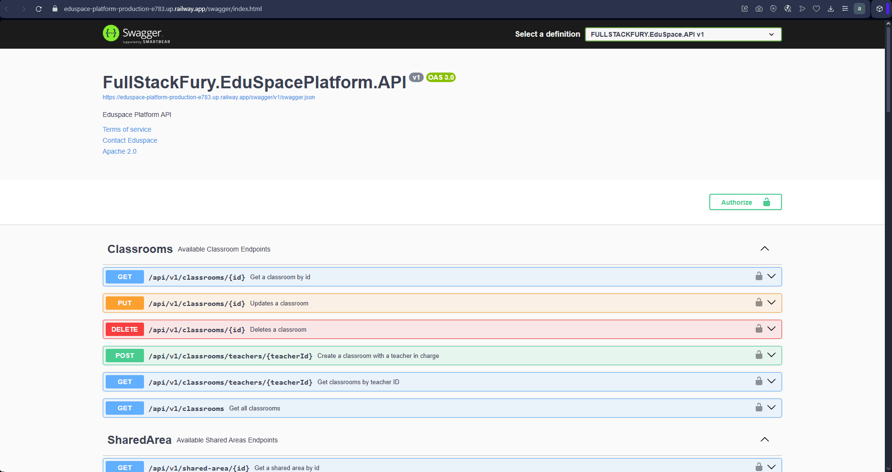
Enlace:[https://tinyurl.com/5aadb5bm](https://tinyurl.com/5aadb5bm)

##### 4.2.1.6. Services Documentation Evidence for Sprint Review

| Endpoint                                                  | Acción                                             | Verbo HTTP | Parámetros / Request Body                                                                                                                                                                       | Ejemplo                                                                                                                                                          |
| --------------------------------------------------------- | -------------------------------------------------- | ---------- | ----------------------------------------------------------------------------------------------------------------------------------------------------------------------------------------------- | ---------------------------------------------------------------------------------------------------------------------------------------------------------------- |
| `/api/v1/classrooms/teachers/{teacherId}`                 | Crear un aula con un docente encargado             | POST       | `{ "name": "string", "description": "string" }`                                                                                                                                                 | `{ "id": 0, "name": "string", "description": "string", "teacherId": 0 }`                                                                                         |
| `/api/v1/shared-area/{id}`                                | Actualizar un espacio compartido por su ID         | PUT        | `{ "name": "string", "capacity": 0, "description": "string" }`                                                                                                                                  | **Response 200:** `{ "id": 0, "name": "string", "capacity": 0, "description": "string" }`   **Response 404:** `"The shared area was not found"`               |
| `/api/v1/shared-area`                                     | Obtener todos los espacios compartidos             | GET        | N/A                                                                                                                                                                                             | `[ { "id": 0, "name": "string", "capacity": 0, "description": "string" } ]`                                                                                      |
| `/api/v1/authentication/sign-in`                          | Iniciar sesión con credenciales de usuario         | POST       | `{ "username": "string", "password": "string" }`                                                                                                                                                | `{ "id": 0, "username": "string", "role": "string", "token": "string" }`                                                                                         |
| `/api/v1/administrator-profiles`                          | Registrar un nuevo perfil de administrador         | POST       | `{ "firstName": "string", "lastName": "string", "email": "string", "dni": "string", "address": "string", "phone": "string", "username": "string", "password": "string" }`                       | **Response 200:** `"OK"`                                                                                                                                         |
| `/api/v1/classrooms/{classroomId}/resources`              | Registrar un recurso dentro de un aula específica  | POST       | `classroomId` `{ "name": "string", "kindOfResource": "string" }`                                                                                                                                | **Response 200:** `"OK"`                                                                                                                                         |
| `/api/v1/classrooms/{classroomId}/resources/{resourceId}` | Actualizar un recurso dentro de un aula específica | PUT        | `classroomId`   `resourceId`   `{ "id": 0, "name": "string", "kindOfResource": "string", "classroomId": 0 }`                                                                              | **Response 200:** `"OK"`                                                                                                                                         |
| `/api/v1/reports`                                         | Crear un reporte para un recurso específico        | POST       | `{ "kindOfReport": "string", "description": "string", "resourceId": 0, "createdAt": "2025-10-09T04:38:47.148Z" }`                                                                               | **Response 201:** `{ "id": 0, "kindOfReport": "string", "description": "string", "resourceId": 0, "createdAt": "2025-10-09T04:38:47.148Z", "status": "string" }` |
| `/api/v1/teachers-profiles`                               | Registrar un nuevo perfil de docente               | POST       | `{ "firstName": "string", "lastName": "string", "email": "string", "dni": "string", "address": "string", "phone": "string", "administratorId": 0, "username": "string", "password": "string" }` | **Response 200:** `"OK"`                                                                                                                                         |

##### 4.2.1.7. Software Deployment Evidence for Sprint Review

La Landing Page fue desplegada correctamente mediante GitHub Pages, configurando en ramas "features" que luego fueron incorporadas a la rama main como fuente de publicación y verificando su disponibilidad pública a continuación.

Evidencia del despliegue del Landing Page:

Enlace: [https://tinyurl.com/bdftnb7v](https://tinyurl.com/bdftnb7v)

Por otro lado, el backend fue desplegado en un entorno cloud con MySQL configurado como base de datos a través de una instancia Docker, vinculada al proyecto eduspace-platform; se validó el correcto funcionamiento de las tablas principales (accounts, admin_profiles, classrooms, reports, reservations, shared_areas, teacher_profiles, entre otras) y la conexión establecida entre el servicio y la base de datos.

Evidencia del despliegue de los Web Services:
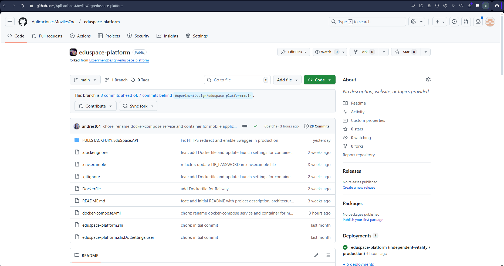

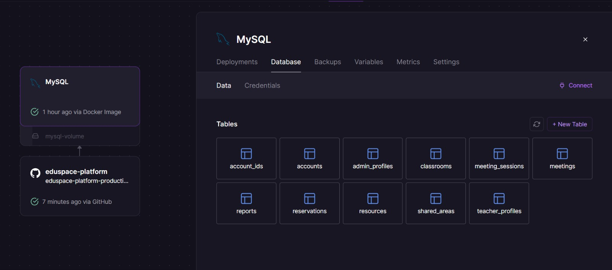

Enlace:[https://tinyurl.com/5aadb5bm](https://tinyurl.com/5aadb5bm)

##### 4.2.1.8. Team Collaboration Insights during Sprint

Durante el Sprint I del proyecto Eduspace, el equipo se enfocó en el desarrollo de la landing page y Web Service. Para ello, se utilizó
Visual Studio Code y Rider como editor de código además se empleó Git como herramienta de control de versiones. El trabajo se organizó mediante tareas del backlog y se
gestionó a través de un flujo de trabajo basado en ramas secundarias (feature/), lo que permitió un desarrollo paralelo eficiente.

A continuación, se presentan los aportes de los integrantes en cada uno de los repositorios:

**Landing Page:**
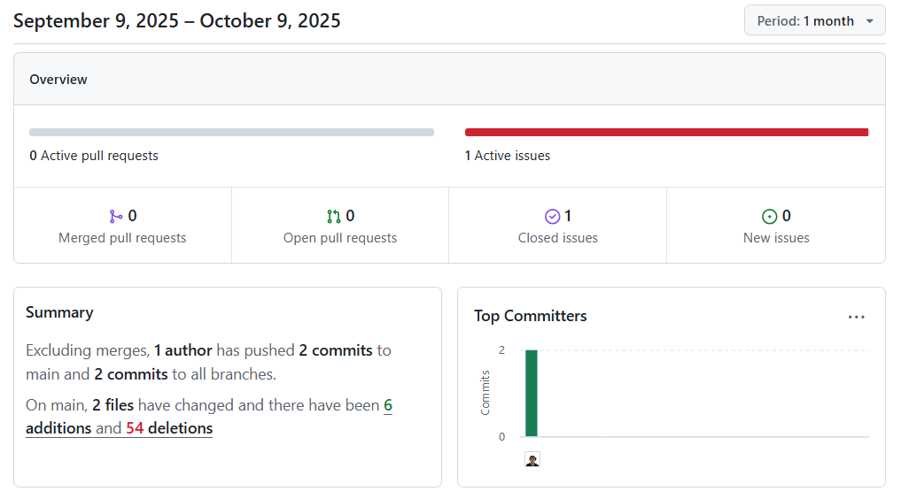

**Web Services:**
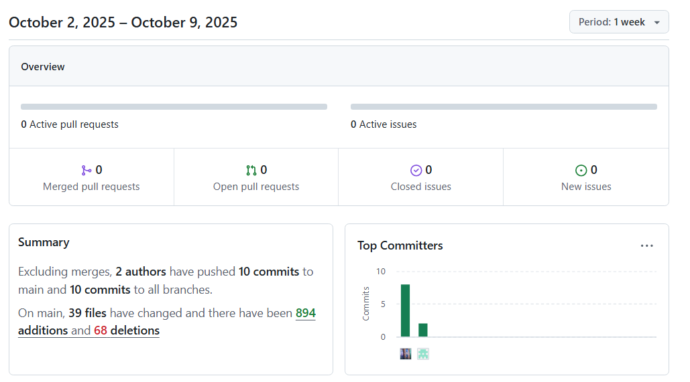

**Project Report:**
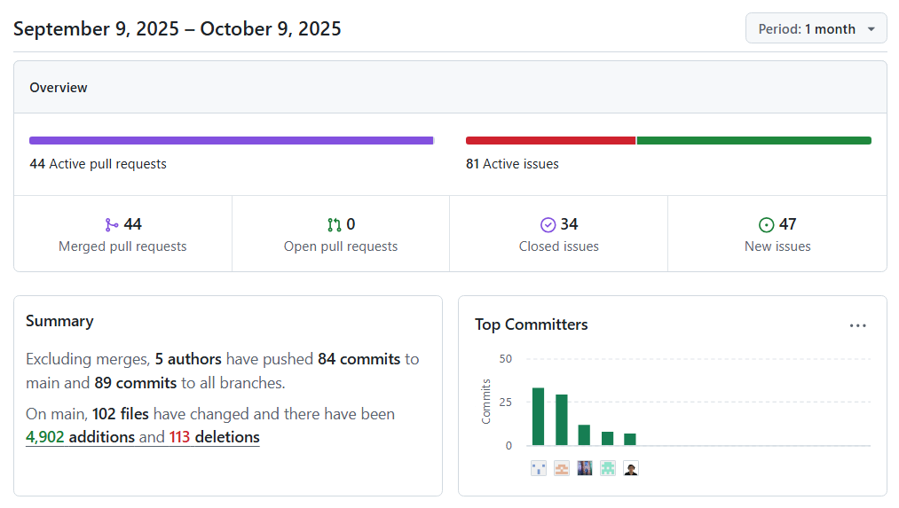

### 4.2.2. Sprint 2

#### 4.2.2.1. Sprint Planning 2

Para este segundo sprint nos enfocaremos en los tasks para la
elaboración del producto. Nuestro objetivo principal es desarrollar el backend al 100% y lograr la integración completa con el frontend, utilizando datos reales para garantizar una experiencia de usuario fluida y mejorar la usabilidad general de la aplicación. Este objetivo se considerará alcanzado cuando los usuarios puedan utilizar la aplicación con su información real.

| Sprint #                            |                   Sprint 2                                                    |
| ----------------------------------- | --------------------------------------------------------------------------------------------------------------------------------------------------- |
| **Sprint Planning Background Date** | 2025-11-01                                                                                                                                          |
| **Time**                            | 10:00 PM                                                                                                                                             |
| **Location**                        | Remote  (Discord / Whatsapp)                                                                                                                     |
| **Prepared by** | 
| **Attendees**                       | All members of EduSpace                                                                                        |
| **Sprint 1 Review Summary**         | The development of our mobile application and the integration with the backend were succesful |
| **Sprint 1 Retrospective Summary**  | We need to improve the integration of our services, add new features to the mobile application, and migrate our database from MySql to MongoDB |
| **Sprint Goal & User Stories** |
| **Sprint 2 Goal**  | Our focus is on complete all the features from our Android Native mobile application, such as add, edit and elete meetings, resources and teachers, also migrate our database to MongoDB. We believe it delivers the most value to our users by providing a seamless and efficient experience when managing educational spaces. This will be confirmed when users can fully utilize all the features of the mobile application with a reliable and scalable database backend. |
| **Sprint 2 Velocity**  | ... |
| **Sum of Story points**  | ... |

#### 4.2.2.2. Sprint Backlog 2
#### 4.2.2.3. Development Evidence
#### 4.2.2.4. Testing Suite Evidence
#### 4.2.2.5. Execution Evidence

Evidencia de ejecución del Landing Page:

Enlace: [https://tinyurl.com/bdftnb7v](https://tinyurl.com/bdftnb7v)

Evidencia de Ejecución Web Services:

Enlace:[https://tinyurl.com/565amdea](https://tinyurl.com/565amdea)

Evidencia de Ejecución Aplicación Móvil:

Enlace: [https://tinyurl.com/3yb63dzw](https://tinyurl.com/3yb63dzw)

#### 4.2.2.6. Services Documentation Evidence

#### 4.2.2.7. Software Deployment Evidence for Sprint Review

**Landing page**

La Landing Page fue desplegada correctamente mediante GitHub Pages, configurando en ramas "features" que luego fueron incorporadas a la rama main como fuente de publicación y verificando su disponibilidad pública a continuación.

Evidencia del despliegue del Landing Page:

Enlace: [https://tinyurl.com/bdftnb7v](https://tinyurl.com/bdftnb7v)

**Android mobile application**

La aplicación móvil fue desplegada usando firebase, el cuál nos permite descargar la aplicación en un archivo .apk, de este modo los usuarios pueden instalar la aplicación en sus dispositivos Android.

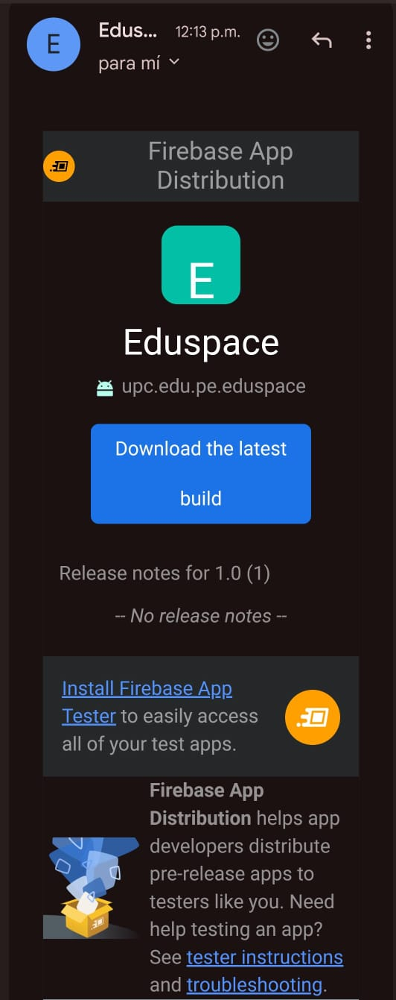

Enlace de descarga de la aplicación móvil: [https://tinyurl.com/3yb63dzw](https://tinyurl.com/3yb63dzw)

**Backend**

El backend fue desplegado en Railway. Se migró la base de datos de MySQL a MongoDB Atlas, asegurando una mejor escalabilidad y rendimiento para la aplicación. Se verificó el correcto funcionamiento de las tablas principales y la conexión establecida entre el servicio y la base de datos.

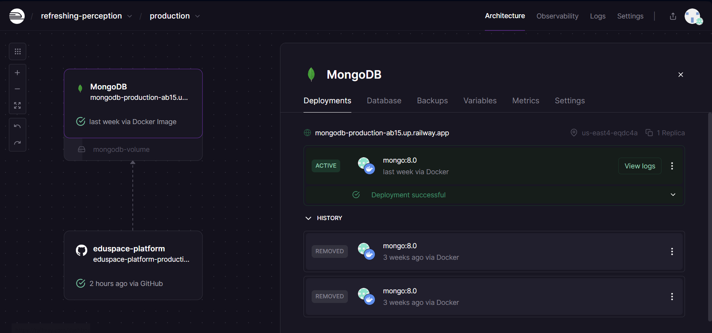

Enlace del backend desplegado en Railway: [https://tinyurl.com/565amdea](https://tinyurl.com/565amdea)

Repositorio del backend: [https://tinyurl.com/2p8f4f3m](https://tinyurl.com/2p8f4f3m)

#### 4.2.2.8. Team Collaboration Insights

### 4.3. Validation Interviews

En la sección **“Validation Interviews”** de nuestro proyecto, nos concentramos en **refinar la plataforma EduSpace**, la cual está orientada a **mejorar la gestión integral de los espacios educativos** en instituciones con **infraestructuras amplias y complejas**. Esta etapa esencial del desarrollo se centra en **realizar entrevistas estructuradas y conversaciones interactivas** con nuestros principales usuarios: **administradores, docentes y auxiliares**.
El propósito de estas entrevistas es **recoger sus percepciones, necesidades y recomendaciones**, garantizando que EduSpace **no solo cumpla con los requerimientos técnicos**, sino que también **se adapte a las dinámicas operativas y expectativas específicas** de cada tipo de usuario.

#### 4.3.1. Diseño de Entrevistas

En esta sección se establece por cada segmento objetivo los elementos a incluir en la sesión de validación, incluyendo el Landing Page y las aplicaciones. Además se especifica cuáles serán los user flows de las aplicaciones, que formarán parte del proceso de validación.

Segmento 1: Administradores de instituciones educativas

Objetivo de la validación: Comprobar si los usuarios entienden el valor de la plataforma para la gestion de la infraestructura educativa.

Elementos a incluir:

- Claridad del mensaje principal en la landing page

- Opiniones sobre testimonios y beneficios listados.

- Visualización de los beneficios sobre las herramientas ofrecidas

- Visualización de planes y precios de la plataforma

- Paneles de errores

Segmento 2: Docentes y auxiliares

Objetivo de la validación: Comprobar si los usuarios entienden el valor de la plataforma para la gestion de los espacios educativos.

Elementos a incluir:

- Claridad del mensaje principal en la landing page

- Opiniones sobre testimonios y beneficios listados.

- Visualización de los beneficios sobre las herramientas ofrecidas

- Visualización de planes y precios de la plataforma

#### 4.3.2. Registro de Entrevistas

**Segmento 1: Administradores de instituciones educativas**

Entrevista 1:

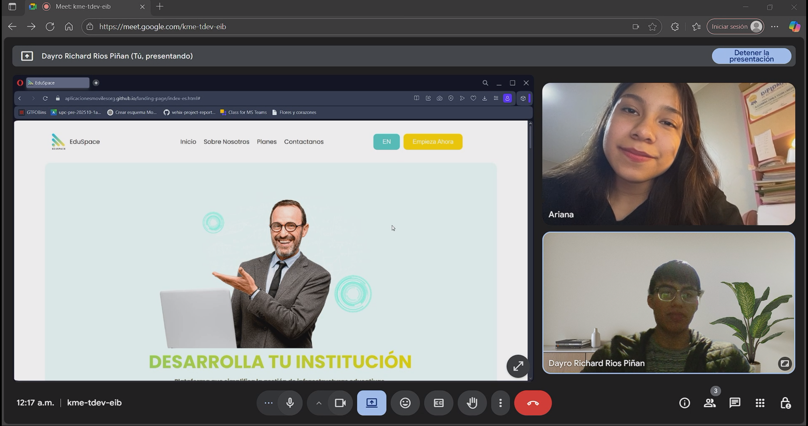

[ 00:00 - 2:34 ]

Duración: 2 minutos 34 segundos

Link de la entrevista: https://tinyurl.com/4d86ueya

Nombre: Ariana

Apellidos: Yasan Laredo

Edad: 23 años

Distrito: San Juan de Miraflores

Resumen: Ariana, administradora de la institución educativa, tiene a su cargo la coordinación de eventos y la gestión de recursos para las actividades escolares. Consideró que la página de inicio era visual y fácil de comprender, destacando los testimonios y la sección de beneficios como los elementos que más le llamaron la atención.

Entrevista 2:

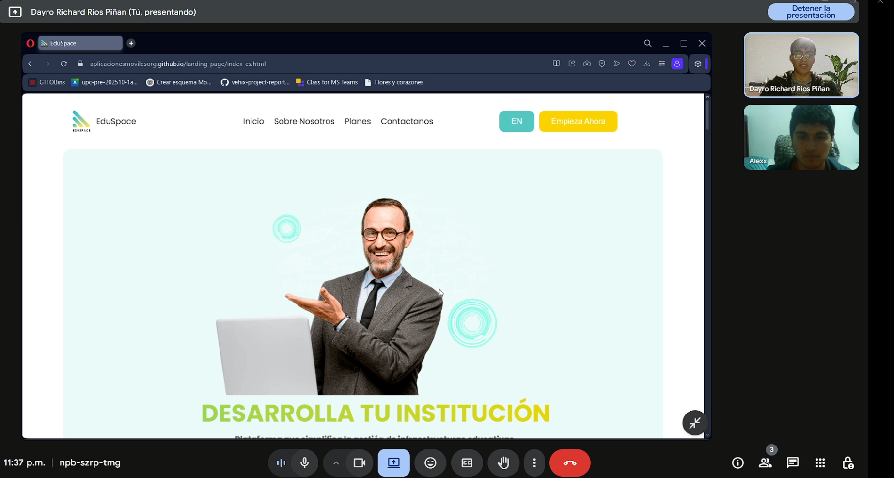

[ 2:34 - 6:21 ]

Duración: 3 minutos 47 segundos

Link de la entrevista: https://tinyurl.com/44nk7k5y

Nombre: Alexander

Apellidos: Miranda Vivanco

Edad: 20

Distrito: Villa el Salvador

Resumen: Alexander es un estudiante universitario que también trabaja como asistente administrativo en una institución educativa en Villa El Salvador. Está encargado de coordinar eventos y gestionar recursos para actividades escolares. Encontró que la landing page era clara y atractiva, y valoró especialmente los testimonios y beneficios listados. Sin embargo, sugirió que se incluyan videos dentro de la landing page para tener un mejor sobre la aplicación, además de hacerla más dinámica y atractiva.

Entrevista 3:

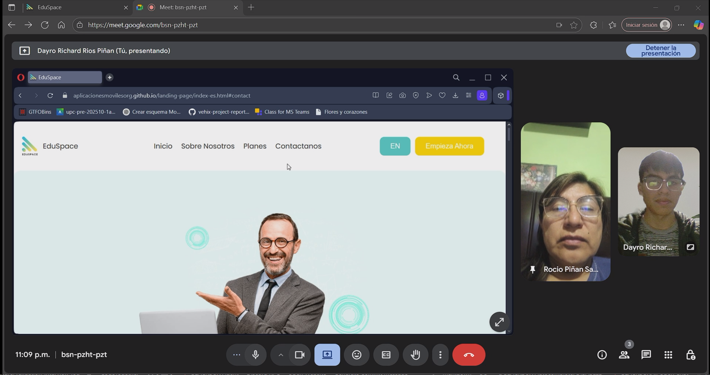

[ 6:21 - 9:14 ]

Duración: 2 minutos 53 segundos

Link de la entrevista: https://tinyurl.com/s2sn78kw

Nombre: Rocio

Apellidos: Piñan Saavedra

Edad: 53

Distrito: Villa el Salvador

Resumen: Rocio es una administradora de una institución educativa privada en Villa El Salvador. Ella maneja la gestión de espacios y recursos para eventos escolares. Encontró que la landing page era clara y atractiva, y valoró especialmente los testimonios y beneficios listados.

**Segmento 2: Docentes y auxiliares**

Entrevista 4:

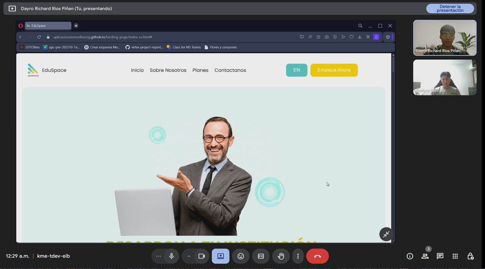

[ 9:14 - 11:53 ]

Duración: 2 minutos 39 segundos

Link de la entrevista: https://tinyurl.com/5b968sky

Nombre: Stefano Lucarelly

Apellidos: Sanchez Heredia

Edad: 20

Distrito: Villa el Salvador

Resumen: Lucas es auxiliar de una institución educativa privada. Consideró que la landing page era clara, aunque señaló que la interfaz de usuario podría mejorarse, y valoró especialmente los planes presentados.

Entrevista 5:

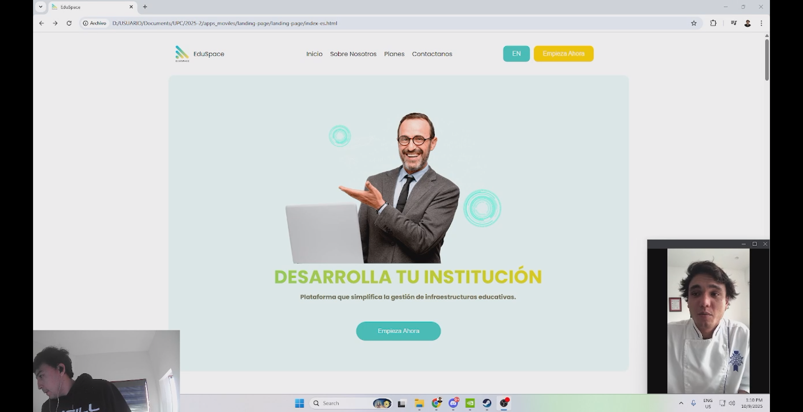

[ 11:53 - 17:50 ]

Duración: 5 minutos 57 segundos

Link de la entrevista: https://tinyurl.com/d5rawyv6

Nombre: Mateo Yoshi

Apellidos: Kiyan, Gardener

Edad: 28

Distrito: San Isidro

Resumen: Mateo es un docente en el insituto privado Le Cordon Bleu. El enseña el curso de Gestion de Inventario. Encontró que la landing page era clara pero que le faltaba mejor UI, y valoró especialmente los planes listados.

Entrevista 6:

[ 17:50 - 20:57 ]

Duración: 3 minutos 7 segundos

Link de la entrevista: https://tinyurl.com/2cbzaujv

Nombre: Adrian Isaac

Apellidos: De La Torre, Lorenzo

Edad: 25

Distrito: Lince

Resumen: Adrian es un auxiliar en un colegio. El gestiona recursos y cierto personal educativo. Encontró que la landing page era muy buena, le gusto mucho, y valoró especialmente el plan Basico y Medio para instituciones chicas y medianas.

#### 4.3.3. Evaluaciones según heurísticas

La evaluación heurística se centró en la **landing page de EduSpace Mobile**, considerando los comentarios recopilados durante las entrevistas con usuarios. El objetivo fue identificar fortalezas y oportunidades de mejora en la experiencia de navegación inicial, aplicando las **10 heurísticas de usabilidad de Jakob Nielsen**.

| **Heurística de Nielsen**                                                  | **Descripción**                                                   | **Observaciones en la Landing Page (según entrevistas)**                                                                                  | **Recomendaciones de mejora**                                                                                 |
| -------------------------------------------------------------------------- | ----------------------------------------------------------------- | ----------------------------------------------------------------------------------------------------------------------------------------- | ------------------------------------------------------------------------------------------------------------- |
| **1. Visibilidad del estado del sistema**                                  | El usuario debe saber en todo momento qué está ocurriendo.        | La página carga correctamente y muestra contenido sin retrasos notables. No obstante, podría incluir indicadores visuales al desplazarse. | Incorporar animaciones o efectos sutiles al hacer scroll para mejorar la percepción de fluidez.               |
| **2. Correspondencia entre el sistema y el mundo real**                    | El diseño y lenguaje deben ser familiares para el usuario.        | Los usuarios consideraron clara la información y comprendieron fácilmente los planes y beneficios.                                        | Mantener el lenguaje sencillo y cercano al entorno educativo, evitando tecnicismos.                           |
| **3. Control y libertad del usuario**                                      | Permitir moverse libremente y deshacer acciones fácilmente.       | La navegación es lineal y sin distracciones. Sin embargo, el botón de “Volver arriba” no está presente.                                   | Agregar un botón flotante que permita regresar al inicio de la página.                                        |
| **4. Consistencia y estándares**                                           | Mantener coherencia visual y de interacción.                      | Algunos usuarios mencionaron que la UI podría mejorar, especialmente en coherencia visual.                                                | Unificar estilos tipográficos, espaciados y colores para reforzar la identidad visual.                        |
| **5. Prevención de errores**                                               | Evitar que el usuario cometa errores.                             | No se detectaron errores funcionales al interactuar con los elementos visibles.                                                           | Verificar que los botones y enlaces mantengan la misma funcionalidad en todas las resoluciones móviles.       |
| **6. Reconocimiento antes que recuerdo**                                   | Mostrar opciones y contenidos visibles sin necesidad de recordar. | Los usuarios destacaron que los **planes** y **beneficios** estaban claramente visibles y organizados.                                    | Mantener la estructura actual, reforzando el uso de íconos o etiquetas que ayuden a la identificación rápida. |
| **7. Flexibilidad y eficiencia de uso**                                    | Permitir interacciones fluidas y accesibles.                      | La experiencia es fluida, aunque algunos usuarios sugirieron añadir contenido más dinámico.                                               | Incluir videos breves o animaciones explicativas para mejorar la interacción y el dinamismo visual.           |
| **8. Estética y diseño minimalista**                                       | Evitar el exceso de información y priorizar lo esencial.          | La mayoría de usuarios valoró el diseño limpio y la claridad general.                                                                     | Mantener el enfoque minimalista, pero optimizar la jerarquía visual entre secciones.                          |
| **9. Ayuda al usuario a reconocer, diagnosticar y recuperarse de errores** | Los mensajes de error deben ser claros y útiles.                  | No se observaron errores o mensajes emergentes, ya que se trata de una página informativa.                                                | Añadir mensajes amigables para redirecciones rotas o enlaces inactivos.                                       |
| **10. Ayuda y documentación**                                              | Ofrecer soporte o información adicional.                          | Algunos usuarios sugirieron incluir **videos explicativos** sobre la aplicación.                                                          | Incorporar un video introductorio y enlaces hacia documentación o contacto para instituciones interesadas.    |

**Conclusión:**  
La landing page de **EduSpace Mobile** fue bien valorada por los entrevistados, destacando su **claridad**, **organización de los planes** y **secciones de beneficios y testimonios**. Las principales oportunidades de mejora se relacionan con la **optimización de la interfaz visual (UI)** y la **incorporación de elementos multimedia** que hagan la experiencia más dinámica e informativa para los nuevos usuarios.
